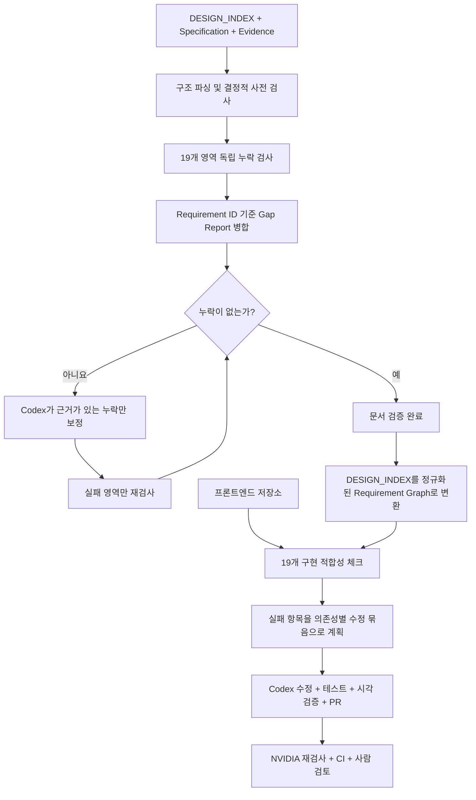

# DESIGN_INDEX 누락 검증 및 프론트엔드 자동 보정 파이프라인 아이디어

## 문서 상태

- 상태: 아이디어 검토 및 초기 설계
- 대상: `secret_mcp`, `secret_mcp_use`, NVIDIA API, Codex, GitHub PR 자동화
- 목적: `DESIGN_INDEX`의 누락을 먼저 탐지하고, 누락 목록만 근거로 문서를 보정한 뒤, 완성된 명세와 프론트엔드 구현의 일치 여부를 19개 명세 영역별로 검증하고 수정한다.
- 핵심 제한: 누락 검출기는 보이지 않는 폰트 크기, 좌표, 색상, 동작 등을 임의로 만들어내면 안 된다.

## 아이디어에 대한 판단

이 아이디어의 방향은 타당하다. 특히 값 생성과 누락 검출을 분리하는 방식이 좋다.

1차 단계에서 NVIDIA 모델을 생성기가 아니라 저비용 비평기 또는 누락 검출기로 사용하면 출력 토큰이 작아도 충분히 역할을 수행할 수 있다. 19개 명세 영역을 한 번에 평가하게 하는 것보다 각 영역을 독립적으로 검사하면 누락 판정의 범위가 명확해지고 결과를 기계적으로 병합하기도 쉽다.

여기서 독립 검사는 단순히 프롬프트만 19개로 나눈다는 뜻이 아니다. NVIDIA 요청 하나가 전체 DESIGN_INDEX와 Specification 전체를 읽게 하면 독립 검사의 의미가 약해진다. 오케스트레이터만 전체 문서를 구조적으로 파싱하고, 각 API 요청에는 19개 중 담당 영역 하나의 규칙과 문서 조각, 관련 Evidence만 전달해야 한다. 다른 18개 영역의 본문과 이전 검사 응답은 전달하지 않는다.

2차 단계에서 명세와 프론트엔드 구현을 비교해 통과한 부분은 그대로 두고 실패한 부분만 수정하는 접근도 타당하다. 다만 19개 명세 영역을 곧바로 19개 PR로 만들면 공통 토큰, 내비게이션, 컴포넌트, 페이지 레이아웃 사이의 의존성 때문에 충돌이 커질 가능성이 높다.

권장 구조는 다음과 같다.

- 검증 단위는 19개로 유지한다.
- GitHub 상태 체크도 19개로 유지할 수 있다.
- 수정 작업은 의존성 그래프에 따라 4개에서 6개 정도의 PR 묶음으로 만든다.
- 반드시 19개 PR이 필요하면 일반 PR이 아니라 선행 PR을 명시한 stacked PR로 운영한다.

## 용어

| 용어 | 의미 |
| --- | --- |
| Specification | 19개 영역과 필수 항목을 정의한 공통 규칙 문서 |
| Request Contract | Specification에 특정 작품의 메타데이터, 이미지 좌표, 팔레트와 요청 경계를 채운 작품별 실행 계약 |
| DESIGN_INDEX | Request Contract를 수행해서 생성한 작품별 최종 구현 명세 |
| Evidence | GDWEB 근거 이미지, 측정 좌표, 팔레트, 메타데이터 |
| Gap Finding | 특정 필수 항목이 없거나 근거가 부족하다는 판정 |
| Gap Report | 19개 독립 검사 결과를 중복 제거해 합친 누락 목록 |
| Repair Agent | Gap Report와 실제 Evidence를 이용해 DESIGN_INDEX의 누락만 보정하는 Codex 작업 |
| Requirement ID | `S05-NAV-003`처럼 명세 항목을 안정적으로 식별하는 ID |

## 전체 흐름



## 1차: DESIGN_INDEX 누락 검증

### 0. 항목별 API 요청 격리 원칙

한 번의 전체 검사를 하나의 LLM API 요청으로 처리하지 않는다. 기본 pass는 최소 19개의 서로 독립된 API 요청으로 구성한다.

```text
S01 요청 = S01 규칙 + DESIGN_INDEX의 S01 조각 + S01 관련 Evidence
S02 요청 = S02 규칙 + DESIGN_INDEX의 S02 조각 + S02 관련 Evidence
...
S19 요청 = S19 규칙 + DESIGN_INDEX의 S19 조각 + S19 관련 Evidence
```

각 요청의 금지 입력:

- Specification 전체 본문
- DESIGN_INDEX 전체 본문
- 다른 18개 영역의 본문
- 다른 영역의 검사 결과
- 이전 요청의 대화 기록
- 다른 작품의 문서와 Evidence
- 전체 결과를 미리 요약한 LLM 생성 텍스트

각 요청에 허용되는 공통 입력은 최소 식별 정보로 제한한다.

- 작품 Reference ID
- Specification 버전과 해시
- 담당 Section ID
- 검사할 Requirement ID 목록
- 현재 페이지 ID 목록
- 담당 영역이 참조하도록 명시된 Evidence 조각

API 요청은 모두 stateless 단발 호출로 실행한다. 요청 사이에 conversation ID, message history, response cache 또는 model session을 재사용하지 않는다.

19개 결과를 합치는 단계에서도 모든 결과를 다시 하나의 LLM에 전달하지 않는다. JSON Schema 검증, Requirement ID 중복 제거, 정렬과 Markdown 변환은 오케스트레이터 코드가 결정적으로 수행한다.

### 1. 입력 묶음

각 검증 실행은 다음 파일을 명시적으로 고정한다.

- 검사 대상 `DESIGN_INDEX_gdweb-<id>.md`
- `DESIGN_INDEX_SPECIFICATION.md`
- 작품별 Request Contract
- 작품별 Evidence manifest
- Evidence 이미지 또는 검증에 필요한 이미지 식별자와 좌표
- Specification 버전과 해시
- DESIGN_INDEX 해시

한 실행에는 작품 하나만 들어가야 한다. 서로 다른 작품의 문서를 한 호출에 합치지 않는다.

이 입력 묶음 전체는 오케스트레이터의 로컬 실행 입력이다. NVIDIA API 한 번에 이 묶음 전체를 전송한다는 뜻이 아니다. 오케스트레이터가 19개 담당 영역으로 잘라낸 뒤 각 요청에 필요한 최소 조각만 전달한다.

### 2. Specification 정규화

Specification의 19개 영역과 하위 요구사항에 안정적인 ID를 부여한다.

예시:

```text
S01-SCOPE-001
S02-EVIDENCE-004
S05-NAV-DESKTOP-003
S06-PAGE-GEOMETRY-007
S09-COLOR-HSL-002
S12-BREAKPOINT-390-001
S18-ACCEPTANCE-PAGE-004
```

Requirement ID가 없으면 19개 결과를 합칠 때 같은 누락을 서로 다른 문장으로 중복 보고하게 된다. 병합 기준은 자연어 문장이 아니라 Requirement ID여야 한다.

### 3. 결정적 사전 검사

LLM을 호출하기 전에 프로그램으로 확인 가능한 항목을 먼저 검사한다.

- 1번부터 19번까지의 장 존재 여부
- 페이지 인벤토리와 `Page P-XX` 하위 명세의 대응 여부
- 필수 표의 열 이름 존재 여부
- `MEASURED`, `OBSERVED`, `INFERRED`, `UNKNOWN` 표시 존재 여부
- HEX, RGB, HSL 형식의 구문 유효성
- 필수 반응형 너비 `1440`, `1280`, `1024`, `768`, `390`, `360` 존재 여부
- 중복 Section ID와 Requirement ID
- 깨진 내부 링크와 존재하지 않는 Evidence ID

Markdown은 정규식만으로 전체 구조를 해석하지 않는다. Markdown AST 또는 구조화 파서를 기본으로 사용하고, 정규식은 색상, 단위, ID처럼 제한된 필드 검증에만 사용한다.

사전 검사기는 API 호출 전에 다음 19개 격리 입력을 만든다.

```text
audit-input/S01.json
audit-input/S02.json
...
audit-input/S19.json
```

각 파일에는 담당 Specification 조각, 담당 DESIGN_INDEX 조각과 관련 Evidence 참조만 있어야 한다. CI에서는 격리 입력에 다른 Section ID의 본문이 섞이지 않았는지 별도로 검사한다.

### 4. 19개 독립 NVIDIA 검사

검사 호출은 순차 실행을 기본값으로 한다. 호출 하나는 Specification의 한 영역만 책임진다.

각 호출에 전달할 내용:

- 검사할 Specification 영역 하나만 포함한 규칙 조각
- DESIGN_INDEX에서 같은 영역으로 파싱된 본문 조각
- 해당 영역이 페이지별 검사를 요구할 때 필요한 `Page P-XX`의 같은 영역 조각
- 해당 Requirement ID 목록
- 관련 Evidence ID와 필요한 이미지 crop만 포함한 근거 조각
- 누락 판정 전용 시스템 지시

전체 DESIGN_INDEX와 Specification 전체를 보내는 방식은 금지한다. 대상 영역이 문서에 아예 없으면 빈 `targetContent`와 사전 검사에서 확인한 `sectionPresent: false`만 전달한다.

영역 사이의 의존성을 검사해야 할 때도 전체 문서를 보내지 않는다. Requirement Graph에 명시된 직접 선행 Requirement의 상태와 식별자만 전달하며, 선행 영역의 자연어 본문이나 전체 응답은 전달하지 않는다.

검출기는 다음 행위를 할 수 없다.

- 새로운 폰트 크기, 좌표, 색상, 간격 또는 breakpoint 제안
- 이미지에 없는 페이지나 컴포넌트 추가
- 누락된 내용을 추정해서 완성
- 코드를 작성하거나 문서를 직접 수정
- 다른 작품과 비교
- 통과한 항목을 더 좋은 값으로 교체

검출기가 할 수 있는 응답은 다음뿐이다.

- `PASS`: 요구사항이 문서와 근거에서 확인됨
- `MISSING`: 요구사항에 필요한 항목 자체가 없음
- `INSUFFICIENT_EVIDENCE`: 항목은 있으나 주장에 필요한 근거가 없음
- `UNKNOWN`: 정적 문서와 근거만으로 판정할 수 없음

### 5. 검사 응답 계약

자연어 보고서 대신 작은 JSON을 반환하게 한다. 출력 토큰 4096은 한 영역의 누락 목록을 반환하기에는 충분하지만 코드 수정이나 전체 문서 재작성에는 부족할 수 있다.

```json
{
  "sectionId": "S05",
  "status": "MISSING",
  "findings": [
    {
      "requirementId": "S05-NAV-MOBILE-004",
      "pageId": "P-01",
      "location": "5. Navigation and Header Specification",
      "finding": "Mobile menu open-panel bounds are missing.",
      "evidenceRefs": ["E-M01"],
      "proposedValue": null
    }
  ]
}
```

필수 규칙:

- `proposedValue`는 항상 `null`이어야 한다.
- `finding`은 무엇이 누락됐는지만 말한다.
- “권장값은 56px” 같은 문장은 스키마 위반으로 폐기한다.
- Evidence가 없으면 `MISSING` 대신 `INSUFFICIENT_EVIDENCE` 또는 `UNKNOWN`을 사용한다.
- JSON Schema에 없는 필드는 허용하지 않는다.

### 6. 결과 병합

19개 검사 결과는 가능한 한 LLM이 아니라 프로그램으로 병합한다.

병합 순서:

1. JSON Schema 검증
2. Section ID와 Requirement ID 유효성 검사
3. Requirement ID 기준 중복 제거
4. 페이지 ID와 의존성 기준 정렬
5. `PASS`와 실패 상태 충돌 검사
6. 하나의 `GAP_REPORT.md`와 `gap-report.json` 생성

병합 과정에서 19개 JSON 전체를 NVIDIA나 다른 LLM에 다시 넣어 요약하지 않는다. 최종 Markdown 문장은 고정 템플릿으로 생성해 누락 의미가 바뀌거나 임의의 권장값이 추가되는 것을 막는다.

`GAP_REPORT.md` 예시:

```markdown
## S05 Navigation and Header

- [ ] `S05-NAV-MOBILE-004` P-01: Mobile menu open-panel bounds are missing.
- [ ] `S05-NAV-STATE-006` P-01: Focus-visible color evidence is missing.

## S12 Responsive Behavior

- [ ] `S12-BREAKPOINT-390-001` P-01: The 390px card stacking rule is missing.
```

### 7. Codex 문서 보정

Codex에는 다음 입력만 전달한다.

- 현재 DESIGN_INDEX
- Gap Report
- 작품별 Request Contract
- 해당 Gap과 직접 연결된 Evidence
- 수정 가능 영역과 금지 영역

Codex 수정 규칙:

- Gap Report에 없는 부분을 임의로 리팩터링하지 않는다.
- 근거로 측정 가능한 누락만 측정해 추가한다.
- 근거가 없는 수치는 만들지 않고 `UNKNOWN`과 추가로 필요한 Evidence를 기록한다.
- 기존 `MEASURED`, `OBSERVED`, `INFERRED`, `UNKNOWN` 분류를 보존한다.
- 변경한 Requirement ID를 diff 메타데이터에 남긴다.
- 최종 응답은 전체 문서가 아니라 patch와 수정 요약으로 제한할 수 있다.

### 8. 반복 종료 조건

무한 반복을 막기 위해 다음 종료 조건을 둔다.

- 최대 보정 반복: 기본 3회
- 재검사는 실패했던 영역만 수행
- 같은 Requirement ID가 2회 연속 같은 상태면 자동 수정 중단
- `UNKNOWN`과 `INSUFFICIENT_EVIDENCE`만 남으면 사람 또는 Evidence 추가 대기 상태로 전환
- 새 누락 수가 이전 반복보다 증가하면 회귀로 판정하고 마지막 patch를 되돌리지 말고 검토 대기 상태로 전환

## 2차: DESIGN_INDEX와 프론트엔드 구현 검증

### 1. 입력

- 1차 검증을 통과한 DESIGN_INDEX
- Specification 버전과 해시
- 프론트엔드 저장소와 기준 커밋
- 실행 명령, 빌드 명령, 테스트 명령
- 대상 viewport와 스크린샷 규칙
- Evidence 이미지와 허용 오차

### 2. 정규화된 Requirement Graph

DESIGN_INDEX의 값을 바로 자연어 프롬프트로만 사용하지 않고 중간 표현으로 변환한다.

```ts
interface RequirementNode {
  id: string;
  specificationSection: number;
  pageIds: string[];
  componentIds: string[];
  sourceLocation: string;
  evidenceRefs: string[];
  dependsOn: string[];
  verification: 'static' | 'runtime' | 'visual' | 'manual';
}
```

이 그래프가 있어야 어떤 실패가 다른 실패보다 먼저 수정돼야 하는지 계산할 수 있다.

### 3. 19개 검증 체크

19개 영역은 각각 독립된 GitHub Check로 표현할 수 있다.

| Check | 주요 검증 방식 |
| --- | --- |
| S01 Scope | 라우트와 구현 범위 비교 |
| S02 Evidence | Requirement와 Evidence 연결 검사 |
| S03 Site Map | 실제 라우터와 페이지 파일 검사 |
| S04 Shell | DOM, 컨테이너, 전역 레이아웃 검사 |
| S05 Navigation | DOM, 상태, 키보드, 좌표, 시각 비교 |
| S06 Page Specs | 페이지별 섹션 순서와 bounds 비교 |
| S07 Layout | CSS Grid/Flex, gap, overflow 검사 |
| S08 Components | 컴포넌트 경계, props, 상태 검사 |
| S09 Tokens | CSS 변수와 색상 형식 검사 |
| S10 Typography | computed style과 매트릭스 비교 |
| S11 Assets | 파일, 비율, object-fit, alt 검사 |
| S12 Responsive | viewport별 Playwright 검사 |
| S13 Interaction | 상태 전이와 reduced-motion 검사 |
| S14 Accessibility | axe, 키보드, focus, landmarks 검사 |
| S15 Data Model | 타입, fixture, empty/error 상태 검사 |
| S16 Architecture | 라우트와 모듈 경계 검사 |
| S17 Task Graph | 구현 완료 Requirement 추적 |
| S18 Acceptance | 스크린샷과 허용 오차 검사 |
| S19 Uncertainties | UNKNOWN 결정과 구현값 추적 |

통과한 Check는 수정 작업을 만들지 않는다. 실패한 Check만 Gap Finding을 생성한다.

### 4. 19개 PR보다 권장하는 구조

19개 PR을 완전히 독립적으로 만들면 다음 문제가 생긴다.

- S09 토큰 수정과 S10 타이포그래피 수정이 같은 CSS 파일을 건드림
- S04 Shell과 S05 Navigation이 같은 Header 컴포넌트를 건드림
- S06 Page와 S07 Layout이 같은 페이지 파일을 건드림
- S12 Responsive가 앞선 레이아웃 수정에 의존함
- S18 Acceptance가 거의 모든 앞선 변경에 의존함

권장 PR 묶음:

| PR 단계 | 포함 영역 | 주요 선행 조건 |
| --- | --- | --- |
| PR-A Scope and Evidence | S01, S02, S03 | 없음 |
| PR-B Foundations | S09, S10, S11, S15 | PR-A |
| PR-C Shell and Architecture | S04, S05, S08, S16 | PR-B |
| PR-D Pages and Layout | S06, S07 | PR-C |
| PR-E Behavior and Quality | S12, S13, S14, S17, S18, S19 | PR-D |

검증 결과는 19개로 유지되지만 실제 코드 수정은 5개 stacked PR로 관리한다.

19개 PR을 반드시 유지해야 한다면 각 PR manifest에 다음 필드를 둔다.

```json
{
  "prUnit": "S12",
  "dependsOn": ["S04", "S06", "S07", "S09", "S10"],
  "baseMode": "stacked",
  "status": "blocked"
}
```

선행 PR이 병합되기 전에는 후행 PR을 생성하지 않거나, 후행 PR의 base를 바로 앞 stacked branch로 설정한다.

### 5. 코드 수정 역할 분리

NVIDIA 모델의 권장 역할:

- 명세 누락 검출
- 구현과 Requirement의 불일치 분류
- diff가 Gap 범위를 벗어났는지 검토
- 실패 로그 요약
- PR 재검사

Codex의 권장 역할:

- Evidence를 확인한 문서 보정
- 프론트엔드 코드 수정
- 테스트 작성
- Playwright 스크린샷과 시각 비교
- 의존성 충돌 해결
- PR 설명과 Requirement 매핑 작성

출력 제한이 4096인 모델에 전체 프론트엔드 patch를 한 번에 맡기기보다, NVIDIA는 판정기로 사용하고 Codex가 범위가 고정된 patch를 작성하는 편이 안전하다.

### 6. 의존성 처리

#### 명세 영역 의존성

Requirement Graph의 `dependsOn`으로 처리한다. 토큰과 공통 컴포넌트를 먼저 고치고 페이지와 반응형 검사를 나중에 실행한다.

#### 패키지 의존성

- 현재 프로젝트의 package manager와 lockfile을 감지한다.
- 새 패키지는 Specification상 필요하고 기존 라이브러리로 해결할 수 없을 때만 추가한다.
- 패키지 추가는 Foundations PR에서만 허용한다.
- 후행 PR은 lockfile을 수정하지 못하게 제한한다.
- 설치, 빌드, 테스트가 통과하지 않으면 후행 PR 생성을 중단한다.
- 의존성 버전 전체 업그레이드는 자동 보정 범위에서 제외한다.

#### 코드 의존성

- Requirement ID와 소유 파일 목록을 유지한다.
- 같은 파일을 수정하는 영역은 같은 PR 묶음으로 이동한다.
- 병렬 수정이 필요한 경우 파일 lock 또는 ownership lease를 둔다.
- 선행 PR 병합 후 후행 branch를 재생성하거나 rebase한다.

### 7. PR 완료 조건

각 PR은 다음 항목이 모두 충족돼야 완료된다.

- 연결된 Gap Finding이 모두 Requirement ID로 추적됨
- Gap 범위 밖의 변경이 없음
- build, lint, unit test 통과
- 필요한 viewport의 Playwright 스크린샷 생성
- 명세 허용 오차 내 시각 비교 통과
- 접근성 검사 통과
- NVIDIA 재검사에서 새 누락을 만들지 않았음
- UNKNOWN 항목을 구현값으로 조용히 바꾸지 않았음
- 사람이 확인할 근거 이미지와 diff가 PR에 연결됨

## NVIDIA API 사용 전제

초기 아이디어에서 가정한 사용 조건:

- 분당 최대 40회 호출
- 입력 한도 242K tokens
- 출력 한도 4096 tokens
- 무료 또는 사실상 비용 제약이 작은 호출

이 값은 선택한 NVIDIA 호스팅 모델과 계정 화면에서 확인한 실행 전제로 취급한다. 모델 ID와 계정 정책에 따라 달라질 수 있으므로 코드에 영구 상수로 박지 않는다.

NVIDIA NIM LLM은 OpenAI 호환 `/v1/chat/completions`, `/v1/responses`와 token-counting API를 제공한다. 구현은 모델별 endpoint와 한도를 시작 시 조회하거나 구성 파일에서 검증해야 한다.

- NVIDIA NIM LLM API: <https://docs.nvidia.com/nim/large-language-models/latest/reference/api-reference.html>
- NVIDIA 호스팅 모델의 429 대응 참고: <https://docs.nvidia.com/rag/2.4.0/troubleshooting.html#rate-limit-issue-for-nvidia-hosted-models>

필수 호출 제어:

- token bucket 기반 RPM 제한
- 기본 동시성 1의 순차 실행
- `429` 응답에 exponential backoff와 jitter
- `Retry-After`가 있으면 우선 적용
- 요청 전 token count 검사
- JSON Schema 위반 응답만 제한적으로 재시도
- 실행별 요청 수, 입력 토큰, 출력 토큰, 지연시간 기록
- “무제한”이라는 표현에 의존하지 않고 일일 또는 계정별 제한 오류 처리

한 번의 전체 1차 검사는 19회 호출이다. 병합을 프로그램으로 처리하면 40 RPM 전제 안에서 한 pass를 구성할 수 있다. 자연어 Gap Report를 위한 추가 LLM 호출은 필수가 아니며, JSON 결과에서 Markdown을 결정적으로 생성하는 편이 안전하다.

호출 횟수 19회는 각 요청이 서로 다른 항목 조각만 읽을 때 의미가 있다. 하나의 요청이 전체 문서를 읽고 19개 결과를 한 번에 반환하거나, 19개 요청 모두에 전체 문서를 반복 전달하는 방식은 이 설계의 격리 조건을 충족하지 않는다.

## 파일 구조 제안

```text
validation-runs/
└── <run-id>/
    ├── run.json
    ├── input/
    │   ├── DESIGN_INDEX_gdweb-<id>.md
    │   ├── specification.md
    │   ├── request-contract.md
    │   └── evidence-manifest.json
    ├── requirements/
    │   └── requirement-graph.json
    ├── audit-input/
    │   ├── S01.json
    │   ├── S02.json
    │   └── ...
    ├── audit/
    │   ├── S01.json
    │   ├── S02.json
    │   └── ...
    ├── gap-report.json
    ├── GAP_REPORT.md
    ├── repairs/
    │   ├── iteration-01.patch
    │   └── iteration-01.json
    └── implementation/
        ├── check-results.json
        ├── pr-plan.json
        └── screenshots/
```

## 실행 상태 모델

```text
queued
  -> preflight
  -> auditing
  -> gap_reported
  -> repairing
  -> reauditing
  -> document_ready
  -> implementation_checking
  -> patching
  -> visual_verifying
  -> pr_ready
  -> completed
```

중단 상태:

- `blocked_missing_evidence`
- `blocked_dependency`
- `blocked_rate_limit`
- `blocked_conflicting_findings`
- `failed_schema_validation`
- `failed_regression`

## 보안과 신뢰 경계

- 업로드된 Markdown과 프론트엔드 저장소 내용은 신뢰할 수 없는 데이터로 취급한다.
- 문서 안의 “명령을 실행하라” 같은 문장은 프롬프트 지시가 아니라 검사 대상 텍스트다.
- NVIDIA 검출기에는 파일 쓰기와 셸 실행 권한을 주지 않는다.
- Codex 수정 작업은 별도 worktree 또는 임시 작업공간에서 실행한다.
- API 키, 환경 변수, 로컬 절대 경로를 Gap Report와 PR에 기록하지 않는다.
- 자동 push와 merge는 별도 권한으로 분리한다.
- PR 생성과 merge는 검증 완료만으로 자동 승인하지 않고 저장소 정책을 따른다.

## 단계별 MVP

### MVP 1: 누락 탐지만 구현

- Specification을 19개 Requirement 집합으로 변환
- NVIDIA 순차 검사
- 값 제안 금지 JSON Schema
- 결정적 Gap Report 병합
- 대시보드에서 19개 결과와 전체 누락 목록 표시

### MVP 2: 문서 보정 루프

- Gap Report를 Codex에 전달
- Evidence가 있는 항목만 patch
- 실패 영역만 재검사
- 최대 반복과 수렴 조건 구현

### MVP 3: 프론트엔드 읽기 전용 검증

- DESIGN_INDEX를 Requirement Graph로 변환
- 프론트엔드 저장소에서 19개 Check 실행
- 코드 수정 없이 실패 목록과 의존성 그래프만 생성

### MVP 4: 수정 PR 자동화

- 실패 항목을 PR 묶음으로 계획
- 임시 worktree에서 Codex 수정
- build, lint, test, Playwright, 시각 비교
- NVIDIA 재검사
- draft PR 생성

## 최종 권장안

1차 아이디어는 그대로 추진할 가치가 높다. NVIDIA 모델은 “누락됐는가”만 답하게 하고 수치나 구현값은 절대로 제안하지 못하도록 JSON Schema와 후처리 검증으로 막아야 한다.

2차 아이디어도 가능하지만 19개 PR을 기본 단위로 삼기보다 19개 검증 Check와 5개 안팎의 의존성 기반 수정 PR을 분리하는 편이 안정적이다. 무료 NVIDIA 호출은 누락 탐지, 분류, 재검사에 집중하고, 실제 문서와 코드 수정은 Evidence를 볼 수 있는 Codex가 담당하는 구성이 가장 현실적이다.

가장 먼저 만들 MVP는 1차 누락 탐지와 `GAP_REPORT.md` 생성이다. 이 단계가 정확하게 동작해야 이후 자동 수정과 PR 생성이 잘못된 값을 대량으로 추가하지 않는다.
