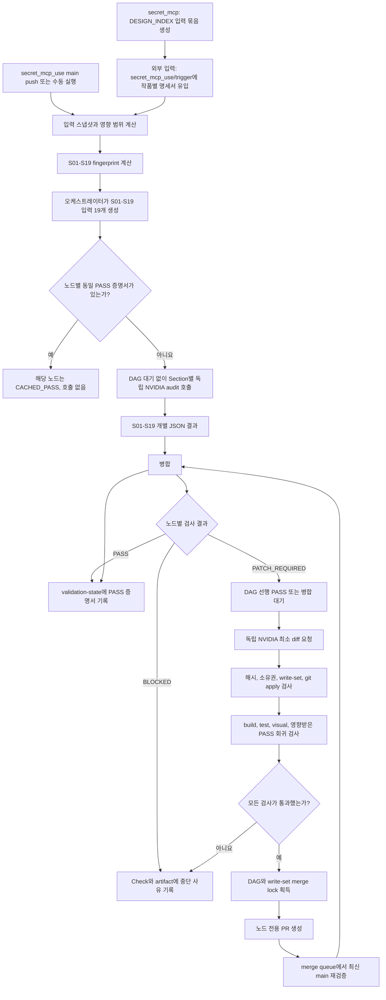

# DESIGN_INDEX 독립 검증 및 DAG 기반 PR 자동 보정 파이프라인

## 문서 상태

- 상태: V2 전체 파이프라인 구현 완료
- 실행 대상 저장소: `secret_mcp_use` 하나만 사용
- 상위 생성기: `secret_mcp`는 작품별 `DESIGN_INDEX`, Request Contract와 Evidence를 생성해 전달하는 역할만 담당
- 입력: `secret_mcp`가 생성한 작품별 `DESIGN_INDEX`, 공통 Specification, 작품별 Request Contract, Evidence와 `secret_mcp_use`의 프론트엔드 소스
- 출력: 19개 항목의 독립 검증 증명서, 필요한 경우에만 생성되는 최소 수정 PR, 재실행 시 사용할 정적 PASS 상태
- 핵심 변경: 19개 항목을 항상 19개 PR로 만드는 구조를 폐기하고, 19개 항목을 DAG 노드로 유지하되 `PATCH_VERIFIED`인 노드만 PR을 생성한다.

## 결론

이 아이디어는 다음 구조로 구현하는 것이 가장 안전하다.

1. Specification의 19개 영역을 `S01`부터 `S19`까지 독립 노드로 만든다.
2. 최초 전체 검증 또는 강제 전체 검증은 NVIDIA API를 정확히 19번 호출한다. S01 요청부터 S19 요청까지 한 요청이 한 Section만 담당한다.
3. 각 노드는 별도의 임시 작업공간, 별도의 NVIDIA stateless 요청, 별도의 입력 JSON과 출력 JSON을 사용한다.
4. 하나의 NVIDIA 요청이나 하나의 통합 LLM이 S01-S19 전체를 읽고 19개 결과를 한꺼번에 반환하는 방식은 금지한다.
5. audit fan-out은 DAG 선행 상태와 무관하게 실행한다. 전체 검증에서는 선행 노드가 실패해도 S01-S19의 19개 audit 호출을 모두 완료한다.
6. DAG 의존성은 patch 적용과 PR 생성 순서에만 사용한다.
7. 선행 노드의 자연어 응답은 후행 노드에 전달하지 않는다. patch scheduler는 서명된 상태와 공개 출력 해시만 읽는다.
8. 기존 PASS 증명서의 fingerprint가 현재 입력 fingerprint와 같으면 API를 호출하지 않고 `CACHED_PASS`로 종료한다.
9. `PASS`인 노드는 PR을 만들지 않는다. 정적 PASS 증명서만 `validation-state` 브랜치에 기록한다.
10. `PATCH_REQUIRED`인 노드만 별도의 NVIDIA patch 요청으로 최소 unified diff를 생성한다. audit 요청과 patch 요청도 서로 다른 세션이다.
11. diff가 허용 파일, 기준 해시, 변경 범위, 테스트와 회귀 검사를 모두 통과한 경우에만 PR을 만든다.
12. 서로 의존하지 않고 쓰기 파일도 겹치지 않는 노드는 병렬 실행할 수 있다.
13. 같은 파일을 수정하거나 의존 관계가 있는 노드는 자동으로 직렬화한다.
14. merge 전에는 최신 `main`을 기준으로 patch를 다시 검증하며, 오래된 patch는 자동 병합하지 않는다.
15. 모든 비-PASS 결과는 사라지지 않는다. supplied finding 전체를 구현하고 검증한 코드 diff만 PR로 만들며, PR을 만들 수 없는 결과는 Section Check와 불변 실행 artifact에만 기록한다. 이 파이프라인은 GitHub Issue를 생성하지 않는다.

`19개 항목`은 검증 격리 단위이지 `19개 PR을 반드시 생성한다`는 뜻이 아니다. 한 실행에서 17개가 이미 PASS이고 2개만 누락됐다면 PR은 최대 2개만 생성되어야 한다.

## 저장소 역할 경계

| 저장소 | 역할 | 이 파이프라인이 할 수 있는 작업 |
| --- | --- | --- |
| `secret_mcp` | GDWEB 검색 결과를 작품별 독립 요청으로 분석하고 `DESIGN_INDEX`, Request Contract와 Evidence 묶음을 생성하는 upstream producer | 생성 결과를 읽어 입력 묶음으로 전달하는 것만 허용 |
| `secret_mcp_use` | 생성된 명세로 프론트엔드를 구현하고 19개 항목을 검증·보정하는 유일한 execution target | DAG 실행, NVIDIA API 호출, PASS 증명서 기록, 임시 branch, 코드 patch, 테스트와 PR 생성 |

강제 규칙:

- `secret_mcp`에는 검증 branch, `validation-state`, 자동 수정 commit 또는 PR을 만들지 않는다.
- `secret_mcp`의 소스 코드를 이 파이프라인의 구현 입력이나 patch 대상으로 전달하지 않는다.
- `secret_mcp`에서 전달받은 산출물은 content hash가 고정된 읽기 전용 입력으로 취급한다.
- `main`, `auto/<target>/<section>/<fingerprint>`, `validation-state`와 모든 자동 PR은 `secret_mcp_use` 저장소에만 존재한다.
- 문서에서 별도 저장소 표기가 없는 `저장소`, `main`, `프론트엔드`, `target repository`는 모두 `secret_mcp_use`를 뜻한다.

## 실행 기준 명세서

이 파이프라인의 실제 구현 기준은 `secret_mcp_use/trigger/` 아래에 커밋된 작품별 `DESIGN_INDEX` 문서다.

현재 예시 target의 기준 문서:

```text
trigger/DESIGN_INDEX_gdweb-26357.md
```

문서별 역할은 다음과 같이 구분한다.

| 입력 | 역할 | 코드 patch 값의 출처가 될 수 있는가? |
| --- | --- | --- |
| `trigger/DESIGN_INDEX_gdweb-<id>.md` | 작품별 페이지, 좌표, 색상, 타이포그래피, 레이아웃, 반응형과 상호작용의 실행 계약 | 예. 코드에 넣을 실제 값의 최우선 출처 |
| `DESIGN_INDEX_SPECIFICATION.md` | 작품별 문서가 반드시 가져야 할 19개 구조와 검증 규칙 | 아니요. 필수 항목과 형식만 정의 |
| 작품별 Request Contract | 요청 경계, reference ID, Evidence 목록과 생성 조건 | 직접 값이 명시된 경우에만 보조 근거 |
| Evidence | trigger 문서의 측정값과 관찰값을 검증하는 원본 근거 | trigger와 일치할 때만 사용 |
| 현재 frontend 코드 | 명세와 비교할 실제 구현 상태 | 기대값이 아니라 검사 대상 |

### 기준 우선순위

1. 오케스트레이터는 공통 Specification으로 필수 Requirement ID와 입력 형식을 결정한다.
2. 각 Requirement의 기대값은 `trigger/DESIGN_INDEX_gdweb-<id>.md`의 같은 번호 Section에서 읽는다.
3. Evidence는 trigger 값의 출처와 신뢰 수준을 확인하는 데 사용한다.
4. frontend 코드는 기대값과 비교할 observed implementation으로만 읽는다.
5. 공통 Specification의 예시 수치나 다른 작품의 trigger 값은 현재 작품 patch에 사용할 수 없다.

Specification, trigger, Request Contract와 Evidence가 서로 충돌하면 어느 하나를 LLM이 임의로 선택하지 않는다. 해당 Requirement를 `BLOCKED_CONTRACT_CONFLICT`로 표시하고 PR을 만들지 않는다.

### S01-S19 추출 규칙

한 작품의 trigger 문서를 Markdown AST로 파싱해 다음처럼 정확히 19개의 입력 fragment를 만든다.

```text
S01 = trigger 문서의 "## 1. ..." 전체
S02 = trigger 문서의 "## 2. ..." 전체
...
S19 = trigger 문서의 "## 19. ..." 전체
```

각 Section의 모든 하위 heading, 표, code block과 페이지별 하위 내용은 해당 fragment에 포함한다. 다음 번호의 `## N.` heading이 시작되는 지점에서 fragment를 종료한다.

강제 규칙:

- trigger 문서 하나는 작품 하나만 나타낸다.
- 작품 하나당 S01-S19 NVIDIA audit 요청 19개를 만든다.
- 여러 trigger 문서를 한 target이나 한 요청에 합치지 않는다.
- trigger 문서가 두 개면 작품별 run 두 개와 최대 38개의 독립 audit 요청으로 분리한다.
- 1~19번 중 하나가 없거나 중복되면 NVIDIA 호출 전에 `FAILED_TRIGGER_STRUCTURE`로 중단한다.
- 빠진 trigger Section을 공통 Specification 본문으로 대신 채우지 않는다.
- Section fragment가 비어 있으면 코드 patch를 만들지 않고 먼저 DESIGN_INDEX 문서 누락으로 보고한다.
- audit와 patch prompt에는 현재 Section의 trigger fragment만 전달한다.

### trigger 고정 manifest

모든 run은 분석한 trigger 파일과 hash를 고정한다.

```json
{
  "schemaVersion": "design-validation/trigger-source/v2",
  "repository": "yyeongjin/secret_mcp_use",
  "path": "trigger/DESIGN_INDEX_gdweb-26357.md",
  "referenceId": "gdweb-26357",
  "contentHash": "sha256:...",
  "specificationPath": "DESIGN_INDEX_SPECIFICATION.md",
  "specificationHash": "sha256:...",
  "sectionMap": {
    "S01": "heading:1",
    "S02": "heading:2",
    "S03": "heading:3",
    "S04": "heading:4",
    "S05": "heading:5",
    "S06": "heading:6",
    "S07": "heading:7",
    "S08": "heading:8",
    "S09": "heading:9",
    "S10": "heading:10",
    "S11": "heading:11",
    "S12": "heading:12",
    "S13": "heading:13",
    "S14": "heading:14",
    "S15": "heading:15",
    "S16": "heading:16",
    "S17": "heading:17",
    "S18": "heading:18",
    "S19": "heading:19"
  }
}
```

run 도중 trigger 파일 hash가 바뀌면 실행을 계속하지 않는다. 현재 run을 `STALE_TRIGGER`로 종료하고 새 hash로 S01-S19 입력을 다시 만든다.

### trigger 불변 입력 규칙

`trigger/DESIGN_INDEX_gdweb-*`는 이 파이프라인의 read-only input이다. 파이프라인은 어떤 단계에서도 이 경로를 생성, 수정, 삭제, rename, format 또는 자동 보정할 수 없다.

```yaml
immutableInputGlobs:
  - trigger/DESIGN_INDEX_gdweb-*.md

allowedWriteGlobs:
  - frontend/**
  - validation/**

forbiddenWriteGlobs:
  - trigger/**
  - DESIGN_INDEX_SPECIFICATION.md
  - DESIGN_INDEX_SPECIFICATION.ko.md
```

강제 규칙:

- `secret_mcp` 또는 사람이 trigger 파일을 `secret_mcp_use`에 넣는 행위는 upstream 입력 공급이다.
- 이 DAG 파이프라인의 GitHub token에는 trigger 경로를 수정하는 권한을 주지 않는다.
- 모든 NVIDIA patch output의 write-set에서 `trigger/**`를 무조건 거부한다.
- 자동 PR에 trigger 파일 diff가 한 줄이라도 있으면 PR 생성 전에 전체 patch를 폐기한다.
- trigger 구조나 내용에 누락이 있어도 이 파이프라인은 문서를 고치지 않는다.
- 문서 오류는 Requirement ID와 위치만 보고하고 새로운 입력 버전을 기다린다.
- trigger가 외부 commit으로 변경되면 기존 파일을 이어서 수정한 것으로 처리하지 않고 새로운 content hash의 불변 입력 버전으로 처리한다.

### trigger 유입 이벤트

다음 경로가 GitHub push에서 `added`, `modified` 또는 `renamed` target으로 감지되면 작품별 full audit를 시작한다.

```text
trigger/DESIGN_INDEX_gdweb-*.md
```

trigger 유입 이벤트는 부분 증분 검증을 사용하지 않는다.

```text
trigger file 1개 유입 또는 새 버전 -> S01-S19 독립 NVIDIA audit 19개
trigger file 2개 유입 또는 새 버전 -> 작품별 run 2개, 독립 NVIDIA audit 총 38개
frontend code만 변경              -> 영향받은 Section만 증분 audit
```

trigger 문서에서 실제로 바뀐 줄이 S05뿐이어도 새 trigger content hash가 들어온 것이므로 S01-S19 전체를 다시 각각 호출한다. 이는 한 작품 명세서 전체를 하나의 versioned input contract로 취급하기 때문이다.

## 절대 규칙

### 요청 독립성

- 한 API 요청은 정확히 한 작품의 한 Section ID만 담당한다.
- 전체 검증 한 pass는 `audit:S01`부터 `audit:S19`까지 19개의 요청 ID를 가진다.
- 19개의 요청은 같은 NVIDIA model ID를 사용할 수 있지만 요청 context, request ID, 응답, 임시 디렉터리와 로그는 완전히 분리한다.
- `audit:S01-S19`처럼 여러 Section을 나타내는 통합 request ID는 허용하지 않는다.
- 요청마다 새로운 stateless 세션을 사용한다.
- conversation ID, message history, response cache, 임시 작업공간을 재사용하지 않는다.
- 다른 Section의 Specification 본문, DESIGN_INDEX 본문, finding 자연어 문장과 diff를 입력에 넣지 않는다.
- audit 요청에는 선행 노드의 현재 응답을 전달하지 않는다.
- patch scheduler만 선행 상태의 `sectionId`, `status`, `publicDigest`, `attestationHash`를 읽는다.
- 19개 결과를 하나의 LLM에 다시 넣어 병합하지 않는다. 병합은 코드가 수행한다.
- 한 요청의 입력 JSON에 다른 Section ID가 발견되면 NVIDIA를 호출하기 전에 실행을 실패시킨다.
- 한 응답의 `sectionId`가 요청 Section과 다르면 해당 응답을 폐기한다.

### 값 창작 금지

- 문서와 Evidence에 없는 색상, 폰트 크기, 좌표, 간격, breakpoint, 상태를 만들지 않는다.
- 누락 검출 단계는 누락 사실만 반환하며 수정값을 제안하지 않는다.
- patch 단계도 DESIGN_INDEX와 Evidence에 이미 존재하는 값만 사용할 수 있다.
- 근거가 없으면 `BLOCKED_MISSING_EVIDENCE`를 반환한다.

### PR 생성 금지 조건

다음 상태에서는 PR을 생성하지 않는다.

- `PASS`
- `CACHED_PASS`
- `BLOCKED_MISSING_EVIDENCE`
- `BLOCKED_CONTRACT_CONFLICT`
- `BLOCKED_DEPENDENCY`
- `BLOCKED_PATCH_TOO_LARGE`
- `BLOCKED_CONFLICT`
- `BLOCKED_IMMUTABLE_INPUT_WRITE`
- `FAILED_TRIGGER_STRUCTURE`
- `STALE_TRIGGER`
- `ERROR`
- diff가 비어 있는 경우
- 애플리케이션 코드 변경 없이 검증 기록만 있는 경우

PASS 기록을 남기기 위해 빈 PR이나 report-only PR을 만드는 방식은 사용하지 않는다.

단, `PR 없음`은 `검증 결과 없음`을 뜻하지 않는다. `PATCH_WAITING_DEPENDENCY`와 write-set 대기는 실패나 사람의 작업 항목이 아니라 정적 DAG queue로 보관한다. 선행 자동 PR이 병합되면 main 변경 이벤트가 fingerprint와 PASS 증명서를 다시 계산하고, 새로 준비된 Section만 독립 NVIDIA audit와 patch 단계로 자동 진행한다. `UNKNOWN`, `BLOCKED_MISSING_EVIDENCE`, `BLOCKED_CONTRACT_CONFLICT`는 첫 응답으로 확정하지 않고 동일 Section만 `PIPELINE_AUDIT_ATTEMPTS`까지 독립 재호출한다. 근거가 있는 `PATCH_REQUIRED`의 patch 거부, 충돌 판단, 불완전 diff도 `PIPELINE_PATCH_ATTEMPTS`까지 독립 후보를 다시 호출한다. 모든 재시도가 끝난 뒤에도 검증 가능한 전체 diff를 만들 수 없으면 Section Check와 불변 실행 artifact에 결과를 남기며 GitHub Issue는 생성하지 않는다.

## 전체 아키텍처



## 19개 NVIDIA 호출과 결정적 병합

### 전체 검증 모드

최초 실행, Specification 공통 규칙 변경, validator contract 변경 또는 사용자가 `forceFullAudit: true`를 지정한 실행은 cache와 관계없이 정확히 19개의 audit 요청을 만든다. Specification의 번호별 Section 하나만 바뀌면 해당 노드와 더 이상 유효한 dependency attestation을 갖지 못한 DAG 후행 노드만 다시 호출한다.

```text
audit:S01 -> NVIDIA request #01 -> nodes/S01/audit-output.json
audit:S02 -> NVIDIA request #02 -> nodes/S02/audit-output.json
...
audit:S19 -> NVIDIA request #19 -> nodes/S19/audit-output.json
```

이 19개 호출은 한 모델 응답을 논리적으로 나눈 것이 아니다. 실제 HTTP 요청 19개이며 요청마다 다음 값이 달라야 한다.

- `requestId`
- `sectionId`
- system prompt의 Section 소유권
- Specification fragment
- DESIGN_INDEX fragment
- Evidence subset
- implementation slice
- response JSON 파일
- 실행 로그와 token usage

동일해야 하는 값은 schema 버전, target ID, run ID, 기준 commit처럼 실행을 식별하는 최소 metadata뿐이다.

### 증분 검증 모드

일반적인 code push에서는 먼저 S01-S19의 fingerprint를 코드로 계산한다. fingerprint는 LLM이 계산하거나 판단하지 않는다.

- fingerprint가 동일하고 유효한 PASS 증명서가 있으면 해당 Section은 `CACHED_PASS`다.
- fingerprint가 달라진 Section은 Section마다 NVIDIA 요청 하나를 새로 호출한다.
- 직접 선행 노드의 `publicDigest`가 달라져 무효화된 후행 Section도 각각 별도 NVIDIA 요청을 호출한다.
- 변경된 Section이 4개라면 호출은 4개이며, 이 4개를 한 요청에 묶지 않는다.
- 전체 검증을 요구하면 19개 모두 다시 각각 호출한다.

따라서 호출 규칙은 다음과 같다.

```text
fresh full audit       = 19개의 독립 audit 호출
forced full audit      = 19개의 독립 audit 호출
incremental audit      = dirty Section 수만큼 독립 audit 호출
patch generation       = PATCH_REQUIRED Section마다 완전한 diff가 나올 때까지 독립 patch 후보 1~PIPELINE_PATCH_ATTEMPTS개
merge                  = LLM 호출 0개, 오케스트레이터 코드만 사용
```

### 19개 요청 manifest

```json
{
  "schemaVersion": "design-validation/audit-batch/v2",
  "runId": "run-2026-08-20-001",
  "targetId": "yyeongjin-secret-mcp-use--gdweb-26357",
  "mode": "full",
  "triggerSource": {
    "path": "trigger/DESIGN_INDEX_gdweb-26357.md",
    "documentHash": "sha256:..."
  },
  "expectedSections": [
    "S01", "S02", "S03", "S04", "S05", "S06", "S07", "S08", "S09", "S10",
    "S11", "S12", "S13", "S14", "S15", "S16", "S17", "S18", "S19"
  ],
  "requests": [
    {
      "requestId": "run-2026-08-20-001:audit:S01",
      "sectionId": "S01",
      "inputPath": "nodes/S01/audit-input.json",
      "outputPath": "nodes/S01/audit-output.json"
    },
    {
      "requestId": "run-2026-08-20-001:audit:S02",
      "sectionId": "S02",
      "inputPath": "nodes/S02/audit-input.json",
      "outputPath": "nodes/S02/audit-output.json"
    }
  ]
}
```

실제 `requests` 배열은 S01-S19의 19개 행을 가져야 한다. full mode에서 한 행이라도 없거나 Section ID가 중복되면 API 호출을 시작하지 않는다.

### fan-out 실행 규칙

오케스트레이터는 다음 검사를 한 뒤 각 요청을 독립 queue item으로 보낸다.

1. S01-S19가 정확히 한 번씩 존재하는지 검사한다.
2. 각 input에 담당 Section 이외의 Specification heading이 없는지 검사한다.
3. 각 input에 다른 Section의 DESIGN_INDEX 본문이 없는지 검사한다.
4. Evidence reference가 담당 Section allowlist에 포함되는지 검사한다.
5. implementation file이 담당 노드의 `allowedReadGlobs`에 포함되는지 검사한다.
6. request마다 빈 대화 기록과 새로운 client request ID를 할당한다.
7. rate limiter가 허용하는 범위에서 병렬 호출한다.

### fan-in 병합 규칙

19개 응답을 합치는 `merge-audit-results`는 일반 프로그램이며 NVIDIA, Codex 또는 다른 LLM을 호출하지 않는다.

```ts
function mergeAuditResults(
  manifest: AuditBatchManifest,
  outputs: NodeAuditOutput[],
): AuditMatrix {
  assertExactSectionSet(manifest.expectedSections, outputs);
  outputs.forEach(validateNodeAuditSchema);
  outputs.forEach(assertRequestSectionMatchesOutput);
  outputs.forEach(assertRequirementOwnership);

  const ordered = outputs.sort(byNumericSectionId);
  const findings = deduplicateByRequirementId(ordered.flatMap((item) => item.findings));

  return {
    runId: manifest.runId,
    sections: ordered.map(toSectionVerdict),
    findings,
    summary: countStatuses(ordered),
  };
}
```

병합 산출물:

```text
audit-matrix.json   S01-S19의 상태와 응답 hash
gap-report.json     Requirement ID 기준 누락 목록
GAP_REPORT.md       고정 Markdown template로 만든 사람이 읽는 목록
batch-summary.json  PASS, PATCH_REQUIRED, BLOCKED, ERROR 개수
```

`GAP_REPORT.md` 문장을 자연스럽게 다듬기 위한 추가 LLM 호출도 금지한다. 자연어 표현이 조금 딱딱하더라도 각 Section 응답의 finding을 고정 template에 넣어 의미 변형을 막는다.

## 저장소와 상태 분리

아래 branch와 artifact는 모두 `secret_mcp_use`에만 만든다. 애플리케이션 코드와 검증 상태를 같은 브랜치에 섞지 않는다.

| 위치 | 역할 |
| --- | --- |
| `main` | DESIGN_INDEX와 프론트엔드 소스의 기준 브랜치 |
| `auto/<target>/<section>/<fingerprint>` | 실제 코드 변경이 있는 노드 전용 임시 branch |
| `validation-state` | PASS 증명서와 실행 기록만 저장하는 orphan branch |
| GitHub Actions artifact | 로그, screenshot, 원본 API 응답, 테스트 결과 저장 |
| GitHub Check | 현재 commit에서 노드별 PASS, CACHED_PASS, BLOCKED 상태 표시 |

`validation-state`에는 중앙의 가변 `current.json` 하나를 두지 않는다. 동시에 여러 노드가 완료되어도 같은 파일을 수정하지 않도록 fingerprint별 불변 파일을 추가한다.

```text
attestations/
└── <target-id>/
    ├── S01/<fingerprint>.json
    ├── S02/<fingerprint>.json
    └── ...
runs/
└── <run-id>/
    ├── run.json
    ├── graph.json
    └── summary.json
```

현재 입력의 fingerprint를 계산한 뒤 정확히 같은 경로의 증명서가 존재하는지를 확인하면 되므로 별도 mutable index가 필요 없다.

## 식별자와 fingerprint

### Target ID

```text
<repository-owner>-<repository-name>--<design-index-reference-id>
```

예:

```text
yyeongjin-secret-mcp-use--gdweb-26357
```

### Node fingerprint

각 노드의 fingerprint는 다음 canonical JSON을 RFC 8785 방식으로 정규화한 뒤 SHA-256으로 계산한다.

```json
{
  "schemaVersion": "design-validation/v2",
  "targetId": "yyeongjin-secret-mcp-use--gdweb-26357",
  "sectionId": "S12",
  "triggerPath": "trigger/DESIGN_INDEX_gdweb-26357.md",
  "triggerDocumentHash": "sha256:...",
  "specificationFragmentHash": "sha256:...",
  "designIndexFragmentHash": "sha256:...",
  "evidenceSubsetHash": "sha256:...",
  "implementationSliceHash": "sha256:...",
  "validatorConfigHash": "sha256:...",
  "modelContractHash": "sha256:..."
}
```

fingerprint에 전체 저장소 commit SHA를 직접 넣지 않는다. 무관한 README 수정만으로 19개 노드가 모두 무효화되는 것을 막기 위해 각 노드가 실제로 읽는 구현 조각의 해시만 넣는다.

audit fingerprint에는 선행 노드 응답을 넣지 않는다. 선행 상태는 PASS 증명서의 `dependencyAttestations`에서 별도로 비교한다. 이 분리 덕분에 full audit의 19개 요청이 서로의 응답을 기다리지 않고 독립적으로 실행될 수 있다.

### PASS 재사용 조건

다음 조건이 모두 참일 때만 `CACHED_PASS`로 재사용한다.

- 같은 `targetId`, `sectionId`, `fingerprint`의 PASS 증명서가 존재한다.
- 증명서의 schema와 validator 버전이 현재 허용 목록에 있다.
- 모든 직접 선행 노드가 현재 입력에서 PASS 또는 CACHED_PASS다.
- 선행 노드의 `publicDigest`가 증명서에 기록된 값과 같다.
- 증명서가 취소 목록에 포함되지 않았다.
- 수동 강제 재검증 플래그가 없다.

## 공통 입력 계약

모든 노드는 같은 envelope를 사용하되 `payload`만 Section별로 다르다.

```ts
interface NodeAuditInput<TPayload> {
  schemaVersion: 'design-validation/audit-input/v2';
  run: {
    runId: string;
    targetId: string;
    baseCommit: string;
    requestedAt: string;
  };
  node: {
    sectionId: SectionId;
    requirementIds: string[];
    fingerprint: `sha256:${string}`;
  };
  contract: {
    specificationVersion: string;
    specificationFragment: string;
    designIndexSource: {
      path: `trigger/DESIGN_INDEX_gdweb-${string}.md`;
      referenceId: `gdweb-${string}`;
      documentHash: `sha256:${string}`;
      sectionHeading: string;
    };
    designIndexFragment: string;
  };
  evidence: Array<{
    evidenceId: string;
    kind: 'image' | 'crop' | 'metadata' | 'measurement';
    contentHash: `sha256:${string}`;
    localRef: string;
    bounds?: { x: number; y: number; width: number; height: number };
  }>;
  implementation: {
    files: Array<{
      path: string;
      contentHash: `sha256:${string}`;
      content: string;
    }>;
    runtimeFacts: Record<string, unknown>;
  };
  policy: {
    allowedReadGlobs: string[];
    allowedWriteGlobs: string[];
    immutableInputGlobs: ['trigger/**'];
    forbiddenOperations: string[];
    maxChangedFiles: number;
    maxChangedLines: number;
  };
  payload: TPayload;
}
```

노드 입력 JSON에는 `implementation.files`에 선언되지 않은 저장소 파일을 넣지 않는다. LLM은 로컬 파일 시스템이나 GitHub 저장소에 직접 접근하지 않는다.

## 공통 누락 검사 출력 계약

```ts
interface NodeAuditOutput {
  schemaVersion: 'design-validation/audit-output/v2';
  sectionId: SectionId;
  fingerprint: `sha256:${string}`;
  status: 'PASS' | 'PATCH_REQUIRED' | 'BLOCKED_MISSING_EVIDENCE' | 'BLOCKED_CONTRACT_CONFLICT' | 'UNKNOWN';
  findings: Array<{
    requirementId: string;
    pageId: string | null;
    componentId: string | null;
    status: 'MISSING' | 'INSUFFICIENT_EVIDENCE' | 'UNKNOWN';
    finding: string;
    evidenceRefs: string[];
    implementationRefs: string[];
    proposedValue: null;
  }>;
  publicOutput: Record<string, string | number | boolean | string[] | null>;
}
```

규칙:

- `proposedValue`는 항상 `null`이다.
- `PASS`이면 `findings`는 빈 배열이다.
- `PATCH_REQUIRED`는 값이 DESIGN_INDEX 또는 Evidence에 이미 있고 코드에만 누락된 경우에만 사용한다.
- 문서에도 값이 없으면 `BLOCKED_MISSING_EVIDENCE` 또는 `UNKNOWN`이다.
- `publicOutput`은 후행 노드가 해시로 참조할 정규화된 기계 값만 포함한다. 자연어 finding과 diff는 포함하지 않는다.
- `implementationRefs`의 각 값은 `frontend/...` 또는 `validation/...` 형식의 정확한 저장소 상대 파일 경로다. selector, CSS 선언, 소스 조각, `path:line`, 컴포넌트 이름과 설명문은 허용하지 않는다.
- `PATCH_REQUIRED`의 모든 finding은 supplied writable file 경로 또는 `allowedWriteGlobs`가 허용하는 안전한 새 text file 경로를 하나 이상 가져야 한다. 경로를 특정할 수 없으면 patch 단계로 보내지 않는다.
- finding이 `DESIGN_INDEX`, Specification, contract 또는 source document 자체의 section·table·field·heading 누락을 설명하면 애플리케이션 patch로 바꾸지 않고 `BLOCKED_CONTRACT_CONFLICT`로 기록한다.
- source value가 `UNKNOWN`, `TBD`, `N/A`, unspecified, unavailable, 빈 값이거나 finding 스스로 `no value`라고 밝히면 `PATCH_REQUIRED`를 허용하지 않고 `BLOCKED_MISSING_EVIDENCE`로 기록한다. 이 상태에서 patch API를 반복 호출하지 않는다.
- 주석, marker, TODO, 문서 문자열, hidden metadata 또는 report file만 추가하는 diff는 실제 프론트엔드 구현이 아니므로 `COMMENT_ONLY_PATCH`로 전체 폐기한다. 유효한 애플리케이션 finding이면 같은 Section의 다음 독립 patch 후보를 요청하고, 계약 문서 누락이면 코드 후보 요청 자체를 하지 않는다.

## 공통 patch 입력과 출력 계약

누락 검사와 patch 생성은 같은 대화의 연속 메시지가 아니라 서로 다른 API 요청이다.

```ts
interface NodePatchInput<TPayload> {
  schemaVersion: 'design-validation/patch-input/v2';
  runId: string;
  targetId: string;
  sectionId: SectionId;
  fingerprint: `sha256:${string}`;
  baseCommit: string;
  findings: NodeAuditOutput['findings'];
  designIndexSource: NodeAuditInput<unknown>['contract']['designIndexSource'];
  specificationFragment: string;
  designIndexFragment: string;
  evidence: NodeAuditInput<unknown>['evidence'];
  files: NodeAuditInput<unknown>['implementation']['files'];
  allowedWriteGlobs: string[];
  payload: TPayload;
}

interface NodePatchOutput {
  schemaVersion: 'design-validation/patch-output/v2';
  sectionId: SectionId;
  fingerprint: `sha256:${string}`;
  status: 'PATCH' | 'BLOCKED_MISSING_VALUE' | 'BLOCKED_PATCH_TOO_LARGE' | 'BLOCKED_AUDIT_CONFLICT';
  requirementIds: string[];
  evidenceRefs: string[];
  readSet: Array<{ path: string; baseHash: `sha256:${string}` }>;
  writeSet: Array<{ path: string; baseHash: `sha256:${string}` }>;
  reason: string;
  diff: string;
}
```

모델의 patch 후보 응답은 `addressedRequirementIds`를 별도로 반환한다. `PATCH`일 때는 supplied finding 전체의 Requirement ID를 빠짐없이 적고 diff가 전부 구현해야 하며, 차단 상태에서는 빈 배열이어야 한다. orchestrator는 이 값을 검증한 뒤 `NodePatchOutput.requirementIds`로 정규화하며, 알려지지 않은 ID, 빈 수정 범위 또는 일부 ID만 포함한 후보를 거부하고 같은 Section의 새 독립 후보를 호출한다.

patch 응답은 추가 중심의 최소 unified diff여야 한다. 파일 삭제, 이동, 이름 변경, 전체 포맷, 무관한 리팩터링은 허용하지 않는다. 한 Section에 finding이 여러 개 있으면 그 후보는 모든 finding을 구현해야 한다. 일부만 구현한 후보는 PR로 게시하지 않고 폐기하며, 동일한 격리 입력에서 다음 독립 후보를 요청한다.

patch 모델 하나가 supplied base code가 audit finding을 이미 충족한다고 판단해 `BLOCKED_AUDIT_CONFLICT`를 반환해도 audit의 근거 있는 누락을 취소할 수 없다. `BLOCKED_AUDIT_CONFLICT`, `BLOCKED_MISSING_VALUE`, `BLOCKED_PATCH_TOO_LARGE`는 해당 후보의 결과일 뿐 Section의 최종 결과가 아니며, 오케스트레이터는 같은 격리 입력과 변경되지 않은 base에서 새 seed와 request ID를 가진 독립 patch 후보를 `PIPELINE_PATCH_ATTEMPTS`까지 호출한다. 모든 독립 후보가 만장일치로 `BLOCKED_AUDIT_CONFLICT`를 반환하면 원래 audit이 false positive였다는 consensus artifact를 기록하고 해당 Section을 현재 실행의 PASS로 해소해 후행 DAG를 계속 진행한다. 판정이 섞이거나 다른 실패를 모두 소진한 경우에는 최종 차단 상태와 전체 시도 기록을 Section Check와 불변 실행 artifact에만 기록한다.

patch 적용 뒤에는 일반 완전성 audit를 다시 실행하지 않는다. 별도의 stateless 재검증 요청이 `addressedRequirementIds`, 원래 finding, 실제 diff, before/after 구현만 받아 각 주장 항목을 독립적으로 확인한다. supplied finding 전체가 선언됐고 after 코드에서 모두 충족될 때만 해당 후보를 게시할 수 있다.

## 19개 DAG 노드

### 의존성 그래프

| 노드 | 이름 | 직접 선행 노드 |
| --- | --- | --- |
| S01 | 목표와 범위 | 없음 |
| S02 | 근거와 좌표계 | S01 |
| S03 | 사이트 맵과 라우트 | S01, S02 |
| S09 | 디자인 토큰과 색상 | S02 |
| S10 | 타이포그래피 | S02, S09 |
| S11 | 에셋과 아이콘 | S02, S03 |
| S15 | 데이터와 콘텐츠 | S01, S03 |
| S16 | 프론트엔드 구조 | S01, S03, S15 |
| S04 | 공통 애플리케이션 셸 | S03, S09, S16 |
| S05 | 내비게이션과 헤더 | S03, S04, S09, S10 |
| S06 | 페이지별 명세 | S02, S03, S04, S05, S09, S10, S11, S15 |
| S07 | 섹션과 레이아웃 | S04, S06, S09 |
| S08 | 컴포넌트 추상화 | S06, S07, S15, S16 |
| S12 | 반응형 동작 | S04, S05, S06, S07, S08, S09, S10, S11 |
| S13 | 상호작용과 모션 | S05, S08, S09, S12 |
| S14 | 접근성 | S05, S08, S10, S12, S13 |
| S17 | 구현 작업 그래프 | S04, S05, S06, S07, S08, S09, S10, S11, S12, S13, S14, S15, S16 |
| S18 | 페이지별 인수 조건 | S05, S06, S09, S10, S11, S12, S13, S14 |
| S19 | 불확실성과 결정 | S01-S18 |

이 의존성은 patch와 PR 처리 순서를 위한 것이며 audit 호출 순서를 막지 않는다. 최초·강제 full audit는 S01-S19에 대해 정확히 19개의 논리 audit 요청을 만들고 모두 실행한다. 재시도는 같은 Section 안에서만 추가 호출로 집계하며 다른 Section 응답을 전달하지 않는다. 선행 노드가 아직 PASS가 아니면 후행 노드의 audit 결과를 `PASS_PENDING_DEPENDENCY` 또는 `PATCH_WAITING_DEPENDENCY`로 정적 보관한다. 이 대기 상태는 Issue로 바꾸지 않는다. 선행 PR 병합으로 최신 main에서 의존 노드가 PASS가 되면 후행 노드를 자동 재예약한다.

### S01 목표와 범위

**전용 입력 `payload`:**

```json
{
  "reference": { "id": "gdweb-26357", "title": "..." },
  "declaredPages": ["P-01"],
  "declaredRoutes": ["/"],
  "targetViewports": [1440, 1280, 1024, 768, 390, 360],
  "nonGoals": [],
  "replacementAssets": []
}
```

**구현 입력:** 앱 entrypoint, package manifest, route 목록, 배포 설정의 요약만 허용한다.

**출력 `publicOutput`:** `pageIds`, `routeIds`, `viewportIds`, `scopeDigest`, `outOfScopeItems`.

**자동 수정 범위:** 원칙적으로 validation-only다. 범위 자체가 모호하면 PR이 아니라 `BLOCKED_MISSING_EVIDENCE`로 종료한다.

### S02 근거와 좌표계

**전용 입력 `payload`:**

```json
{
  "evidenceManifest": [
    {
      "evidenceId": "E-D01",
      "sourceSize": [1920, 2675],
      "preparedSize": [1200, 1672],
      "crop": [0, 0, 1200, 1600],
      "scale": 0.625,
      "pageIds": ["P-01"]
    }
  ],
  "coordinateOrigins": ["source", "prepared", "crop", "css"]
}
```

**구현 입력:** 이미지 manifest, 실제 이미지 크기, hash, crop metadata만 허용한다.

**출력 `publicOutput`:** `evidenceIds`, `coordinateSystemDigest`, `pageEvidenceMap`, `unusableEvidenceIds`.

**자동 수정 범위:** frontend가 별도로 소유한 Evidence adapter metadata만 허용한다. `trigger/**`의 문서, 표와 Evidence manifest는 수정하지 않으며 원본 이미지 픽셀도 추정해서 바꾸지 않는다.

### S03 사이트 맵과 라우트

**전용 입력 `payload`:** `pages[]`에 `pageId`, `route`, `purpose`, `shellVariant`, `activeNavigation`, `evidenceRefs`, `desktopAvailable`, `mobileAvailable`를 넣는다.

**구현 입력:** router 설정, route entry, page module export, 정적 링크 대상만 허용한다.

**출력 `publicOutput`:** `routeMap`, `defaultRoute`, `pageModuleMap`, `missingRoutes`, `orphanRoutes`.

**자동 수정 범위:** route table과 비어 있는 page entry 생성. 보이지 않는 새 route 생성은 금지한다.

### S04 공통 애플리케이션 셸

**전용 입력 `payload`:** `viewportSurface`, `container`, `globalGutters`, `shellVariants`, `chrome`, `overlays`, `zIndexLayers`, `overflowRules`.

**구현 입력:** AppShell, root layout, global wrapper, 공통 surface 스타일만 허용한다.

**출력 `publicOutput`:** `shellVariantIds`, `containerContracts`, `globalLayerMap`, `shellComponentIds`.

**자동 수정 범위:** AppShell과 shell 전용 스타일. 페이지 내부 섹션 수정은 금지한다.

### S05 내비게이션과 헤더

**전용 입력 `payload`:** `desktopGeometry`, `mobileGeometry`, `orderedItems`, `routeTargets`, `stateMatrix`, `stickyMode`, `menuPanel`, `focusBehavior`.

**구현 입력:** header/navigation component, 해당 스타일, navigation test, DOM snapshot과 computed style만 허용한다.

**출력 `publicOutput`:** `navigationItems`, `navigationComponentIds`, `desktopBoundsDigest`, `mobileBoundsDigest`, `stateIds`.

**자동 수정 범위:** navigation 소유 파일. route 구현, page body, 전역 토큰 값 변경은 금지한다.

### S06 페이지별 명세

**전용 입력 `payload`:** 페이지마다 `pageId`, `route`, `canvas.desktop`, `canvas.mobile`, `orderedSections[]`, `entryPoints`, `activeNavigation`, `evidenceRefs`를 넣는다.

`orderedSections[]`의 필수 필드는 `sectionId`, `bounds`, `semanticRole`, `container`, `layout`, `spacing`, `alignment`, `surface`, `content`, `responsive`, `evidenceLevel`이다.

**구현 입력:** S06 요청 하나에 S06이 소유한 모든 Page ID의 page fragment를 넣되 다른 Section 본문은 넣지 않는다. full audit의 정확한 19호출 계약을 지키기 위해 S06 audit를 페이지 수만큼 추가 분할하지 않는다. 응답의 finding은 `pageId`로 분리한다.

**출력 `publicOutput`:** `pageSectionOrder`, `pageCanvasDigests`, `sectionIdsByPage`, `pageFanoutDigest`.

**자동 수정 범위:** 대상 Page ID의 section composition 파일만 허용한다. 공통 component 내부 수정은 S08에서 처리한다.

### S07 섹션과 레이아웃

**전용 입력 `payload`:** `sections[]`에 `sectionId`, `domHierarchy`, `layoutModel`, `tracks`, `flexRules`, `intrinsicSizing`, `aspectRatio`, `spacing`, `overflow`, `anchors`, `zIndex`, `viewportVariants`를 넣는다.

**구현 입력:** 대상 section DOM, section-scoped CSS, computed box tree와 screenshot crop만 허용한다.

**출력 `publicOutput`:** `layoutDigestBySection`, `sectionOwnerFiles`, `overflowExpectations`, `layoutDependencyMap`.

**자동 수정 범위:** section-scoped layout 파일. 토큰 원본값과 component API 변경은 금지한다.

### S08 컴포넌트 추상화

**전용 입력 `payload`:** `componentTree`, `components[]`의 `componentId`, `responsibility`, `props`, `variants`, `slots`, `state`, `events`, `dataDependencies`, `a11y`, `pageIds`, `sectionIds`.

**구현 입력:** component modules, types, 직접 test와 import graph만 허용한다.

**출력 `publicOutput`:** `componentIds`, `componentOwnership`, `componentDependencyMap`, `publicApiDigest`.

**자동 수정 범위:** 담당 component와 직접 test. 다른 component 이름 변경이나 공통화 리팩터링은 금지한다.

### S09 디자인 토큰과 색상

**전용 입력 `payload`:** `colors[]`, `spacing`, `dimensions`, `radii`, `borders`, `shadows`, `opacity`, `zIndex`, `breakpoints`, `containers`, `icons`, `motion`.

색상 항목은 `token`, `hex`, `rgb`, `hsl`, `alpha`, `role`, `pageIds`, `sectionIds`, `evidenceRefs`, `evidenceLevel`, `confidence`, `tolerance`를 모두 가진다.

**구현 입력:** token 파일, CSS custom properties, theme 설정과 computed variables만 허용한다.

**출력 `publicOutput`:** `tokenNames`, `tokenValueDigest`, `tokenConsumerMap`, `missingFormats`.

**자동 수정 범위:** token 소유 파일에 누락 선언 추가. 기존 값 교체는 직접 충돌이 입증된 경우만 허용한다.

### S10 타이포그래피

**전용 입력 `payload`:** `roles[]`에 `roleId`, `fontFamily`, `fallback`, `source`, `px`, `rem`, `weight`, `lineHeightPx`, `lineHeightUnitless`, `letterSpacing`, `case`, `decoration`, `alignment`, `maxWidth`, `wrapping`, `responsiveValues`를 넣는다.

**구현 입력:** font import, typography token, role class, computed typography snapshot만 허용한다.

**출력 `publicOutput`:** `typographyRoleIds`, `fontSourceDigest`, `typographyValueDigest`, `roleConsumerMap`.

**자동 수정 범위:** typography 소유 파일. 측정되지 않은 font metric 추정은 금지한다.

### S11 에셋과 아이콘

**전용 입력 `payload`:** `assets[]`에 `assetId`, `pageId`, `sectionId`, `role`, `evidenceCrop`, `displaySize`, `sourceAspectRatio`, `crop`, `focalPoint`, `objectFit`, `objectPosition`, `responsive`, `priority`, `format`, `altBehavior`, `replacementPolicy`를 넣는다.

**구현 입력:** asset manifest, public asset 경로, image component 호출부와 실제 파일 metadata만 허용한다.

**출력 `publicOutput`:** `assetIds`, `assetPathMap`, `assetUsageDigest`, `replacementRequiredIds`.

**자동 수정 범위:** manifest, 참조 경로, 명시된 대체 asset 연결. 새로운 저작권 이미지 생성은 별도 작업으로 둔다.

### S12 반응형 동작

**전용 입력 `payload`:** `viewports`는 최소 `1440`, `1280`, `1024`, `768`, `390`, `360`을 포함하고, `matrix[]`에 페이지와 component별 `container`, `gutter`, `columns`, `order`, `visibility`, `navigationMode`, `type`, `spacing`, `crop`, `touchTarget`, `transitionRule`, `overflow`를 넣는다.

**구현 입력:** responsive stylesheet, media/container query, viewport별 DOM snapshot, computed style, screenshot만 허용한다.

**출력 `publicOutput`:** `breakpointBehaviorDigest`, `viewportCoverage`, `responsiveOwnerFiles`, `overflowResults`.

**자동 수정 범위:** responsive 소유 파일. 기본 desktop 구조를 재작성하지 않는다.

### S13 상호작용과 모션

**전용 입력 `payload`:** `interactions[]`에 `interactionId`, `componentId`, `trigger`, `states`, `visualChange`, `color`, `opacity`, `transform`, `duration`, `easing`, `focus`, `keyboard`, `pointer`, `reducedMotion`을 넣는다.

**구현 입력:** event handler, state reducer, interaction style, 직접 test와 runtime trace만 허용한다.

**출력 `publicOutput`:** `interactionIds`, `stateTransitionDigest`, `reducedMotionCoverage`, `interactionOwnerFiles`.

**자동 수정 범위:** 대상 interaction handler와 state style. 데이터 모델 변경은 금지한다.

### S14 접근성

**전용 입력 `payload`:** `landmarks`, `headingOrder`, `skipLink`, `tabOrder`, `focusRing`, `labels`, `descriptions`, `altRules`, `liveRegions`, `errors`, `contrastTargets`, `reducedMotion`, `reflow`, `touchTargets`, `navigationSemantics`.

**구현 입력:** 접근성 관련 DOM 속성, focus code, axe 결과, keyboard trace와 computed contrast만 허용한다.

**출력 `publicOutput`:** `landmarkDigest`, `focusOrderDigest`, `a11yRuleResults`, `a11yOwnerFiles`.

**자동 수정 범위:** 명세에 정의된 semantic attribute와 focus 처리. 보이는 UI 구조를 임의로 바꾸지 않는다.

### S15 데이터와 콘텐츠

**전용 입력 `payload`:** `entities[]`, `fields`, `types`, `cardinality`, `optional`, `nullable`, `ordering`, `grouping`, `formatting`, `localization`, `loading`, `empty`, `error`, `success`, `fixtures`.

**구현 입력:** type/schema, fixture, loader와 상태별 renderer만 허용한다.

**출력 `publicOutput`:** `entityIds`, `schemaDigest`, `fixtureDigest`, `contentStateIds`.

**자동 수정 범위:** schema, fixture, 명시된 상태 처리. 외부 API 계약 변경은 금지한다.

### S16 프론트엔드 구조

**전용 입력 `payload`:** `routes`, `layouts`, `directoryPlan`, `pageModules`, `sharedModules`, `stylingStrategy`, `tokenFiles`, `assetOrganization`, `stateOwnership`, `serverClientBoundary`, `thirdPartyResponsibilities`.

**구현 입력:** module graph, directory tree, build 설정과 package manifest만 허용한다.

**출력 `publicOutput`:** `moduleBoundaryDigest`, `ownershipMap`, `frameworkBoundary`, `architectureViolations`.

**자동 수정 범위:** 기본은 validation-only다. 광범위한 파일 이동과 구조 변경은 자동 patch가 아니라 수동 architecture 작업으로 차단한다.

### S17 구현 작업 그래프

**전용 입력 `payload`:** `tasks[]`에 `taskId`, `dependsOn`, `inputs`, `outputs`, `pageIds`, `sectionIds`, `componentIds`, `doneConditions`, `parallelGroup`을 넣는다.

**구현 입력:** 현재 Requirement 상태와 기계 판독 가능한 구현 manifest만 허용한다.

**출력 `publicOutput`:** `taskIds`, `taskGraphDigest`, `unresolvedTaskIds`, `parallelGroups`.

**자동 수정 범위:** validation-only다. 작업 그래프 누락을 이유로 애플리케이션 코드를 직접 고치지 않는다.

### S18 페이지별 인수 조건

**전용 입력 `payload`:** 페이지마다 `viewports`, `sectionBoundsTolerance`, `containerAlignment`, `navigationGeometry`, `colorDeltaE`, `typographyMetrics`, `overflow`, `assetCrop`, `keyboard`, `responsiveStates`, `performance`를 넣는다.

**구현 입력:** test config, Playwright spec, screenshot diff metadata와 실행 결과만 허용한다.

**출력 `publicOutput`:** `acceptanceIds`, `testCoverageDigest`, `pageVerdicts`, `toleranceDigest`.

**자동 수정 범위:** 누락된 인수 test 추가. 실패를 숨기기 위한 tolerance 완화는 금지한다.

### S19 불확실성과 결정

**전용 입력 `payload`:** `uncertainties[]`에 `uncertaintyId`, `pageId`, `sectionId`, `componentId`, `decision`, `alternatives`, `confidence`, `risk`, `requiredEvidence`를 넣는다.

**구현 입력:** S19에 기록된 uncertainty·decision marker와 직접 연결된 구현 파일만 허용한다. S01-S18의 audit 응답, 자연어 보고서나 diff를 넣지 않는다.

**출력 `publicOutput`:** `uncertaintyIds`, `unresolvedIds`, `decisionDigest`, `requiredEvidenceIds`.

**자동 수정 범위:** validation-only다. UNKNOWN을 임의 구현값으로 바꾸지 않는다.

## PASS 증명서

PASS와 병합 완료는 다음 정적 증명서로 남긴다.

```json
{
  "schemaVersion": "design-validation/attestation/v2",
  "targetId": "yyeongjin-secret-mcp-use--gdweb-26357",
  "sectionId": "S12",
  "fingerprint": "sha256:...",
  "triggerSource": {
    "path": "trigger/DESIGN_INDEX_gdweb-26357.md",
    "documentHash": "sha256:...",
    "fragmentHash": "sha256:..."
  },
  "status": "PASS",
  "baseCommit": "<main-sha>",
  "source": "fresh-audit",
  "requirementIds": ["S12-BREAKPOINT-390-001"],
  "dependencyAttestations": {
    "S05": "sha256:...",
    "S07": "sha256:..."
  },
  "publicOutput": {
    "viewportCoverage": [1440, 1280, 1024, 768, 390, 360]
  },
  "publicDigest": "sha256:...",
  "validator": {
    "id": "nvidia:<model-id>",
    "contractHash": "sha256:..."
  },
  "tests": [
    { "id": "responsive-playwright", "status": "PASS", "artifactHash": "sha256:..." }
  ],
  "createdAt": "2026-08-20T00:00:00Z",
  "attestationHash": "sha256:..."
}
```

증명서는 불변이다. 잘못된 증명서를 수정하거나 덮어쓰지 않고 `revocations/<attestationHash>.json`을 추가해 취소한다.

## 변경 영향과 정적 skip

### Impact manifest

노드별로 읽는 파일과 산출물 소유권을 정적으로 관리한다.

```yaml
nodes:
  S05:
    reads:
      - src/components/navigation/**
      - src/styles/navigation/**
      - src/tokens/**
    writes:
      - src/components/navigation/**
      - src/styles/navigation/**
    dependsOn: [S03, S04, S09, S10]
  S12:
    reads:
      - src/**/*.css
      - src/components/**
    writes:
      - src/styles/responsive/**
    dependsOn: [S04, S05, S06, S07, S08, S09, S10, S11]
```

### dirty node 계산

1. `baseCommit..headCommit`의 변경 파일을 구한다.
2. 각 노드의 `reads`에 매칭되는 노드만 직접 dirty로 표시한다.
3. 직접 dirty 노드의 `publicDigest`가 바뀐 경우에만 후행 노드를 dirty로 전파한다.
4. DESIGN_INDEX의 S05 조각이 바뀌면 S05 fingerprint만 즉시 바뀐다.
5. Specification의 공통 schema 버전이 바뀌면 영향받는 모든 노드를 dirty로 표시한다.
6. README, unrelated docs, CI comment 변경처럼 읽기 집합에 없는 변경은 모든 기존 PASS를 유지한다.

### 이미 통과한 영역 보호

- PR patch가 기존 PASS 노드의 `reads` 파일을 건드리면 해당 PASS 노드를 PR 내부 회귀 검사로 다시 실행한다.
- 회귀 검사는 통과해도 그 노드 전용 PR을 만들지 않는다.
- 회귀 검사가 실패하면 현재 patch PR을 생성하지 않거나 이미 열렸다면 merge를 차단한다.
- patch 노드는 다른 PASS 노드의 코드를 조용히 함께 수정할 수 없다.
- 재검사 결과의 `publicDigest`가 같으면 기존 후행 PASS는 유지한다.

## code push 입력 계약

GitHub push, PR merge, 수동 실행을 모두 같은 `ChangeEvent` 형식으로 정규화한다.

```ts
interface ChangeEvent {
  schemaVersion: 'design-validation/change-event/v2';
  eventId: string;
  source: 'push' | 'merge' | 'manual' | 'design-index-import';
  repository: 'yyeongjin/secret_mcp_use';
  beforeCommit: string | null;
  afterCommit: string;
  changedFiles: Array<{
    path: string;
    status: 'added' | 'modified' | 'deleted' | 'renamed';
    beforeHash: `sha256:${string}` | null;
    afterHash: `sha256:${string}` | null;
  }>;
  importedArtifacts: Array<{
    producer: 'secret_mcp';
    kind: 'design-index' | 'request-contract' | 'evidence';
    referenceId: string;
    contentHash: `sha256:${string}`;
  }>;
  options: {
    forceFullAudit: boolean;
    allowCachedPass: boolean;
  };
}
```

오케스트레이터는 code diff를 LLM에 통째로 보내지 않는다. `changedFiles`를 impact manifest에 대입해 dirty Section을 계산하고, 각 Section builder가 담당 파일의 필요한 조각만 추출한다.

## 코드 변경 유형별 처리 행렬

아래 표의 `호출`은 항상 Section마다 별도 NVIDIA 요청이라는 뜻이다. `S04, S09, S12 호출`은 세 Section을 한 번에 보내는 요청 하나가 아니라 서로 격리된 요청 세 개다.

| 들어온 변경 | 최초 dirty Section | NVIDIA audit 호출 | PR 동작 |
| --- | --- | --- | --- |
| `README.md`, 일반 문서만 변경 | 없음 | 0개 | PR 없음, 기존 PASS 유지 |
| 새 `trigger/DESIGN_INDEX_gdweb-<id>.md` 추가 | S01-S19 | 새 작품 run에서 정확히 19개 독립 호출 | trigger는 수정하지 않고 frontend 누락만 PR |
| 기존 `trigger/DESIGN_INDEX_gdweb-<id>.md`에 새 버전 유입 | S01-S19 | 변경 Section 수와 무관하게 정확히 19개 독립 호출 | trigger는 수정하지 않고 새 hash 기준 frontend 누락만 PR |
| trigger 문서의 번호 Section 누락·중복 | 실행 전 구조 오류 | 0개 | `FAILED_TRIGGER_STRUCTURE`, PR 없음 |
| Request Contract 변경 | contract가 소유한 Section | 해당 Section별 독립 호출 | 코드 patch가 필요한 Section만 PR |
| Evidence 이미지 또는 crop metadata 변경 | S02와 Evidence를 직접 읽는 노드 | S02부터 DAG를 따라 별도 호출 | 새 근거로 기존 값이 무효화되면 patch PR |
| route 파일 추가·수정 | S03 | S03 1개 후 digest 변경 시 S04, S05, S06, S11, S15, S16 등 후행 호출 | 누락 route 구현만 S03 PR |
| route 파일 삭제 | S03 | S03 별도 호출 | 문서에 route가 있으면 복구 patch PR, 근거가 없으면 BLOCKED |
| AppShell 또는 root layout 변경 | S04 | S04 1개 후 S05, S06, S07, S12 등 후행 호출 가능 | shell 누락만 S04 PR |
| navigation component 변경 | S05 | S05 1개 후 S06, S12, S13, S14, S17, S18, S19 재평가 가능 | navigation 누락만 S05 PR |
| 페이지 section composition 변경 | S06 | S06 독립 호출 1개, 결과 내부 finding을 Page ID별로 분리 | 해당 page composition PR만 생성 |
| section-scoped layout CSS 변경 | S07 | S07 독립 호출 1개, 결과 내부 finding을 Section ID별로 분리 | layout 누락만 S07 PR |
| component props 또는 variant 변경 | S08 | S08 1개 후 S12-S14 등 후행 호출 가능 | component API 누락만 S08 PR |
| color/token 파일 변경 | S09 | S09 1개 후 S10, S12, S13 등 digest 영향 노드 호출 | 누락 token 선언만 S09 PR |
| font import 또는 typography class 변경 | S10 | S10 1개 후 S05, S06, S12, S14, S18 영향 호출 | typography 누락만 S10 PR |
| 이미지·아이콘 파일 또는 manifest 변경 | S11 | S11 1개 후 S06, S12, S18 영향 호출 | 잘못된 참조 연결만 S11 PR |
| media query 또는 responsive stylesheet 변경 | S12 | S12 1개 후 S13, S14, S17-S19 영향 호출 | 반응형 누락만 S12 PR |
| event handler·state reducer 변경 | S13 | S13 1개 후 S14, S17-S19 영향 호출 | 상호작용 누락만 S13 PR |
| aria, focus, keyboard code 변경 | S14 | S14 1개 후 S17-S19 영향 호출 | 접근성 누락만 S14 PR |
| type, schema, fixture 변경 | S15 | S15 1개 후 S16, S06, S08, S17, S19 영향 호출 | 데이터 상태 누락만 S15 PR |
| module graph, build 설정 변경 | S16 | S16 1개와 영향 graph에 포함된 후행 호출 | 광범위 구조 변경은 validation-only 또는 BLOCKED |
| 구현 manifest 변경 | S17 | S17 1개 후 S19 영향 호출 | 애플리케이션 코드 PR 없음 |
| Playwright, acceptance test 변경 | S18 | S18 1개 후 S19 영향 호출 | 누락 test만 S18 PR, tolerance 완화 PR 금지 |
| uncertainty decision 변경 | S19 | S19 1개 | 애플리케이션 코드 PR 없음 |
| 전역 `styles.css` 하나가 여러 역할을 담당 | S04, S05, S07, S09, S10, S12, S13, S14, S18 | 각 Section을 별도 호출 | 같은 파일 write-set은 직렬 PR 처리 |
| `package.json` 또는 lockfile 변경 | S16과 package consumer 노드 | 영향 manifest에 따른 별도 호출 | 무관한 dependency upgrade는 BLOCKED |
| impact manifest에 없는 source 파일 변경 | 알 수 없음 | 안전 기본값으로 S01-S19 19개 전체 호출 | 판정된 실제 누락만 PR |
| generated build output만 변경 | 없음 또는 정책 오류 | 정상적으로 0개 | 추적 금지 파일이면 Check 경고, PR 없음 |

## 상세 동작 사례

### 사례 A: 완전히 새로운 frontend 코드가 들어온 경우

입력:

```text
frontend/index.html added
frontend/styles.css added
frontend/app.js added
frontend/assets/* added
PASS 증명서 없음
```

동작:

1. 신규 target이므로 S01-S19 audit input 19개를 만든다.
2. NVIDIA API를 실제로 19번 독립 호출한다.
3. 각 응답을 `nodes/SXX/audit-output.json`에 따로 저장한다.
4. 코드 merger가 19개 JSON을 Section 순서로 합친다.
5. PASS Section은 증명서만 기록하고 PR을 만들지 않는다.
6. PATCH_REQUIRED Section은 Section마다 별도의 patch API 요청을 호출한다.
7. patch write-set이 겹치지 않으면 여러 PR을 병렬로 열 수 있다.
8. write-set이 겹치면 DAG와 file lock 순서대로 하나씩 연다.

예상 결과:

```text
19 audit calls
S01-S08, S11, S15-S17 PASS -> 0 PR
S09 PATCH_REQUIRED -> PR #101
S10 PATCH_REQUIRED -> S09 병합 대기
S12 PATCH_REQUIRED -> S09/S10 병합 대기
S13-S14 PASS -> 0 PR
S18 PATCH_REQUIRED -> PR #102, 파일이 겹치지 않으면 병렬 가능
S19 BLOCKED_MISSING_EVIDENCE -> 0 PR
```

### 사례 B: README 문장만 수정된 경우

1. changed file이 어떤 노드의 `reads`에도 매칭되지 않는다.
2. 19개 fingerprint가 모두 이전과 같다.
3. 19개 모두 `CACHED_PASS` 또는 기존 blocked 상태를 유지한다.
4. NVIDIA 호출 0개, branch 0개, PR 0개다.

### 사례 C: navigation에 메뉴 항목 하나가 추가된 경우

입력 diff:

```diff
+ <a href="/community">Community</a>
```

동작:

1. `src/components/navigation/**` 변경으로 S05만 직접 dirty다.
2. S05 input에는 navigation 코드, S05 명세, 관련 Evidence만 들어간다.
3. S05 NVIDIA audit 요청을 한 번 호출한다.
4. 문서에도 `/community`가 있으면 상태·모바일 메뉴·active state 누락을 finding으로 만들 수 있다.
5. 문서에 없는 항목이면 모델이 새 route로 인정하지 않고 S03 범위 위반 또는 `UNKNOWN`으로 보고한다.
6. S05가 PATCH_REQUIRED이고 안전한 추가 diff를 만들면 S05 PR을 연다.
7. S05 PR이 병합되기 전 S06, S12-S14 후행 patch PR은 만들지 않는다.
8. 병합 후 S05 `publicDigest`가 바뀐 경우에만 후행 노드를 각각 재호출한다.

### 사례 D: 명세에 있는 모바일 메뉴 CSS가 코드에서 삭제된 경우

입력 diff:

```diff
- @media (max-width: 768px) {
-   .mobile-menu { display: block; }
- }
```

동작:

1. S12 audit가 명세에 존재하지만 코드에 없는 규칙을 `PATCH_REQUIRED`로 판정한다.
2. 별도의 S12 patch 요청이 삭제된 규칙을 복구하는 최소 diff를 반환한다.
3. base hash, write-set과 `git apply --check`를 검사한다.
4. 768, 390, 360px Playwright와 overflow 검사를 실행한다.
5. S05 navigation PASS 회귀 검사도 실행한다.
6. 전부 통과한 경우에만 `fix(S12): restore mobile navigation breakpoint` PR을 연다.

### 사례 E: 코드에 문서 근거가 없는 색상값이 들어온 경우

입력 diff:

```diff
- color: var(--color-primary);
+ color: #7b61ff;
```

동작:

1. S09와 해당 consumer Section이 dirty다.
2. S09 audit는 `#7b61ff`가 DESIGN_INDEX 또는 Evidence에 없음을 확인한다.
3. 근거에 올바른 기존 값이 있으면 최소 교체 patch를 만들 수 있다.
4. 올바른 값도 문서에 없으면 `BLOCKED_MISSING_EVIDENCE`다.
5. 근거 없이 모델이 새로운 색상을 제안하거나 평균값을 계산하는 것은 schema 위반이다.
6. BLOCKED 상태에서는 PR을 만들지 않고 필요한 Evidence ID만 Check에 표시한다.

### 사례 F: 두 독립 코드 변경이 서로 다른 파일에 들어온 경우

입력:

```text
src/tokens/colors.css modified       -> S09
src/data/game.fixture.ts modified    -> S15
```

동작:

1. S09와 S15 audit를 서로 다른 NVIDIA 요청으로 병렬 호출할 수 있다.
2. 둘 다 patch가 필요하고 write-set이 겹치지 않으면 PR 두 개를 병렬 생성할 수 있다.
3. 각 PR은 자기 Section test와 영향받는 PASS 회귀 검사만 실행한다.
4. merge queue는 각 PR을 최신 main에서 다시 검증한다.

### 사례 G: 두 노드가 같은 `styles.css`를 수정하려는 경우

입력:

```text
S09 patch writeSet = [frontend/styles.css]
S12 patch writeSet = [frontend/styles.css]
```

동작:

1. 두 audit 요청은 독립적으로 실행할 수 있다.
2. 두 patch proposal도 격리된 작업공간에서 생성할 수 있다.
3. write-set lock이 겹치므로 PR은 동시에 열지 않는다.
4. DAG상 먼저 준비된 S09 PR을 열고 S12를 `WAITING_WRITE_LOCK`으로 둔다.
5. S09가 병합되면 기존 S12 patch는 base hash가 달라졌으므로 폐기한다.
6. 최신 main에서 S12 audit와 patch 요청을 새로 실행한다.
7. 새 S12 diff가 검증될 때만 두 번째 PR을 연다.

### 사례 H: 이미 PASS인 코드를 다른 PR이 건드린 경우

1. patch write-set과 기존 PASS 노드들의 read-set을 교차 검사한다.
2. 교차되는 PASS 노드를 현재 PR의 regression set에 추가한다.
3. 각 regression Section은 별도 NVIDIA audit 요청으로 실행한다.
4. 모두 PASS면 별도 PR 없이 현재 PR check에 증명서를 연결한다.
5. 하나라도 실패하면 현재 PR 생성 또는 merge를 중단한다.

### 사례 I: 열린 자동 PR이 있는 동안 사람이 main에 직접 push한 경우

1. open PR의 `baseCommit`과 현재 main이 달라진다.
2. PR을 `STALE_BASE`로 표시하고 merge queue 진입을 막는다.
3. 기존 diff를 최신 base에 그대로 rebase하지 않고, 최신 main에서 해당 Section audit를 새 요청으로 다시 호출한다.
4. 사람이 이미 누락을 고쳤다면 PASS 증명서와 설명 comment를 남기되 기존 자동 PR은 사람의 판단을 위해 열린 상태로 보존한다. 자동화가 PR을 닫거나 branch를 삭제하지 않는다.
5. 여전히 누락이면 새 fingerprint와 patch hash로 만든 diff를 처음부터 검증한다. 모든 guard를 통과한 경우에만 봇 소유 branch를 `--force-with-lease`로 갱신하고 같은 PR 번호, review 대화, 제목과 본문을 최신 결과로 바꾼다.
6. 새 결과가 차단되거나 안전한 diff를 만들 수 없으면 기존 PR은 열린 상태로 두고 Section Check와 실행 artifact에 현재 결과를 기록한다.

### 사례 J: 같은 push event가 중복 전달된 경우

1. `eventId`, run key와 node idempotency key를 확인한다.
2. 이미 같은 fingerprint를 처리 중이면 두 번째 실행은 기존 실행을 관찰만 한다.
3. 동일한 open PR key가 있으면 새 branch와 PR을 만들지 않는다.
4. 완료된 PASS 증명서가 있으면 CACHED_PASS로 종료한다.

### 사례 K: NVIDIA 응답이 잘렸거나 JSON이 아닌 경우

1. 해당 Section 응답만 `FAILED_SCHEMA`로 처리한다.
2. 다른 18개 응답과 PASS 증명서는 폐기하지 않는다.
3. 같은 독립 입력으로 제한된 횟수만 재시도한다.
4. 재시도에도 실패하면 그 Section과 후행 노드만 BLOCKED다.
5. 불완전한 diff를 이어 붙이거나 다른 Section 응답으로 보충하지 않는다.

### 사례 L: NVIDIA diff가 허용 범위를 벗어난 경우

예:

```text
S05 allowedWriteGlobs = src/components/navigation/**
NVIDIA diff           = src/components/navigation/Nav.tsx + src/pages/Home.tsx
```

동작:

1. scope guard가 전체 diff를 거부한다.
2. 허용 파일 부분만 잘라서 적용하지 않는다.
3. PR을 만들지 않는다.
4. `BLOCKED_CROSS_OWNER_CHANGE`와 위반 경로를 기록한다.
5. 필요한 경우 S06을 별도 dirty 노드로 예약하되 두 Section을 한 요청에 묶지 않는다.

### 사례 M: 코드가 추가됐지만 이미 명세를 만족하는 경우

1. 담당 Section audit 요청은 `PASS`를 반환한다.
2. diff 생성 요청을 호출하지 않는다.
3. branch와 PR을 만들지 않는다.
4. 새 fingerprint의 PASS 증명서만 `validation-state`에 기록한다.

### 사례 N: 코드가 과도하게 추가되어 명세 범위를 침범한 경우

1. 담당 Section은 범위 위반을 finding으로 기록한다.
2. 기본 정책이 누락 추가 중심이므로 대량 삭제 patch를 만들지 않는다.
3. 안전한 한 줄 교체나 직접 위반 줄 제거로 한정할 수 없으면 `BLOCKED_UNSAFE_REMOVAL`로 둔다.
4. PR 대신 사람이 검토할 Section Check와 실행 artifact를 남긴다.

### 사례 O: package dependency가 추가된 경우

1. S16이 dependency 이름, 사용 파일과 lockfile 변화를 검사한다.
2. 해당 package를 import하는 Section을 impact graph로 찾고 각각 독립 호출한다.
3. 사용되지 않는 package 또는 전체 upgrade는 자동 제거·정리하지 않고 BLOCKED로 표시한다.
4. 명세 구현에 필수이고 안전한 경우에도 package 추가 PR은 다른 code patch보다 먼저 병합한다.
5. 병합 뒤 lockfile hash가 바뀌므로 후행 patch는 최신 base에서 다시 생성한다.

### 사례 P: 자동 PR이 병합되지 않고 닫힌 경우

1. 해당 노드를 PASS로 표시하지 않는다.
2. patch proposal과 PR 결과를 실행 이력으로만 남긴다.
3. 다음 code push에서 fingerprint가 같아도 유효한 PASS 증명서가 없으므로 다시 audit한다.
4. 사람이 `do-not-retry` 결정을 기록한 경우에만 수동 차단 상태를 유지한다.

### 사례 Q: 자동 PR이 병합된 경우

1. merge commit에서 담당 Section과 영향받은 PASS Section을 다시 audit한다.
2. 모두 PASS면 새 fingerprint별 증명서를 기록한다.
3. 담당 Section의 `publicDigest`가 달라졌으면 DAG 후행 노드를 dirty로 표시한다.
4. ready 상태가 된 후행 노드는 각자 새로운 NVIDIA 요청으로 실행한다.
5. 이전 PR의 대화 내용이나 diff를 후행 모델 context에 전달하지 않는다.

### 사례 R: 어떤 노드에도 매핑되지 않는 source code가 들어온 경우

1. 누락된 영향 매핑을 안전하게 무시하지 않는다.
2. `UNMAPPED_SOURCE_CHANGE` 경고를 남긴다.
3. 이번 실행은 S01-S19 전체 독립 audit 19개로 전환한다.
4. 실행 후 새 파일을 어느 노드가 읽고 쓸지 `impact-manifest.yml` 보정 작업을 만든다.

### 사례 S: `secret_mcp`에서 새 작품 명세서를 trigger에 넣은 경우

입력:

```text
trigger/DESIGN_INDEX_gdweb-30000.md added
```

동작:

1. 파일 이름과 문서 reference ID가 일치하는지 확인한다.
2. Markdown AST로 `## 1`부터 `## 19`까지 정확히 한 번씩 존재하는지 검사한다.
3. gdweb-30000을 기존 작품과 분리된 새 target ID로 만든다.
4. 해당 trigger 문서의 S01-S19 fragment로 NVIDIA audit 요청 19개를 만든다.
5. 기존 gdweb-26357의 문서, Evidence, 응답과 PASS 증명서는 어느 요청에도 넣지 않는다.
6. 코드 patch는 gdweb-30000 trigger의 값과 Evidence로 증명되는 누락에 대해서만 생성한다.

### 사례 T: trigger 명세서에 S12가 빠진 경우

1. 오케스트레이터의 1~19 heading 검사가 S12 부재를 발견한다.
2. 공통 Specification의 S12 본문을 대신 NVIDIA에 보내지 않는다.
3. frontend 코드를 보고 반응형 값을 추정하지 않는다.
4. NVIDIA audit 호출을 시작하지 않고 전체 run을 `FAILED_TRIGGER_STRUCTURE`로 종료한다.
5. 파이프라인은 trigger를 수정하지 않는다. `secret_mcp` 또는 사람이 완전한 새 입력 버전을 넣었을 때 새 content hash로 다시 실행한다.

## DAG 스케줄러

audit queue와 patch queue의 준비 조건을 분리한다.

- `AUDIT_READY`: node가 dirty이고 같은 target·Section audit가 실행 중이 아니며 NVIDIA rate limit token이 있다. DAG 선행 PASS는 요구하지 않는다.
- `PATCH_READY`: audit가 PATCH_REQUIRED이고 직접 선행 노드가 모두 최종 PASS 또는 CACHED_PASS이며 write-set lock과 중복 PR 검사를 통과했다.
- `PATCH_WAITING_DEPENDENCY`: 근거 있는 코드 누락은 유지하되 선행 PR 병합을 기다리는 정적 queue 상태다. 다음 main merge 이벤트에서 자동으로 다시 준비 조건을 계산한다.

```ts
function auditReady(node: Node, state: State): boolean {
  return node.isDirty
    && !state.auditLocks.has(node.auditLockKey)
    && state.rateLimiter.available();
}

function patchReady(node: Node, state: State): boolean {
  return node.auditStatus === 'PATCH_REQUIRED'
    && node.dependsOn.every((id) => state[id].isFinalPassing)
    && !state.patchLocks.has(node.patchLockKey)
    && !state.activeWriteSets.some((set) => intersects(set, node.plannedWriteSet))
    && !state.openPrKeys.has(node.idempotencyKey);
}
```

누락 검사 단계는 read-only이므로 full audit에서 S01-S19를 모두 queue에 올린다. rate limit 안에서 19개를 병렬 또는 순차 전송할 수 있지만 요청은 끝까지 19개로 분리한다. patch 적용과 PR 생성 단계만 DAG와 write-set 충돌 그래프로 보수적으로 직렬화한다.

## 충돌 방지

### 1. 작업공간 격리

- 노드마다 새로운 `git worktree` 또는 임시 clone을 만든다.
- branch 이름은 `auto/<target>/<section>/<fingerprint-12>`로 결정적으로 생성한다.
- 다른 노드의 uncommitted 변경이나 임시 파일을 복사하지 않는다.

### 2. 파일 소유권

- `ownership.yml`에서 각 파일 또는 glob의 기본 소유 노드를 선언한다.
- patch는 자기 노드의 `allowedWriteGlobs`만 수정할 수 있다.
- shared 파일은 `sharedOwners`와 lock group을 명시한다.
- 소유권 밖 변경이 필요하면 자동 확장하지 않고 `BLOCKED_CROSS_OWNER_CHANGE`로 중단한다.

### 3. 기준 해시

- patch의 모든 readSet과 writeSet에는 생성 당시 파일 SHA-256이 있어야 한다.
- 현재 파일 해시가 다르면 `git apply`를 시도하지 않고 patch를 폐기한다.
- 최신 `main`에서 새 patch 요청을 생성한다. 오래된 diff를 재사용하지 않는다.

### 4. 보수적 write-set 직렬화

- 같은 파일을 수정하는 두 patch는 hunk가 달라도 동시에 PR을 만들지 않는다.
- 파일이 겹치지 않아도 DAG 선후 관계가 있으면 선행 PR 병합 후 후행 patch를 다시 생성한다.
- 파일과 의존성이 모두 분리된 경우에만 병렬 PR을 허용한다.

### 5. merge queue

- PR은 merge queue에서 한 번에 하나씩 최신 `main`에 재배치해 검증한다.
- base commit이 바뀌면 fingerprint, base hashes, 직접 영향 PASS 회귀 검사를 다시 계산한다.
- 재검증이 실패하거나 새 patch를 안전하게 만들 수 없으면 기존 PR을 자동 종료하지 않고 merge를 계속 차단한 채 해당 노드를 다시 예약한다.
- 최신 main에서 새로 생성하고 완전히 검증한 diff만 같은 자동화 PR에 반영할 수 있다. 오래된 NVIDIA diff를 단순 rebase해 재사용하지 않는다.
- 갱신은 봇이 만든 `auto/` branch에만 현재 원격 SHA를 지정한 `--force-with-lease`로 수행한다. lease가 맞지 않으면 중단하며 사람의 수동 commit이나 conflict resolution을 덮어쓰지 않는다.
- PASS, BLOCKED 또는 UNKNOWN 결과도 열린 PR을 자동 종료하거나 branch를 삭제하는 권한으로 사용하지 않는다.

## PR 생성 계약

PR은 다음 조건이 모두 참일 때만 생성한다.

```text
audit.status == PATCH_REQUIRED
patch.status == PATCH
patch.diff != ""
schema validation == PASS
base hashes == current hashes
allowed write paths == PASS
immutable trigger paths untouched == PASS
git apply --check == PASS
scope guard == PASS
build/lint/test == PASS
visual/a11y checks for node == PASS
affected cached PASS regression == PASS
no equivalent open PR
write-set lock acquired
```

### idempotency key

```text
sha256(targetId + sectionId + fingerprint + patchHash)
```

PR을 만들기 전에 branch 이름과 PR body의 hidden marker를 검색한다.

```html
<!-- design-validation-pr-key: sha256:... -->
```

같은 key의 open 또는 merged PR이 있으면 새 PR을 만들지 않는다.

### PR manifest

```json
{
  "schemaVersion": "design-validation/pr-manifest/v2",
  "prKey": "sha256:...",
  "targetId": "yyeongjin-secret-mcp-use--gdweb-26357",
  "sectionId": "S12",
  "fingerprint": "sha256:...",
  "triggerSource": {
    "path": "trigger/DESIGN_INDEX_gdweb-26357.md",
    "documentHash": "sha256:...",
    "sectionHeading": "12. Responsive Behavior Matrix"
  },
  "baseCommit": "<main-sha>",
  "requirementIds": ["S12-BREAKPOINT-390-001"],
  "patchHash": "sha256:...",
  "readSet": [{ "path": "...", "baseHash": "sha256:..." }],
  "writeSet": [{ "path": "...", "baseHash": "sha256:..." }],
  "affectedPassAttestations": ["sha256:..."],
  "checks": {
    "schema": "PASS",
    "scope": "PASS",
    "immutableInputs": "PASS",
    "build": "PASS",
    "test": "PASS",
    "regression": "PASS"
  }
}
```

PR branch에는 실제 코드 변경만 둔다. 원본 API 응답, screenshot과 상세 로그는 Actions artifact에 저장하고 PR body에서 링크한다.

### PR 리뷰 본문 계약

PR은 단순히 `검증을 통과했다`고 알리는 상태 봉투가 아니다. 리뷰어가 Actions artifact를 먼저 열지 않아도 누락과 수정 내용을 판단할 수 있어야 하므로 본문 최상단에 다음 항목을 반드시 그대로 제공한다.

1. audit가 반환한 모든 finding의 `requirementId`, 누락 문장, `pageId`, `componentId`, `evidenceRefs`, `implementationRefs`
2. NVIDIA patch 요청이 만든 실제 unified diff
3. 변경 파일과 `+추가/-삭제` 줄 수
4. audit, patch, patched-code re-audit의 서로 다른 request ID
5. scope, immutable input, base hash, build, test, visual, accessibility, regression guard 결과
6. 실행 artifact 링크와 idempotency marker

PR 제목은 최소한 Section과 첫 Requirement ID를 식별해야 한다.

```text
fix(s05): address S05-NAV-ACTIVE-001 omission
```

`[S05] Apply grounded DESIGN_INDEX omissions`처럼 실제 누락을 알 수 없는 일반 제목과, Requirement ID만 나열하고 finding 문장을 생략한 본문은 허용하지 않는다. PR 본문에 `<n>` 같은 자리표시자도 남기지 않고 실제 patch attempt 번호를 기록한다. GitHub의 `Files changed` 탭만 유일한 diff 전달 수단으로 삼지 않으며 본문에도 검증된 diff를 싣는다.

### diff가 없는 결과의 기록 계약

GitHub PR은 branch 간 실제 변경이 있어야 하므로, 안전한 code diff가 없는 상태를 억지로 report 파일 commit이나 빈 PR로 만들지 않는다. 대신 다음 두 출력에만 기록한다.

- Section Check: 현재 commit에 붙는 실행 단위 결과. finding 원문, 근거, 구현 위치, patch 중단 사유와 다음 동작을 표시한다.
- 실행 artifact: Section 입력, 모든 독립 응답, finding, 중단 사유, fingerprint와 재실행 조건을 불변 파일로 보존한다.

GitHub Issue는 어떤 결과에서도 생성하지 않는다. 독립 audit 재시도를 모두 소진한 `BLOCKED_MISSING_EVIDENCE`, `BLOCKED_CONTRACT_CONFLICT`, `UNKNOWN`, 독립 patch 후보를 모두 소진한 guard·test·re-audit·publish 실패, `PATCH_WAITING_DEPENDENCY`와 write-set lock 대기는 모두 Check와 artifact에만 남는다. patch 후보는 supplied finding 전체를 구현해야 하며 부분 수정 PR은 허용하지 않는다. 모든 finding을 구현하고 검증한 diff만 PR이 된다.

S18이 명세에 있는 페이지별 acceptance test의 부재를 찾았는데 새 파일의 `implementationRefs`만 생략한 경우는 근거 부족이 아니다. S18의 소유 경로 `frontend/tests/**`에서 결정적 기본 경로 `frontend/tests/design-index-s18.spec.ts`를 배정하고 독립 patch 요청으로 보낸다. 경로만 오케스트레이터가 결정하며 테스트 내용과 diff는 NVIDIA가 명세 근거로 생성하고 전체 guard를 통과해야 한다.

```markdown
## Validation feedback

The isolated `S13` audit exhausted its independent audit attempts because the exact interaction value is absent from the DESIGN_INDEX evidence boundary.

## Findings

### 1. `S13-INTERACTION-004`

- Result: `INSUFFICIENT_EVIDENCE`
- Missing or uncertain item: The transition duration is not specified in the immutable DESIGN_INDEX input.
- Page: `P-01`
- Component: `build-tabs`
- Evidence: `E-D02`
- Implementation: none

## Why no code PR was opened

- Audit status: `BLOCKED_MISSING_EVIDENCE`
- Execution state: `BLOCKED_MISSING_EVIDENCE`
- Patch status: `NOT_REQUIRED`
- Reason: all isolated audit attempts confirmed that the required value is absent from the immutable contract
```

## PR 동작 예시

### Example 1: S09 누락 token 추가 PR

branch:

```text
auto/gdweb-26357/S09/7f91c3a24b10
```

제목:

```text
fix(s09): address S09-COLOR-SURFACE-004 omission
```

본문:

````markdown
## Corrected by this diff

### 1. `S09-COLOR-SURFACE-004`

- Result: `MISSING`
- Missing or uncertain item: The documented surface color token is absent from the implementation.
- Page: `P-01`
- Component: `design-tokens`
- Evidence: `E-D01`
- Implementation: `frontend/styles/tokens.css`

## Proposed code diff

- Changed files: `frontend/styles/tokens.css`
- Changed lines: `+1 / -0`

```diff
diff --git a/frontend/styles/tokens.css b/frontend/styles/tokens.css
--- a/frontend/styles/tokens.css
+++ b/frontend/styles/tokens.css
@@ -3,4 +3,5 @@
 :root {
   --color-text: #111827;
+  --color-surface: #F5F7FA;
 }
```

## Remaining audit feedback (not changed by this PR)

이 예시에서는 없음. finding이 더 있었다면 일부만 구현한 후보 자체를 폐기하고 새 독립 후보를 요청하므로 부분 PR을 게시하지 않는다.

## Scope

- Section: `S09`
- Target: `gdweb-26357`
- Base commit: `<sha>`
- Trigger source: `trigger/DESIGN_INDEX_gdweb-26357.md` section 9
- Trigger document hash: `sha256:...`

## Independent NVIDIA Requests

- Audit request: `run-...:audit:S09`
- Patch request: `run-...:patch:S09:attempt:1`
- Patched-code audit: `run-...:reaudit:S09:attempt:1`
- No S01-S08 or S10-S19 content was included in either request.

## Patch Guards

- JSON Schema: PASS
- Requirement ownership: PASS
- Base file hashes: PASS
- Allowed paths: PASS
- `git apply --check`: PASS
- Deletion guard: PASS

## Verification

- Build: PASS
- CSS token parser: PASS
- S09 visual color check: PASS
- Affected cached PASS regression: PASS

<!-- design-validation-pr-key: sha256:... -->
````

이 PR에는 S09 이외의 개선, 포맷 변경, 이름 정리와 token 재배치가 들어가면 안 된다. 본문의 `Corrected by this diff`에는 재검증을 통과한 `addressedRequirementIds`만 표시하며, Section audit의 다른 finding을 같은 PR이 해결한 것처럼 쓰지 않는다.

### Example 2: S12 모바일 breakpoint 복구 PR

```text
title: fix(S12): restore 390px navigation layout
branch: auto/gdweb-26357/S12/9a6bd1cc8120
depends-on-attestations: S04, S05, S06, S07, S08, S09, S10, S11
write-set: frontend/styles/responsive.css
verification-viewports: 390, 360
regression-viewports: 768, 1024, 1440
```

동작 과정:

1. S12 audit 요청이 `PATCH_REQUIRED`를 반환한다.
2. S12 patch 요청이 한 파일의 최소 diff를 반환한다.
3. S05, S07, S10의 현재 PASS 증명서를 regression set으로 연결한다.
4. 모바일 viewport와 desktop 회귀 검사를 모두 통과한다.
5. 같은 write-set을 가진 PR이 없을 때만 PR을 연다.
6. review 중 main이 바뀌면 merge 전에 base hash를 다시 검사한다.

### Example 3: PASS이므로 PR을 만들지 않는 결과

GitHub Check 제목:

```text
Design Validation / S05 Navigation: PASS
```

Check summary:

```markdown
The navigation implementation satisfies all S05 requirements for fingerprint `sha256:...`.

- NVIDIA audit requests: 1
- Patch requests: 0
- Application changes: 0
- PR created: no
- Attestation: `attestations/.../S05/<fingerprint>.json`
```

PASS를 눈에 보이게 남기기 위해 빈 commit이나 빈 PR을 만들지 않는다.

### Example 4: CACHED_PASS로 완전히 건너뛴 결과

```text
status: CACHED_PASS
audit API calls: 0
patch API calls: 0
branch created: false
PR created: false
reason: current fingerprint matches immutable PASS attestation
```

GitHub Check에는 어떤 증명서를 재사용했는지와 현재 fingerprint만 표시한다.

### Example 5: Evidence 부족으로 차단되어 Check와 artifact에 기록하는 결과

GitHub Check 제목:

```text
Design Validation / S10 Typography: BLOCKED_MISSING_EVIDENCE
```

Check summary:

```markdown
`S10-HERO-TITLE-003` requires an exact line-height, but neither DESIGN_INDEX nor the provided Evidence contains a measurable value.

- Proposed value: none
- Patch generated: no
- PR created: no
- GitHub issue created: no
- Run artifact: stores the full finding and all independent attempts
- Required Evidence: desktop hero title crop with unscaled text bounds
```

이 상태에서 NVIDIA가 임의의 `1.2` 또는 `64px`을 생성하면 응답 자체를 schema 위반으로 폐기한다.

### Example 6: 허용 파일을 벗어난 patch 차단

```text
section: S05
allowed: frontend/components/navigation/**
returned write-set:
  - frontend/components/navigation/Nav.js
  - frontend/index.html
result: BLOCKED_CROSS_OWNER_CHANGE
PR created: false
```

허용된 첫 번째 파일의 hunk만 잘라 적용하지 않는다. 전체 diff를 폐기한다.

### Example 7: 독립 PR 두 개가 병렬로 열리는 경우

```text
PR #201 S09 write-set = frontend/styles/tokens.css
PR #202 S15 write-set = frontend/data/games.js
dependency path between S09 and S15 = none
```

두 PR은 동시에 열 수 있지만 각각 자기 Section NVIDIA audit와 patch 요청을 사용한다. PR #201의 결과를 PR #202 모델에게 전달하지 않는다. merge queue에서 하나가 먼저 병합되더라도 파일이 겹치지 않으면 나머지 PR은 base 재검증 후 유지할 수 있다.

### Example 8: 같은 파일 때문에 후행 PR을 만들지 않는 경우

```text
S09 verified patch -> frontend/styles.css
S12 verified patch -> frontend/styles.css
```

1. S09만 PR을 연다.
2. S12는 `WAITING_WRITE_LOCK`이며 PR 창을 만들지 않는다.
3. S09 병합 후 S12의 기존 patch를 폐기한다.
4. S12를 최신 main에서 새 NVIDIA audit와 patch 요청으로 다시 처리한다.
5. 새 결과가 PASS라면 S12 PR은 끝까지 생성되지 않는다.

### Example 9: 기존 자동 PR과 같은 수정이 사람이 먼저 들어온 경우

```text
open PR: #203 section S12
manual main push: same 390px rule implemented
```

1. #203을 `STALE_BASE`로 표시한다.
2. 최신 main으로 S12 독립 audit를 실행한다.
3. 결과가 PASS이면 PASS 증명서를 기록한다.
4. #203에 `already satisfied by main <sha>` comment와 검증 근거를 남긴다.
5. 대체 PR을 만들지 않으며 #203과 branch는 삭제하지 않는다. 최종 종료 여부는 사람이 결정한다.

### Example 10: 자동 PR이 테스트에서 실패한 경우

```text
audit: PATCH_REQUIRED
patch schema: PASS
git apply --check: PASS
build: PASS
Playwright 390px: FAIL
```

검증 전 branch를 내부 작업공간에 만들 수는 있지만 GitHub PR은 생성하지 않는다. 결과는 `FAILED_TEST` 또는 `FAILED_VISUAL_REGRESSION`으로 기록하고 NVIDIA에 테스트 로그 전체를 넘겨 임의 재수정을 반복하지 않는다. 재시도는 동일 Requirement에 대해 설정된 횟수로 제한한다.

### Example 11: 열린 PR의 base가 오래된 경우

PR 상태 comment:

```markdown
This automated patch is stale because `main` changed from `<old-sha>` to `<new-sha>`.

- This PR remains open and its branch is preserved.
- Original NVIDIA diff will not be rebased or trusted automatically.
- The node has been queued for a fresh isolated audit against `<new-sha>`.
- A fully verified replacement will update this same PR with `--force-with-lease`.
- PASS or blocked results will be reported here without closing the PR.
```

새 audit가 PASS이면 증명서와 comment를 남기고 PR은 열린 상태로 보존한다. `PATCH_REQUIRED`이면 새로운 fingerprint로 patch를 다시 만들고 모든 검증을 통과한 경우에만 같은 PR의 자동화 branch와 본문을 갱신한다. 차단 결과도 피드백으로 남길 뿐 PR을 닫지 않는다. Git이 우연히 rebase에 성공했다는 이유만으로 오래된 NVIDIA diff를 신뢰하지 않는다.

### Example 12: PR이 병합된 후 후행 DAG가 진행되는 경우

```text
PR #204 / S05 merged
S05 post-merge audit -> PASS
S05 publicDigest changed
ready candidates -> S06, S12
```

S06과 S12는 각각 별도의 NVIDIA audit 요청으로 실행된다. S05 PR 본문, review comment와 diff는 두 요청의 context에 들어가지 않는다. 두 노드가 모두 patch를 요구하더라도 DAG와 write-set 조건을 각각 계산해 PR 생성 여부를 결정한다.

### PR 생성 전후 상태표

| 상태 | branch | PR | 다음 동작 |
| --- | --- | --- | --- |
| PASS | 없음 | 없음 | 증명서 기록 |
| CACHED_PASS | 없음 | 없음 | 즉시 종료 |
| PATCH_REQUIRED | 없음 | 없음 | 독립 patch 요청 |
| PATCH_PROPOSED | 임시 worktree만 | 없음 | guard와 test |
| PATCH_VERIFIED | 생성 가능 | 생성 가능 | lock과 중복 검사 |
| PATCH_WAITING_DEPENDENCY | 없음 | 없음 | 정적 DAG queue에 보관, 선행 PR 병합 이벤트에서 자동 재예약 |
| WAITING_WRITE_LOCK | 없음 | 없음 | 충돌 PR 병합 이벤트에서 자동 재예약 |
| BLOCKED_* | 없음 | 없음 | Check와 artifact |
| PR_OPEN | 있음 | 하나 | review와 merge queue |
| STALE_BASE | 기존 branch 보존 | merge 금지 | 새 audit 후 같은 PR 갱신 또는 피드백, 자동 종료 금지 |
| MERGED | 삭제 가능 | merged | post-merge audit와 증명서 |
| CLOSED_UNMERGED | 삭제 가능 | closed | PASS 처리 금지 |

## 노드 상태 모델

```text
DISCOVERED
  -> CACHED_PASS
  -> AUDIT_READY
  -> AUDITING
  -> PASS
  -> PASS_PENDING_DEPENDENCY
  -> PATCH_REQUIRED
  -> PATCH_WAITING_DEPENDENCY
  -> PATCH_GENERATING
  -> PATCH_PROPOSED
  -> VERIFYING
  -> PATCH_VERIFIED
  -> WAITING_WRITE_LOCK
  -> PR_OPEN
  -> MERGE_QUEUE
  -> MERGED
  -> POST_MERGE_AUDIT
  -> PASS_ATTESTED
```

중단 상태:

- `BLOCKED_MISSING_EVIDENCE`
- `BLOCKED_MISSING_VALUE`
- `BLOCKED_CONTRACT_CONFLICT`
- `BLOCKED_DEPENDENCY`
- `BLOCKED_CONFLICT`
- `BLOCKED_CROSS_OWNER_CHANGE`
- `BLOCKED_IMMUTABLE_INPUT_WRITE`
- `BLOCKED_PATCH_TOO_LARGE`
- `FAILED_SCHEMA`
- `FAILED_TRIGGER_STRUCTURE`
- `FAILED_SCOPE_GUARD`
- `FAILED_BUILD`
- `FAILED_TEST`
- `FAILED_REGRESSION`
- `STALE_BASE`
- `STALE_TRIGGER`

중단된 노드는 PR을 만들지 않고 GitHub Check에 정확한 Requirement ID와 재개 조건만 표시한다.

## 실행 파일 구조

```text
validation-runs/
└── <run-id>/
    ├── run.json
    ├── graph.json
    ├── impact.json
    ├── nodes/
    │   ├── S01/
    │   │   ├── audit-input.json
    │   │   ├── audit-output.json
    │   │   ├── patch-input.json
    │   │   ├── patch-output.json
    │   │   ├── verification.json
    │   │   └── pr-manifest.json
    │   ├── S02/
    │   └── ...
    ├── locks/
    └── summary.json
```

실행 디렉터리는 Actions artifact 또는 로컬 작업 산출물이며 `main`에 자동 커밋하지 않는다.

## GitHub Actions 구성

실제 구현 파일:

```text
.github/workflows/validate-design-index.yml
validation/impact-manifest.yml
validation/src/
validation/schemas/
validation/test/
validation/browser/
```

```text
discover
  -> compute-impact
  -> resolve-attestations
  -> build-dag
  -> audit-ready-nodes
  -> generate-patches-for-failures
  -> verify-patches
  -> open-prs-for-verified-patches
  -> write-pass-attestations
```

필수 concurrency key:

```yaml
concurrency:
  group: design-validation-${{ target-id }}-${{ section-id }}
  cancel-in-progress: false
```

상태 브랜치 writer는 별도 queue를 사용한다.

```yaml
concurrency:
  group: design-validation-state-writer
  cancel-in-progress: false
```

NVIDIA 호출은 token bucket으로 RPM을 제한한다. 19개 노드를 무조건 동시에 쏘지 않고 DAG ready set에서 rate limit과 비용 한도에 맞춰 꺼낸다.

## 보안과 신뢰 경계

- Markdown, Evidence metadata와 저장소 코드는 신뢰할 수 없는 입력으로 취급한다.
- 문서 안의 명령문은 시스템 지시가 아니라 검사 대상 텍스트다.
- NVIDIA API에는 shell, GitHub write, 파일 시스템 write 권한을 주지 않는다.
- NVIDIA는 JSON과 unified diff만 반환한다.
- 오케스트레이터만 검증된 diff를 임시 worktree에 적용한다.
- API key, 환경 변수, 로컬 절대 경로를 artifact나 PR에 기록하지 않는다.
- PR 생성 권한과 merge 권한을 분리한다.
- 자동 생성 PR은 자동 승인하지 않는다.
- 증명서에는 model 응답 원문 대신 검증된 구조와 hash를 기록한다.

## 전체 구현 구성

### 구성 1: 독립 감사와 정적 PASS

- Specification S01-S19 파서
- Section별 audit input builder
- JSON Schema 검증
- NVIDIA stateless 요청
- PASS attestation 생성
- `validation-state` fingerprint 조회와 CACHED_PASS skip
- GitHub Check 표시

### 구성 2: DAG와 영향 분석

- dependency graph validator와 cycle 검사
- `impact-manifest.yml`
- 변경 파일에서 dirty node 계산
- `publicDigest` 기반 후행 invalidation
- ready set scheduler와 rate limiter

### 구성 3: 안전한 patch

- 실패 노드만 patch input 생성
- allowed globs, base hash, size, deletion guard
- `git apply --check`
- 노드별 build, test, Playwright, axe 검증
- 영향받은 cached PASS 회귀 검사

### 구성 4: 조건부 PR 자동화

- 결정적 branch와 idempotency key
- 중복 PR 검색
- write-set lock과 conflict graph
- 검증된 patch만 PR 생성
- merge queue와 stale base 재검증
- 병합 후 PASS attestation 기록

## 성공 예시

현재 실행 결과가 다음과 같다고 가정한다.

```text
S01 audit PASS
S02 audit PASS
S03 audit PASS
S04 audit PASS
S05 PATCH_REQUIRED -> PATCH_VERIFIED -> PR #41
S06 audit PASS -> PASS_PENDING_DEPENDENCY
S07 audit PASS
S08 audit PASS
S09 audit PASS
S10 audit PASS
S11 audit PASS
S12 audit PATCH_REQUIRED -> PATCH_WAITING_DEPENDENCY
S13-S18 audit PASS 또는 PATCH_REQUIRED
S19 audit BLOCKED_MISSING_EVIDENCE
전체 audit 호출 수 = 19
```

S05가 실패했어도 full audit의 S06-S19 호출을 생략하지 않는다. 최초·강제 full audit의 논리 audit 요청 수는 정확히 19개이며, 애매하거나 차단된 응답의 같은-Section 재시도 횟수는 별도 `auditCalls`로 기록한다. S05에 의존하는 PASS 결과는 `PASS_PENDING_DEPENDENCY`, patch 결과는 `PATCH_WAITING_DEPENDENCY`로 보관해 현재 base의 PR 생성을 막고 Check와 artifact에 상태를 기록한다.

`PR #41`이 병합되면 S05의 새 PASS 증명서를 만든다. S05의 `publicDigest`가 이전과 달라졌으므로 S06, S12와 그 후행 노드만 각각 다시 호출한다. S01-S04, S07-S11 중 입력과 dependency digest가 그대로인 노드는 다시 호출하지 않는다. S12가 최신 `main`에서 여전히 실패하고 안전한 diff를 만들 수 있을 때만 두 번째 PR을 생성한다.

## 최종 권장안

가장 중요한 것은 `항목 수`, `API 호출 수`, `PR 수`를 같은 숫자로 취급하지 않는 것이다.

- 항목 수는 항상 19개다.
- 최초·강제 전체 audit의 논리 NVIDIA audit 요청 수는 정확히 19개다. `UNKNOWN`·차단·스키마 오류의 같은-Section 독립 재시도는 별도 실제 호출 수로 추가 기록한다.
- 증분 audit 호출 수는 dirty Section 수만큼이며, 언제나 Section별 별도 요청이다.
- PATCH_REQUIRED가 있으면 audit 19개와 별도로 해당 Section의 patch 요청이 추가되므로 전체 API 호출 수는 19개를 넘을 수 있다.
- PR 수는 실제 누락이 있고 해당 Section의 supplied finding 전체를 구현한 안전한 코드 diff가 검증된 노드 수만큼 생긴다.
- 선행 PASS가 필요한 근거 있는 누락은 정적 DAG queue에 남고, 선행 자동 PR 병합 후 새 main 실행에서 자동 PR 생성 단계로 진행한다.
- 이미 통과한 노드는 fingerprint가 바뀌지 않는 한 정적으로 PASS 상태를 재사용한다.
- 독립성은 별도 요청과 작업공간으로 보장하고, 일관성은 DAG 증명서와 `publicDigest`로 보장한다.
- 충돌 방지는 file ownership, base hash, write-set lock, merge queue와 영향받은 PASS 회귀 검사로 보장한다.

이 구조라면 하나의 코딩 에이전트가 전체 코드를 읽고 불필요한 영역까지 수정하는 문제를 피하면서도, 누락된 항목만 NVIDIA API가 작은 diff로 제안하고 GitHub PR로 검토할 수 있다.
