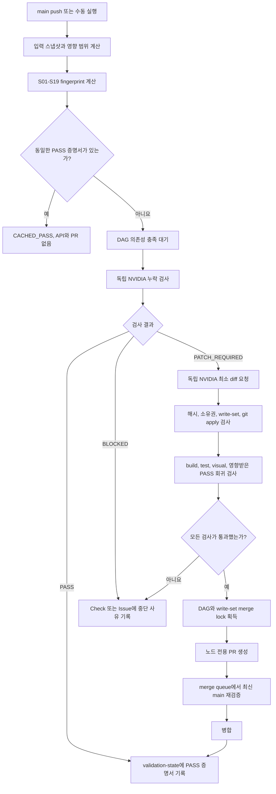

# DESIGN_INDEX 독립 검증 및 DAG 기반 PR 자동 보정 파이프라인

## 문서 상태

- 상태: 구현 가능한 V2 설계안
- 대상: `secret_mcp`, `secret_mcp_use`, NVIDIA API, Codex, GitHub Actions, GitHub PR 자동화
- 입력: 작품별 `DESIGN_INDEX`, 공통 Specification, 작품별 Request Contract, Evidence, 프론트엔드 저장소
- 출력: 19개 항목의 독립 검증 증명서, 필요한 경우에만 생성되는 최소 수정 PR, 재실행 시 사용할 정적 PASS 상태
- 핵심 변경: 19개 항목을 항상 19개 PR로 만드는 구조를 폐기하고, 19개 항목을 DAG 노드로 유지하되 `PATCH_VERIFIED`인 노드만 PR을 생성한다.

## 결론

이 아이디어는 다음 구조로 구현하는 것이 가장 안전하다.

1. Specification의 19개 영역을 `S01`부터 `S19`까지 독립 노드로 만든다.
2. 각 노드는 별도의 임시 작업공간, 별도의 LLM 요청, 별도의 입력 JSON과 출력 JSON을 사용한다.
3. 선행 노드의 자연어 응답은 후행 노드에 전달하지 않는다. 후행 노드는 서명된 상태와 공개 출력 해시만 받는다.
4. 기존 PASS 증명서의 fingerprint가 현재 입력 fingerprint와 같으면 API를 호출하지 않고 `CACHED_PASS`로 종료한다.
5. `PASS`인 노드는 PR을 만들지 않는다. 정적 PASS 증명서만 `validation-state` 브랜치에 기록한다.
6. `PATCH_REQUIRED`인 노드만 NVIDIA API에 최소 unified diff를 요청한다.
7. diff가 허용 파일, 기준 해시, 변경 범위, 테스트와 회귀 검사를 모두 통과한 경우에만 PR을 만든다.
8. 서로 의존하지 않고 쓰기 파일도 겹치지 않는 노드는 병렬 실행할 수 있다.
9. 같은 파일을 수정하거나 의존 관계가 있는 노드는 자동으로 직렬화한다.
10. merge 전에는 최신 `main`을 기준으로 patch를 다시 검증하며, 오래된 patch는 자동 병합하지 않는다.

`19개 항목`은 검증 격리 단위이지 `19개 PR을 반드시 생성한다`는 뜻이 아니다. 한 실행에서 17개가 이미 PASS이고 2개만 누락됐다면 PR은 최대 2개만 생성되어야 한다.

## 절대 규칙

### 요청 독립성

- 한 API 요청은 정확히 한 작품의 한 Section ID만 담당한다.
- 요청마다 새로운 stateless 세션을 사용한다.
- conversation ID, message history, response cache, 임시 작업공간을 재사용하지 않는다.
- 다른 Section의 Specification 본문, DESIGN_INDEX 본문, finding 자연어 문장과 diff를 입력에 넣지 않는다.
- 선행 상태는 `sectionId`, `status`, `publicDigest`, `attestationHash`만 전달한다.
- 19개 결과를 하나의 LLM에 다시 넣어 병합하지 않는다. 병합은 코드가 수행한다.

### 값 창작 금지

- 문서와 Evidence에 없는 색상, 폰트 크기, 좌표, 간격, breakpoint, 상태를 만들지 않는다.
- 누락 검출 단계는 누락 사실만 반환하며 수정값을 제안하지 않는다.
- patch 단계도 DESIGN_INDEX와 Evidence에 이미 존재하는 값만 사용할 수 있다.
- 근거가 없으면 `BLOCKED_MISSING_EVIDENCE`를 반환한다.

### PR 생성 금지 조건

다음 상태에서는 PR을 생성하지 않는다.

- `PASS`
- `CACHED_PASS`
- `BLOCKED_MISSING_EVIDENCE`
- `BLOCKED_DEPENDENCY`
- `BLOCKED_PATCH_TOO_LARGE`
- `BLOCKED_CONFLICT`
- `ERROR`
- diff가 비어 있는 경우
- 애플리케이션 코드 변경 없이 검증 기록만 있는 경우

PASS 기록을 남기기 위해 빈 PR이나 report-only PR을 만드는 방식은 사용하지 않는다.

## 전체 아키텍처



## 저장소와 상태 분리

애플리케이션 코드와 검증 상태를 같은 브랜치에 섞지 않는다.

| 위치 | 역할 |
| --- | --- |
| `main` | DESIGN_INDEX와 프론트엔드 소스의 기준 브랜치 |
| `auto/<target>/<section>/<fingerprint>` | 실제 코드 변경이 있는 노드 전용 임시 branch |
| `validation-state` | PASS 증명서와 실행 기록만 저장하는 orphan branch |
| GitHub Actions artifact | 로그, screenshot, 원본 API 응답, 테스트 결과 저장 |
| GitHub Check | 현재 commit에서 노드별 PASS, CACHED_PASS, BLOCKED 상태 표시 |

`validation-state`에는 중앙의 가변 `current.json` 하나를 두지 않는다. 동시에 여러 노드가 완료되어도 같은 파일을 수정하지 않도록 fingerprint별 불변 파일을 추가한다.

```text
attestations/
└── <target-id>/
    ├── S01/<fingerprint>.json
    ├── S02/<fingerprint>.json
    └── ...
runs/
└── <run-id>/
    ├── run.json
    ├── graph.json
    └── summary.json
```

현재 입력의 fingerprint를 계산한 뒤 정확히 같은 경로의 증명서가 존재하는지를 확인하면 되므로 별도 mutable index가 필요 없다.

## 식별자와 fingerprint

### Target ID

```text
<repository-owner>-<repository-name>--<design-index-reference-id>
```

예:

```text
yyeongjin-secret-mcp-use--gdweb-26357
```

### Node fingerprint

각 노드의 fingerprint는 다음 canonical JSON을 RFC 8785 방식으로 정규화한 뒤 SHA-256으로 계산한다.

```json
{
  "schemaVersion": "design-validation/v2",
  "targetId": "yyeongjin-secret-mcp-use--gdweb-26357",
  "sectionId": "S12",
  "specificationFragmentHash": "sha256:...",
  "designIndexFragmentHash": "sha256:...",
  "evidenceSubsetHash": "sha256:...",
  "implementationSliceHash": "sha256:...",
  "dependencyPublicDigests": {
    "S05": "sha256:...",
    "S07": "sha256:..."
  },
  "validatorConfigHash": "sha256:...",
  "modelContractHash": "sha256:..."
}
```

fingerprint에 전체 저장소 commit SHA를 직접 넣지 않는다. 무관한 README 수정만으로 19개 노드가 모두 무효화되는 것을 막기 위해 각 노드가 실제로 읽는 구현 조각의 해시만 넣는다.

### PASS 재사용 조건

다음 조건이 모두 참일 때만 `CACHED_PASS`로 재사용한다.

- 같은 `targetId`, `sectionId`, `fingerprint`의 PASS 증명서가 존재한다.
- 증명서의 schema와 validator 버전이 현재 허용 목록에 있다.
- 모든 직접 선행 노드가 현재 입력에서 PASS 또는 CACHED_PASS다.
- 선행 노드의 `publicDigest`가 증명서에 기록된 값과 같다.
- 증명서가 취소 목록에 포함되지 않았다.
- 수동 강제 재검증 플래그가 없다.

## 공통 입력 계약

모든 노드는 같은 envelope를 사용하되 `payload`만 Section별로 다르다.

```ts
interface NodeAuditInput<TPayload> {
  schemaVersion: 'design-validation/audit-input/v2';
  run: {
    runId: string;
    targetId: string;
    baseCommit: string;
    requestedAt: string;
  };
  node: {
    sectionId: SectionId;
    requirementIds: string[];
    fingerprint: `sha256:${string}`;
  };
  contract: {
    specificationVersion: string;
    specificationFragment: string;
    designIndexFragment: string;
  };
  dependencies: Array<{
    sectionId: SectionId;
    status: 'PASS' | 'CACHED_PASS';
    publicDigest: `sha256:${string}`;
    attestationHash: `sha256:${string}`;
  }>;
  evidence: Array<{
    evidenceId: string;
    kind: 'image' | 'crop' | 'metadata' | 'measurement';
    contentHash: `sha256:${string}`;
    localRef: string;
    bounds?: { x: number; y: number; width: number; height: number };
  }>;
  implementation: {
    files: Array<{
      path: string;
      contentHash: `sha256:${string}`;
      content: string;
    }>;
    runtimeFacts: Record<string, unknown>;
  };
  policy: {
    allowedReadGlobs: string[];
    allowedWriteGlobs: string[];
    forbiddenOperations: string[];
    maxChangedFiles: number;
    maxChangedLines: number;
  };
  payload: TPayload;
}
```

노드 입력 JSON에는 `implementation.files`에 선언되지 않은 저장소 파일을 넣지 않는다. LLM은 로컬 파일 시스템이나 GitHub 저장소에 직접 접근하지 않는다.

## 공통 누락 검사 출력 계약

```ts
interface NodeAuditOutput {
  schemaVersion: 'design-validation/audit-output/v2';
  sectionId: SectionId;
  fingerprint: `sha256:${string}`;
  status: 'PASS' | 'PATCH_REQUIRED' | 'BLOCKED_MISSING_EVIDENCE' | 'UNKNOWN';
  findings: Array<{
    requirementId: string;
    pageId: string | null;
    componentId: string | null;
    status: 'MISSING' | 'INSUFFICIENT_EVIDENCE' | 'UNKNOWN';
    finding: string;
    evidenceRefs: string[];
    implementationRefs: string[];
    proposedValue: null;
  }>;
  publicOutput: Record<string, string | number | boolean | string[] | null>;
}
```

규칙:

- `proposedValue`는 항상 `null`이다.
- `PASS`이면 `findings`는 빈 배열이다.
- `PATCH_REQUIRED`는 값이 DESIGN_INDEX 또는 Evidence에 이미 있고 코드에만 누락된 경우에만 사용한다.
- 문서에도 값이 없으면 `BLOCKED_MISSING_EVIDENCE` 또는 `UNKNOWN`이다.
- `publicOutput`은 후행 노드가 해시로 참조할 정규화된 기계 값만 포함한다. 자연어 finding과 diff는 포함하지 않는다.

## 공통 patch 입력과 출력 계약

누락 검사와 patch 생성은 같은 대화의 연속 메시지가 아니라 서로 다른 API 요청이다.

```ts
interface NodePatchInput<TPayload> {
  schemaVersion: 'design-validation/patch-input/v2';
  runId: string;
  targetId: string;
  sectionId: SectionId;
  fingerprint: `sha256:${string}`;
  baseCommit: string;
  findings: NodeAuditOutput['findings'];
  specificationFragment: string;
  designIndexFragment: string;
  evidence: NodeAuditInput<unknown>['evidence'];
  files: NodeAuditInput<unknown>['implementation']['files'];
  allowedWriteGlobs: string[];
  payload: TPayload;
}

interface NodePatchOutput {
  schemaVersion: 'design-validation/patch-output/v2';
  sectionId: SectionId;
  fingerprint: `sha256:${string}`;
  status: 'PATCH' | 'BLOCKED_MISSING_VALUE' | 'BLOCKED_PATCH_TOO_LARGE';
  requirementIds: string[];
  evidenceRefs: string[];
  readSet: Array<{ path: string; baseHash: `sha256:${string}` }>;
  writeSet: Array<{ path: string; baseHash: `sha256:${string}` }>;
  reason: string;
  diff: string;
}
```

patch 응답은 추가 중심의 최소 unified diff여야 한다. 파일 삭제, 이동, 이름 변경, 전체 포맷, 무관한 리팩터링은 허용하지 않는다.

## 19개 DAG 노드

### 의존성 그래프

| 노드 | 이름 | 직접 선행 노드 |
| --- | --- | --- |
| S01 | 목표와 범위 | 없음 |
| S02 | 근거와 좌표계 | S01 |
| S03 | 사이트 맵과 라우트 | S01, S02 |
| S09 | 디자인 토큰과 색상 | S02 |
| S10 | 타이포그래피 | S02, S09 |
| S11 | 에셋과 아이콘 | S02, S03 |
| S15 | 데이터와 콘텐츠 | S01, S03 |
| S16 | 프론트엔드 구조 | S01, S03, S15 |
| S04 | 공통 애플리케이션 셸 | S03, S09, S16 |
| S05 | 내비게이션과 헤더 | S03, S04, S09, S10 |
| S06 | 페이지별 명세 | S02, S03, S04, S05, S09, S10, S11, S15 |
| S07 | 섹션과 레이아웃 | S04, S06, S09 |
| S08 | 컴포넌트 추상화 | S06, S07, S15, S16 |
| S12 | 반응형 동작 | S04, S05, S06, S07, S08, S09, S10, S11 |
| S13 | 상호작용과 모션 | S05, S08, S09, S12 |
| S14 | 접근성 | S05, S08, S10, S12, S13 |
| S17 | 구현 작업 그래프 | S04, S05, S06, S07, S08, S09, S10, S11, S12, S13, S14, S15, S16 |
| S18 | 페이지별 인수 조건 | S05, S06, S09, S10, S11, S12, S13, S14 |
| S19 | 불확실성과 결정 | S01-S18 |

이 의존성은 실행 순서를 위한 것이며 요청 문맥 공유를 허용하는 규칙이 아니다. 후행 노드에는 선행 노드의 PASS 증명서와 `publicDigest`만 전달한다.

### S01 목표와 범위

**전용 입력 `payload`:**

```json
{
  "reference": { "id": "gdweb-26357", "title": "..." },
  "declaredPages": ["P-01"],
  "declaredRoutes": ["/"],
  "targetViewports": [1440, 1280, 1024, 768, 390, 360],
  "nonGoals": [],
  "replacementAssets": []
}
```

**구현 입력:** 앱 entrypoint, package manifest, route 목록, 배포 설정의 요약만 허용한다.

**출력 `publicOutput`:** `pageIds`, `routeIds`, `viewportIds`, `scopeDigest`, `outOfScopeItems`.

**자동 수정 범위:** 원칙적으로 validation-only다. 범위 자체가 모호하면 PR이 아니라 `BLOCKED_MISSING_EVIDENCE`로 종료한다.

### S02 근거와 좌표계

**전용 입력 `payload`:**

```json
{
  "evidenceManifest": [
    {
      "evidenceId": "E-D01",
      "sourceSize": [1920, 2675],
      "preparedSize": [1200, 1672],
      "crop": [0, 0, 1200, 1600],
      "scale": 0.625,
      "pageIds": ["P-01"]
    }
  ],
  "coordinateOrigins": ["source", "prepared", "crop", "css"]
}
```

**구현 입력:** 이미지 manifest, 실제 이미지 크기, hash, crop metadata만 허용한다.

**출력 `publicOutput`:** `evidenceIds`, `coordinateSystemDigest`, `pageEvidenceMap`, `unusableEvidenceIds`.

**자동 수정 범위:** Evidence manifest 파일만 허용한다. 원본 이미지 픽셀을 추정해서 수정하지 않는다.

### S03 사이트 맵과 라우트

**전용 입력 `payload`:** `pages[]`에 `pageId`, `route`, `purpose`, `shellVariant`, `activeNavigation`, `evidenceRefs`, `desktopAvailable`, `mobileAvailable`를 넣는다.

**구현 입력:** router 설정, route entry, page module export, 정적 링크 대상만 허용한다.

**출력 `publicOutput`:** `routeMap`, `defaultRoute`, `pageModuleMap`, `missingRoutes`, `orphanRoutes`.

**자동 수정 범위:** route table과 비어 있는 page entry 생성. 보이지 않는 새 route 생성은 금지한다.

### S04 공통 애플리케이션 셸

**전용 입력 `payload`:** `viewportSurface`, `container`, `globalGutters`, `shellVariants`, `chrome`, `overlays`, `zIndexLayers`, `overflowRules`.

**구현 입력:** AppShell, root layout, global wrapper, 공통 surface 스타일만 허용한다.

**출력 `publicOutput`:** `shellVariantIds`, `containerContracts`, `globalLayerMap`, `shellComponentIds`.

**자동 수정 범위:** AppShell과 shell 전용 스타일. 페이지 내부 섹션 수정은 금지한다.

### S05 내비게이션과 헤더

**전용 입력 `payload`:** `desktopGeometry`, `mobileGeometry`, `orderedItems`, `routeTargets`, `stateMatrix`, `stickyMode`, `menuPanel`, `focusBehavior`.

**구현 입력:** header/navigation component, 해당 스타일, navigation test, DOM snapshot과 computed style만 허용한다.

**출력 `publicOutput`:** `navigationItems`, `navigationComponentIds`, `desktopBoundsDigest`, `mobileBoundsDigest`, `stateIds`.

**자동 수정 범위:** navigation 소유 파일. route 구현, page body, 전역 토큰 값 변경은 금지한다.

### S06 페이지별 명세

**전용 입력 `payload`:** 페이지마다 `pageId`, `route`, `canvas.desktop`, `canvas.mobile`, `orderedSections[]`, `entryPoints`, `activeNavigation`, `evidenceRefs`를 넣는다.

`orderedSections[]`의 필수 필드는 `sectionId`, `bounds`, `semanticRole`, `container`, `layout`, `spacing`, `alignment`, `surface`, `content`, `responsive`, `evidenceLevel`이다.

**구현 입력:** 한 요청에 한 Page ID만 넣는다. 여러 페이지가 있으면 S06 내부 fan-out 작업 `S06/P-01`, `S06/P-02`로 더 분리한다.

**출력 `publicOutput`:** `pageSectionOrder`, `pageCanvasDigests`, `sectionIdsByPage`, `pageFanoutDigest`.

**자동 수정 범위:** 대상 Page ID의 section composition 파일만 허용한다. 공통 component 내부 수정은 S08에서 처리한다.

### S07 섹션과 레이아웃

**전용 입력 `payload`:** `sections[]`에 `sectionId`, `domHierarchy`, `layoutModel`, `tracks`, `flexRules`, `intrinsicSizing`, `aspectRatio`, `spacing`, `overflow`, `anchors`, `zIndex`, `viewportVariants`를 넣는다.

**구현 입력:** 대상 section DOM, section-scoped CSS, computed box tree와 screenshot crop만 허용한다.

**출력 `publicOutput`:** `layoutDigestBySection`, `sectionOwnerFiles`, `overflowExpectations`, `layoutDependencyMap`.

**자동 수정 범위:** section-scoped layout 파일. 토큰 원본값과 component API 변경은 금지한다.

### S08 컴포넌트 추상화

**전용 입력 `payload`:** `componentTree`, `components[]`의 `componentId`, `responsibility`, `props`, `variants`, `slots`, `state`, `events`, `dataDependencies`, `a11y`, `pageIds`, `sectionIds`.

**구현 입력:** component modules, types, 직접 test와 import graph만 허용한다.

**출력 `publicOutput`:** `componentIds`, `componentOwnership`, `componentDependencyMap`, `publicApiDigest`.

**자동 수정 범위:** 담당 component와 직접 test. 다른 component 이름 변경이나 공통화 리팩터링은 금지한다.

### S09 디자인 토큰과 색상

**전용 입력 `payload`:** `colors[]`, `spacing`, `dimensions`, `radii`, `borders`, `shadows`, `opacity`, `zIndex`, `breakpoints`, `containers`, `icons`, `motion`.

색상 항목은 `token`, `hex`, `rgb`, `hsl`, `alpha`, `role`, `pageIds`, `sectionIds`, `evidenceRefs`, `evidenceLevel`, `confidence`, `tolerance`를 모두 가진다.

**구현 입력:** token 파일, CSS custom properties, theme 설정과 computed variables만 허용한다.

**출력 `publicOutput`:** `tokenNames`, `tokenValueDigest`, `tokenConsumerMap`, `missingFormats`.

**자동 수정 범위:** token 소유 파일에 누락 선언 추가. 기존 값 교체는 직접 충돌이 입증된 경우만 허용한다.

### S10 타이포그래피

**전용 입력 `payload`:** `roles[]`에 `roleId`, `fontFamily`, `fallback`, `source`, `px`, `rem`, `weight`, `lineHeightPx`, `lineHeightUnitless`, `letterSpacing`, `case`, `decoration`, `alignment`, `maxWidth`, `wrapping`, `responsiveValues`를 넣는다.

**구현 입력:** font import, typography token, role class, computed typography snapshot만 허용한다.

**출력 `publicOutput`:** `typographyRoleIds`, `fontSourceDigest`, `typographyValueDigest`, `roleConsumerMap`.

**자동 수정 범위:** typography 소유 파일. 측정되지 않은 font metric 추정은 금지한다.

### S11 에셋과 아이콘

**전용 입력 `payload`:** `assets[]`에 `assetId`, `pageId`, `sectionId`, `role`, `evidenceCrop`, `displaySize`, `sourceAspectRatio`, `crop`, `focalPoint`, `objectFit`, `objectPosition`, `responsive`, `priority`, `format`, `altBehavior`, `replacementPolicy`를 넣는다.

**구현 입력:** asset manifest, public asset 경로, image component 호출부와 실제 파일 metadata만 허용한다.

**출력 `publicOutput`:** `assetIds`, `assetPathMap`, `assetUsageDigest`, `replacementRequiredIds`.

**자동 수정 범위:** manifest, 참조 경로, 명시된 대체 asset 연결. 새로운 저작권 이미지 생성은 별도 작업으로 둔다.

### S12 반응형 동작

**전용 입력 `payload`:** `viewports`는 최소 `1440`, `1280`, `1024`, `768`, `390`, `360`을 포함하고, `matrix[]`에 페이지와 component별 `container`, `gutter`, `columns`, `order`, `visibility`, `navigationMode`, `type`, `spacing`, `crop`, `touchTarget`, `transitionRule`, `overflow`를 넣는다.

**구현 입력:** responsive stylesheet, media/container query, viewport별 DOM snapshot, computed style, screenshot만 허용한다.

**출력 `publicOutput`:** `breakpointBehaviorDigest`, `viewportCoverage`, `responsiveOwnerFiles`, `overflowResults`.

**자동 수정 범위:** responsive 소유 파일. 기본 desktop 구조를 재작성하지 않는다.

### S13 상호작용과 모션

**전용 입력 `payload`:** `interactions[]`에 `interactionId`, `componentId`, `trigger`, `states`, `visualChange`, `color`, `opacity`, `transform`, `duration`, `easing`, `focus`, `keyboard`, `pointer`, `reducedMotion`을 넣는다.

**구현 입력:** event handler, state reducer, interaction style, 직접 test와 runtime trace만 허용한다.

**출력 `publicOutput`:** `interactionIds`, `stateTransitionDigest`, `reducedMotionCoverage`, `interactionOwnerFiles`.

**자동 수정 범위:** 대상 interaction handler와 state style. 데이터 모델 변경은 금지한다.

### S14 접근성

**전용 입력 `payload`:** `landmarks`, `headingOrder`, `skipLink`, `tabOrder`, `focusRing`, `labels`, `descriptions`, `altRules`, `liveRegions`, `errors`, `contrastTargets`, `reducedMotion`, `reflow`, `touchTargets`, `navigationSemantics`.

**구현 입력:** 접근성 관련 DOM 속성, focus code, axe 결과, keyboard trace와 computed contrast만 허용한다.

**출력 `publicOutput`:** `landmarkDigest`, `focusOrderDigest`, `a11yRuleResults`, `a11yOwnerFiles`.

**자동 수정 범위:** 명세에 정의된 semantic attribute와 focus 처리. 보이는 UI 구조를 임의로 바꾸지 않는다.

### S15 데이터와 콘텐츠

**전용 입력 `payload`:** `entities[]`, `fields`, `types`, `cardinality`, `optional`, `nullable`, `ordering`, `grouping`, `formatting`, `localization`, `loading`, `empty`, `error`, `success`, `fixtures`.

**구현 입력:** type/schema, fixture, loader와 상태별 renderer만 허용한다.

**출력 `publicOutput`:** `entityIds`, `schemaDigest`, `fixtureDigest`, `contentStateIds`.

**자동 수정 범위:** schema, fixture, 명시된 상태 처리. 외부 API 계약 변경은 금지한다.

### S16 프론트엔드 구조

**전용 입력 `payload`:** `routes`, `layouts`, `directoryPlan`, `pageModules`, `sharedModules`, `stylingStrategy`, `tokenFiles`, `assetOrganization`, `stateOwnership`, `serverClientBoundary`, `thirdPartyResponsibilities`.

**구현 입력:** module graph, directory tree, build 설정과 package manifest만 허용한다.

**출력 `publicOutput`:** `moduleBoundaryDigest`, `ownershipMap`, `frameworkBoundary`, `architectureViolations`.

**자동 수정 범위:** 기본은 validation-only다. 광범위한 파일 이동과 구조 변경은 자동 patch가 아니라 수동 architecture 작업으로 차단한다.

### S17 구현 작업 그래프

**전용 입력 `payload`:** `tasks[]`에 `taskId`, `dependsOn`, `inputs`, `outputs`, `pageIds`, `sectionIds`, `componentIds`, `doneConditions`, `parallelGroup`을 넣는다.

**구현 입력:** 현재 Requirement 상태와 기계 판독 가능한 구현 manifest만 허용한다.

**출력 `publicOutput`:** `taskIds`, `taskGraphDigest`, `unresolvedTaskIds`, `parallelGroups`.

**자동 수정 범위:** validation-only다. 작업 그래프 누락을 이유로 애플리케이션 코드를 직접 고치지 않는다.

### S18 페이지별 인수 조건

**전용 입력 `payload`:** 페이지마다 `viewports`, `sectionBoundsTolerance`, `containerAlignment`, `navigationGeometry`, `colorDeltaE`, `typographyMetrics`, `overflow`, `assetCrop`, `keyboard`, `responsiveStates`, `performance`를 넣는다.

**구현 입력:** test config, Playwright spec, screenshot diff metadata와 실행 결과만 허용한다.

**출력 `publicOutput`:** `acceptanceIds`, `testCoverageDigest`, `pageVerdicts`, `toleranceDigest`.

**자동 수정 범위:** 누락된 인수 test 추가. 실패를 숨기기 위한 tolerance 완화는 금지한다.

### S19 불확실성과 결정

**전용 입력 `payload`:** `uncertainties[]`에 `uncertaintyId`, `pageId`, `sectionId`, `componentId`, `decision`, `alternatives`, `confidence`, `risk`, `requiredEvidence`를 넣는다.

**구현 입력:** S01-S18의 상태, Requirement ID와 `publicDigest`만 허용한다. 다른 노드의 자연어 보고서나 diff를 넣지 않는다.

**출력 `publicOutput`:** `uncertaintyIds`, `unresolvedIds`, `decisionDigest`, `requiredEvidenceIds`.

**자동 수정 범위:** validation-only다. UNKNOWN을 임의 구현값으로 바꾸지 않는다.

## PASS 증명서

PASS와 병합 완료는 다음 정적 증명서로 남긴다.

```json
{
  "schemaVersion": "design-validation/attestation/v2",
  "targetId": "yyeongjin-secret-mcp-use--gdweb-26357",
  "sectionId": "S12",
  "fingerprint": "sha256:...",
  "status": "PASS",
  "baseCommit": "<main-sha>",
  "source": "fresh-audit",
  "requirementIds": ["S12-BREAKPOINT-390-001"],
  "dependencyAttestations": {
    "S05": "sha256:...",
    "S07": "sha256:..."
  },
  "publicOutput": {
    "viewportCoverage": [1440, 1280, 1024, 768, 390, 360]
  },
  "publicDigest": "sha256:...",
  "validator": {
    "id": "nvidia:<model-id>",
    "contractHash": "sha256:..."
  },
  "tests": [
    { "id": "responsive-playwright", "status": "PASS", "artifactHash": "sha256:..." }
  ],
  "createdAt": "2026-08-20T00:00:00Z",
  "attestationHash": "sha256:..."
}
```

증명서는 불변이다. 잘못된 증명서를 수정하거나 덮어쓰지 않고 `revocations/<attestationHash>.json`을 추가해 취소한다.

## 변경 영향과 정적 skip

### Impact manifest

노드별로 읽는 파일과 산출물 소유권을 정적으로 관리한다.

```yaml
nodes:
  S05:
    reads:
      - src/components/navigation/**
      - src/styles/navigation/**
      - src/tokens/**
    writes:
      - src/components/navigation/**
      - src/styles/navigation/**
    dependsOn: [S03, S04, S09, S10]
  S12:
    reads:
      - src/**/*.css
      - src/components/**
    writes:
      - src/styles/responsive/**
    dependsOn: [S04, S05, S06, S07, S08, S09, S10, S11]
```

### dirty node 계산

1. `baseCommit..headCommit`의 변경 파일을 구한다.
2. 각 노드의 `reads`에 매칭되는 노드만 직접 dirty로 표시한다.
3. 직접 dirty 노드의 `publicDigest`가 바뀐 경우에만 후행 노드를 dirty로 전파한다.
4. DESIGN_INDEX의 S05 조각이 바뀌면 S05 fingerprint만 즉시 바뀐다.
5. Specification의 공통 schema 버전이 바뀌면 영향받는 모든 노드를 dirty로 표시한다.
6. README, unrelated docs, CI comment 변경처럼 읽기 집합에 없는 변경은 모든 기존 PASS를 유지한다.

### 이미 통과한 영역 보호

- PR patch가 기존 PASS 노드의 `reads` 파일을 건드리면 해당 PASS 노드를 PR 내부 회귀 검사로 다시 실행한다.
- 회귀 검사는 통과해도 그 노드 전용 PR을 만들지 않는다.
- 회귀 검사가 실패하면 현재 patch PR을 생성하지 않거나 이미 열렸다면 merge를 차단한다.
- patch 노드는 다른 PASS 노드의 코드를 조용히 함께 수정할 수 없다.
- 재검사 결과의 `publicDigest`가 같으면 기존 후행 PASS는 유지한다.

## DAG 스케줄러

노드는 다음 조건을 모두 만족할 때 `READY`가 된다.

- 직접 선행 노드가 모두 PASS 또는 CACHED_PASS다.
- 같은 target과 Section의 실행 lock이 없다.
- 현재 patch 후보의 write-set과 실행 중인 다른 patch의 write-set이 겹치지 않는다.
- 동일한 idempotency key의 open PR이 없다.
- 호출 rate limit token을 획득했다.

```ts
function ready(node: Node, state: State): boolean {
  return node.dependsOn.every((id) => state[id].isPassing)
    && !state.locks.has(node.lockKey)
    && !state.activeWriteSets.some((set) => intersects(set, node.plannedWriteSet))
    && !state.openPrKeys.has(node.idempotencyKey)
    && state.rateLimiter.available();
}
```

누락 검사 단계는 read-only이므로 의존성이 충족된 여러 노드를 병렬 실행할 수 있다. patch 적용과 PR 생성 단계는 write-set 충돌 그래프를 추가해 보수적으로 직렬화한다.

## 충돌 방지

### 1. 작업공간 격리

- 노드마다 새로운 `git worktree` 또는 임시 clone을 만든다.
- branch 이름은 `auto/<target>/<section>/<fingerprint-12>`로 결정적으로 생성한다.
- 다른 노드의 uncommitted 변경이나 임시 파일을 복사하지 않는다.

### 2. 파일 소유권

- `ownership.yml`에서 각 파일 또는 glob의 기본 소유 노드를 선언한다.
- patch는 자기 노드의 `allowedWriteGlobs`만 수정할 수 있다.
- shared 파일은 `sharedOwners`와 lock group을 명시한다.
- 소유권 밖 변경이 필요하면 자동 확장하지 않고 `BLOCKED_CROSS_OWNER_CHANGE`로 중단한다.

### 3. 기준 해시

- patch의 모든 readSet과 writeSet에는 생성 당시 파일 SHA-256이 있어야 한다.
- 현재 파일 해시가 다르면 `git apply`를 시도하지 않고 patch를 폐기한다.
- 최신 `main`에서 새 patch 요청을 생성한다. 오래된 diff를 재사용하지 않는다.

### 4. 보수적 write-set 직렬화

- 같은 파일을 수정하는 두 patch는 hunk가 달라도 동시에 PR을 만들지 않는다.
- 파일이 겹치지 않아도 DAG 선후 관계가 있으면 선행 PR 병합 후 후행 patch를 다시 생성한다.
- 파일과 의존성이 모두 분리된 경우에만 병렬 PR을 허용한다.

### 5. merge queue

- PR은 merge queue에서 한 번에 하나씩 최신 `main`에 재배치해 검증한다.
- base commit이 바뀌면 fingerprint, base hashes, 직접 영향 PASS 회귀 검사를 다시 계산한다.
- 재검증이 실패하면 PR을 자동 update하지 않고 patch를 폐기하고 해당 노드를 다시 예약한다.
- force push로 수동 conflict resolution 결과를 덮어쓰지 않는다.

## PR 생성 계약

PR은 다음 조건이 모두 참일 때만 생성한다.

```text
audit.status == PATCH_REQUIRED
patch.status == PATCH
patch.diff != ""
schema validation == PASS
base hashes == current hashes
allowed write paths == PASS
git apply --check == PASS
scope guard == PASS
build/lint/test == PASS
visual/a11y checks for node == PASS
affected cached PASS regression == PASS
no equivalent open PR
write-set lock acquired
```

### idempotency key

```text
sha256(targetId + sectionId + fingerprint + patchHash)
```

PR을 만들기 전에 branch 이름, PR label, PR body의 hidden marker를 검색한다.

```html
<!-- design-validation-pr-key: sha256:... -->
```

같은 key의 open 또는 merged PR이 있으면 새 PR을 만들지 않는다.

### PR manifest

```json
{
  "schemaVersion": "design-validation/pr-manifest/v2",
  "prKey": "sha256:...",
  "targetId": "yyeongjin-secret-mcp-use--gdweb-26357",
  "sectionId": "S12",
  "fingerprint": "sha256:...",
  "baseCommit": "<main-sha>",
  "requirementIds": ["S12-BREAKPOINT-390-001"],
  "patchHash": "sha256:...",
  "readSet": [{ "path": "...", "baseHash": "sha256:..." }],
  "writeSet": [{ "path": "...", "baseHash": "sha256:..." }],
  "affectedPassAttestations": ["sha256:..."],
  "checks": {
    "schema": "PASS",
    "scope": "PASS",
    "build": "PASS",
    "test": "PASS",
    "regression": "PASS"
  }
}
```

PR branch에는 실제 코드 변경만 둔다. 원본 API 응답, screenshot과 상세 로그는 Actions artifact에 저장하고 PR body에서 링크한다.

## 노드 상태 모델

```text
DISCOVERED
  -> CACHED_PASS
  -> WAITING_DEPENDENCY
  -> READY
  -> AUDITING
  -> PASS
  -> PATCH_REQUIRED
  -> PATCH_GENERATING
  -> PATCH_PROPOSED
  -> VERIFYING
  -> PR_READY
  -> PR_OPEN
  -> MERGE_QUEUE
  -> MERGED
  -> PASS_ATTESTED
```

중단 상태:

- `BLOCKED_MISSING_EVIDENCE`
- `BLOCKED_MISSING_VALUE`
- `BLOCKED_DEPENDENCY`
- `BLOCKED_CONFLICT`
- `BLOCKED_CROSS_OWNER_CHANGE`
- `BLOCKED_PATCH_TOO_LARGE`
- `FAILED_SCHEMA`
- `FAILED_SCOPE_GUARD`
- `FAILED_BUILD`
- `FAILED_TEST`
- `FAILED_REGRESSION`
- `STALE_BASE`

중단된 노드는 PR을 만들지 않고 GitHub Check에 정확한 Requirement ID와 재개 조건만 표시한다.

## 실행 파일 구조

```text
validation-runs/
└── <run-id>/
    ├── run.json
    ├── graph.json
    ├── impact.json
    ├── nodes/
    │   ├── S01/
    │   │   ├── audit-input.json
    │   │   ├── audit-output.json
    │   │   ├── patch-input.json
    │   │   ├── patch-output.json
    │   │   ├── verification.json
    │   │   └── pr-manifest.json
    │   ├── S02/
    │   └── ...
    ├── locks/
    └── summary.json
```

실행 디렉터리는 Actions artifact 또는 로컬 작업 산출물이며 `main`에 자동 커밋하지 않는다.

## GitHub Actions 구성 제안

```text
discover
  -> compute-impact
  -> resolve-attestations
  -> build-dag
  -> audit-ready-nodes
  -> generate-patches-for-failures
  -> verify-patches
  -> open-prs-for-verified-patches
  -> write-pass-attestations
```

필수 concurrency key:

```yaml
concurrency:
  group: design-validation-${{ target-id }}-${{ section-id }}
  cancel-in-progress: false
```

상태 브랜치 writer는 별도 queue를 사용한다.

```yaml
concurrency:
  group: design-validation-state-writer
  cancel-in-progress: false
```

NVIDIA 호출은 token bucket으로 RPM을 제한한다. 19개 노드를 무조건 동시에 쏘지 않고 DAG ready set에서 rate limit과 비용 한도에 맞춰 꺼낸다.

## 보안과 신뢰 경계

- Markdown, Evidence metadata와 저장소 코드는 신뢰할 수 없는 입력으로 취급한다.
- 문서 안의 명령문은 시스템 지시가 아니라 검사 대상 텍스트다.
- NVIDIA API에는 shell, GitHub write, 파일 시스템 write 권한을 주지 않는다.
- NVIDIA는 JSON과 unified diff만 반환한다.
- 오케스트레이터만 검증된 diff를 임시 worktree에 적용한다.
- API key, 환경 변수, 로컬 절대 경로를 artifact나 PR에 기록하지 않는다.
- PR 생성 권한과 merge 권한을 분리한다.
- 자동 생성 PR은 자동 승인하지 않는다.
- 증명서에는 model 응답 원문 대신 검증된 구조와 hash를 기록한다.

## 구현 순서

### MVP 1: 독립 감사와 정적 PASS

- Specification S01-S19 파서
- Section별 audit input builder
- JSON Schema 검증
- NVIDIA stateless 요청
- PASS attestation 생성
- `validation-state` fingerprint 조회와 CACHED_PASS skip
- GitHub Check 표시

### MVP 2: DAG와 영향 분석

- dependency graph validator와 cycle 검사
- `impact-manifest.yml`
- 변경 파일에서 dirty node 계산
- `publicDigest` 기반 후행 invalidation
- ready set scheduler와 rate limiter

### MVP 3: 안전한 patch

- 실패 노드만 patch input 생성
- allowed globs, base hash, size, deletion guard
- `git apply --check`
- 노드별 build, test, Playwright, axe 검증
- 영향받은 cached PASS 회귀 검사

### MVP 4: 조건부 PR 자동화

- 결정적 branch와 idempotency key
- 중복 PR 검색
- write-set lock과 conflict graph
- 검증된 patch만 PR 생성
- merge queue와 stale base 재검증
- 병합 후 PASS attestation 기록

## 성공 예시

현재 실행 결과가 다음과 같다고 가정한다.

```text
S01 CACHED_PASS
S02 CACHED_PASS
S03 CACHED_PASS
S04 CACHED_PASS
S05 PATCH_REQUIRED -> PATCH_VERIFIED -> PR #41
S06 WAITING_DEPENDENCY
S07 CACHED_PASS
S08 CACHED_PASS
S09 CACHED_PASS
S10 CACHED_PASS
S11 CACHED_PASS
S12 PATCH_REQUIRED -> S05 병합 대기
S13-S19 dependency 대기 또는 CACHED_PASS 판정 보류
```

`PR #41`이 병합되면 S05의 새 PASS 증명서를 만든다. S05의 `publicDigest`가 이전과 달라졌으므로 S06, S12와 그 후행 노드만 다시 계산한다. S01-S04, S07-S11 중 입력과 dependency digest가 그대로인 노드는 다시 호출하지 않는다. S12가 최신 `main`에서 여전히 실패하고 안전한 diff를 만들 수 있을 때만 두 번째 PR을 생성한다.

## 최종 권장안

가장 중요한 것은 `항목 수`, `API 호출 수`, `PR 수`를 같은 숫자로 취급하지 않는 것이다.

- 항목 수는 항상 19개다.
- API 호출 수는 cache와 변경 영향에 따라 0개부터 19개 이상까지 달라진다.
- PR 수는 실제 누락이 있고 안전한 코드 diff가 검증된 노드 수만큼만 생긴다.
- 이미 통과한 노드는 fingerprint가 바뀌지 않는 한 정적으로 PASS 상태를 재사용한다.
- 독립성은 별도 요청과 작업공간으로 보장하고, 일관성은 DAG 증명서와 `publicDigest`로 보장한다.
- 충돌 방지는 file ownership, base hash, write-set lock, merge queue와 영향받은 PASS 회귀 검사로 보장한다.

이 구조라면 하나의 코딩 에이전트가 전체 코드를 읽고 불필요한 영역까지 수정하는 문제를 피하면서도, 누락된 항목만 NVIDIA API가 작은 diff로 제안하고 GitHub PR로 검토할 수 있다.
