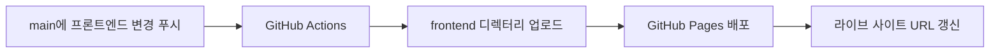

[English](README.md) | **한국어**

# Secret MCP Use

이 저장소는 [`yyeongjin/secret_mcp`](https://github.com/yyeongjin/secret_mcp)의 `DESIGN_INDEX` 명세 규칙 전체를 재사용 가능한 문서로 옮긴 저장소입니다. 하나의 GDWEB 작품과 이미지 근거를 구현 가능한 프론트엔드 명세로 변환할 때 LLM이 따라야 하는 규칙을 정의합니다.

단순한 스타일 요약으로 축약하지 않고 `secret-mcp/design-index/v2` 계약 전체를 보존합니다. 요청 격리, 근거 분류, 이미지 좌표, 페이지·라우트 분리, 내비게이션 좌표, 섹션 경계, 컴포넌트 계약, 정확한 색상, 타이포그래피, 에셋, 반응형 동작, 상호작용, 접근성, 프론트엔드 구조, 구현 작업, 시각 QA와 불확실성 처리 규칙을 모두 포함합니다.

## 문서

- [Complete DESIGN_INDEX Specification](DESIGN_INDEX_SPECIFICATION.md)
- [DESIGN_INDEX 전체 명세 규칙](DESIGN_INDEX_SPECIFICATION.ko.md)

## 핵심 계약

1. 검색 결과 하나는 하나의 독립된 LLM 요청으로 처리합니다.
2. 요청 하나에는 작품 하나의 메타데이터, 계약과 근거 이미지만 전달합니다.
3. 작품 하나마다 `DESIGN_INDEX_gdweb-<id>.md` 문서 하나를 생성합니다.
4. 작품 문서 안에서 확인되는 모든 페이지와 라우트를 서로 분리해 명세합니다.
5. 모든 주요 판단에는 `MEASURED`, `OBSERVED`, `INFERRED`, `UNKNOWN` 중 하나를 표시합니다.
6. 측정값이 뒤따르지 않는 모호한 시각 표현은 유효한 명세로 인정하지 않습니다.
7. 다른 LLM이 GDWEB을 다시 열거나 누락 수치를 몰래 지어내지 않고도 완성된 문서만으로 구현할 수 있어야 합니다.

## 권장 사용법

정확히 한 작품의 메타데이터와 근거 이미지에 전체 명세 문서를 함께 전달합니다. 계약 헤더와 근거 좌표표의 자리표시자를 실제 값으로 교체하고, 출력 언어를 지정한 뒤 완성된 Markdown 문서만 응답하도록 요청합니다.

전체 규칙의 영어 기준 문서는 [DESIGN_INDEX_SPECIFICATION.md](DESIGN_INDEX_SPECIFICATION.md)입니다. [DESIGN_INDEX_SPECIFICATION.ko.md](DESIGN_INDEX_SPECIFICATION.ko.md)는 내용을 생략하지 않은 한국어 대응본입니다.

## NVIDIA 검증 파이프라인 설정

계획된 검증 파이프라인은 NVIDIA API를 통해 [`nvidia/nemotron-3-super-120b-a12b`](https://build.nvidia.com/nvidia/nemotron-3-super-120b-a12b)를 사용합니다. 모델 ID가 하나라고 해서 하나의 통합 LLM 작업으로 처리하지 않습니다. 작품 하나를 `S01`부터 `S19`까지 나누고 오케스트레이터가 프롬프트, 입력, 출력, 요청 ID, 로그와 임시 작업공간이 서로 격리된 stateless 요청 19개를 전송합니다.

전체 파이프라인 계약은 [IDEA_VALIDATION_AND_PR_PIPELINE.ko.md](IDEA_VALIDATION_AND_PR_PIPELINE.ko.md)에 기록되어 있습니다.

### 1. API 키를 GitHub Actions Secret으로 추가

**Settings → Secrets and variables → Actions → Secrets → New repository secret**을 열고 다음 값을 추가합니다.

```text
NVIDIA_API_KEY=nvapi-...
```

`NVIDIA_API_KEY`는 반드시 Secret으로 저장해야 합니다. Repository variable, workflow YAML, 소스 파일, 커밋되는 `.env`, 로그, artifact, PR 본문 또는 검증 증명서에 넣지 않습니다.

명령 기록에 키를 직접 남기지 않고 GitHub CLI로 같은 Secret을 설정할 수도 있습니다.

```bash
read -s NVIDIA_API_KEY
printf '%s' "$NVIDIA_API_KEY" | gh secret set NVIDIA_API_KEY \
  --repo yyeongjin/secret_mcp_use
unset NVIDIA_API_KEY
```

### 2. Repository variable 추가

**Settings → Secrets and variables → Actions → Variables → New repository variable**을 열고 다음 값을 추가합니다.

| Variable | 권장값 | 목적 |
| --- | --- | --- |
| `NVIDIA_BASE_URL` | `https://integrate.api.nvidia.com/v1` | NVIDIA OpenAI 호환 API 기본 URL |
| `NVIDIA_MODEL` | `nvidia/nemotron-3-super-120b-a12b` | Section별 독립 요청이 공통으로 사용할 모델 |
| `NVIDIA_CONTEXT_WINDOW_TOKENS` | `1000000` | 모델의 선언된 전체 context window |
| `NVIDIA_MAX_INPUT_TOKENS` | `980000` | 출력과 메시지 template 공간을 남기는 runner 입력 예산 |
| `NVIDIA_MAX_OUTPUT_TOKENS` | `4096` | 독립 요청 하나의 최대 출력량 |
| `NVIDIA_ENABLE_THINKING` | `false` | 최초 strict audit JSON 테스트에서 reasoning token 비활성화 |
| `NVIDIA_REASONING_BUDGET` | `0` | thinking을 끈 상태에서 별도 reasoning 예산 사용 방지 |
| `NVIDIA_TEMPERATURE` | `1.0` | 해당 모델의 권장 sampling temperature |
| `NVIDIA_TOP_P` | `0.95` | 해당 모델의 권장 top-p 값 |
| `NVIDIA_RPM_LIMIT` | `40` | 저장소 측 rate limiter 값이며 계정 제한이 더 낮으면 함께 낮춤 |
| `NVIDIA_AUDIT_CONCURRENCY` | `1` | 최초 실행용 안전한 동시성으로 요청 독립성은 병렬 실행을 요구하지 않음 |
| `PIPELINE_TRIGGER_GLOB` | `trigger/DESIGN_INDEX_gdweb-*.md` | 작품별 run을 시작하는 불변 입력 문서 경로 |
| `PIPELINE_FORCE_FULL_AUDIT` | `false` | 일반 코드 검증에서 유효한 PASS cache를 유지 |
| `PIPELINE_DRY_RUN` | `true` | patch 적용이나 PR 생성 없이 audit artifact만 생성 |
| `PIPELINE_CREATE_PRS` | `false` | 최초 검증에서 PR 생성 비활성화 |

이 값들은 runner 설정이며 전부 NVIDIA 요청에 그대로 전달되는 필드는 아닙니다. 특히 `NVIDIA_MAX_INPUT_TOKENS`는 HTTP 요청을 보내기 전에 runner가 검사합니다. 입력을 100만 token으로 가득 채우지 않고 `980000`으로 제한해 system message, chat template과 최대 4,096 output token을 위한 약 20,000 token의 여유를 둡니다.

GitHub CLI로도 Variable을 설정할 수 있습니다.

```bash
REPO=yyeongjin/secret_mcp_use

gh variable set NVIDIA_BASE_URL --body 'https://integrate.api.nvidia.com/v1' --repo "$REPO"
gh variable set NVIDIA_MODEL --body 'nvidia/nemotron-3-super-120b-a12b' --repo "$REPO"
gh variable set NVIDIA_CONTEXT_WINDOW_TOKENS --body '1000000' --repo "$REPO"
gh variable set NVIDIA_MAX_INPUT_TOKENS --body '980000' --repo "$REPO"
gh variable set NVIDIA_MAX_OUTPUT_TOKENS --body '4096' --repo "$REPO"
gh variable set NVIDIA_ENABLE_THINKING --body 'false' --repo "$REPO"
gh variable set NVIDIA_REASONING_BUDGET --body '0' --repo "$REPO"
gh variable set NVIDIA_TEMPERATURE --body '1.0' --repo "$REPO"
gh variable set NVIDIA_TOP_P --body '0.95' --repo "$REPO"
gh variable set NVIDIA_RPM_LIMIT --body '40' --repo "$REPO"
gh variable set NVIDIA_AUDIT_CONCURRENCY --body '1' --repo "$REPO"
gh variable set PIPELINE_TRIGGER_GLOB --body 'trigger/DESIGN_INDEX_gdweb-*.md' --repo "$REPO"
gh variable set PIPELINE_FORCE_FULL_AUDIT --body 'false' --repo "$REPO"
gh variable set PIPELINE_DRY_RUN --body 'true' --repo "$REPO"
gh variable set PIPELINE_CREATE_PRS --body 'false' --repo "$REPO"
```

저장된 Secret 값은 GitHub가 다시 보여주지 않으므로 이름과 갱신 시각만 확인합니다.

```bash
gh secret list --repo yyeongjin/secret_mcp_use
gh variable list --repo yyeongjin/secret_mcp_use
```

### 3. 이미 통과한 작업 건너뛰기

변경되지 않은 Section을 검사할지 판단하기 위해 NVIDIA 요청을 보내면 안 됩니다. 그 순간 이미 API 호출을 소모하기 때문입니다. 어떤 요청도 보내기 전에 결정적 오케스트레이터 코드가 Section마다 불변 trigger fragment, 관련 공통 Specification fragment, Evidence hash, validator 계약과 schema 버전, 모델 설정, 소유한 frontend 소스 hash와 직접 의존 증명서를 입력으로 fingerprint를 계산합니다.

그다음 같은 `targetId`, `sectionId`, fingerprint를 가진 불변 PASS 증명서가 있는지 확인합니다.

```text
일치하는 유효 PASS 증명서 -> CACHED_PASS -> NVIDIA 호출 0회 -> patch 없음 -> PR 없음
증명서가 없거나 불일치      -> 해당 Section만 독립 NVIDIA audit 1회 호출
```

시각적으로 비슷해 보인다는 추측이나 모델의 기억만으로는 건너뛸 수 없습니다. 구현되어 보이더라도 유효한 PASS 증명서가 없는 Section은 최초 1회 검증합니다. 통과한 뒤에는 증명서가 이후 동일한 실행을 정적으로 만들고 API 호출도 발생하지 않습니다.

fingerprint 입력 중 하나가 바뀌거나 증명서가 없거나 폐기된 경우, 또는 의존 증명서가 더 이상 유효하지 않으면 cache를 무효화합니다. `trigger/DESIGN_INDEX_gdweb-*.md`가 새로 추가되거나 외부에서 갱신되면 새로운 불변 계약 버전이므로 해당 작품에 대해 19개 전체 요청을 다시 실행합니다. `PIPELINE_FORCE_FULL_AUDIT=true`도 PASS cache를 무시하므로 의도적인 전체 재검증 때만 사용해야 합니다.

### 4. 최초 실행 안전 설정

첫 실행에서는 `PIPELINE_DRY_RUN=true`와 `PIPELINE_CREATE_PRS=false`를 유지합니다. 새 trigger 하나에 대해 서로 격리된 audit 출력 19개와 결정적으로 병합된 artifact가 생기고, `trigger/**` 아래에는 아무것도 쓰지 않으며, PR도 만들지 않는 것이 기대 결과입니다. 요청 격리, 응답 schema 검증, fingerprint 재사용, 불변 경로 거부, rate limiting과 artifact 민감 정보 제거를 모두 확인한 뒤에만 PR 생성을 켭니다.

현재 이 저장소에는 Pages 배포 workflow만 있고 NVIDIA 검증 runner와 전용 GitHub Actions workflow는 아직 없습니다. Secret과 Variable을 추가하면 저장소 설정은 준비되지만 그것만으로 19개의 API 요청이 실행되지는 않습니다. end-to-end 검증을 시작하려면 먼저 위 계약을 구현하는 runner가 필요합니다.

## 프론트엔드 라이브 미리보기

[`trigger/DESIGN_INDEX_gdweb-26357.md`](trigger/DESIGN_INDEX_gdweb-26357.md)를 바탕으로 생성한 구현 결과는 [`frontend/`](frontend/)에 있습니다. GitHub Pages가 이 디렉터리를 실제 웹사이트로 배포하므로 현재 프론트엔드를 확인하기 위한 스크린샷을 저장소에 둘 필요가 없습니다.

**라이브 사이트:** <https://yyeongjin.github.io/secret_mcp_use/>



### 배포 구조

- `frontend/`: 배포 가능한 정적 HTML, CSS, JavaScript와 로컬 시각 에셋입니다.
- `.github/workflows/deploy-frontend-pages.yml`: GitHub Pages 배포 워크플로우입니다.
- `trigger/DESIGN_INDEX_gdweb-26357.md`: 현재 프론트엔드 재구현에 사용한 원본 명세서입니다.
- `main` 푸시에서 `frontend/**` 또는 배포 워크플로우가 바뀌면 새 배포가 시작됩니다.
- 저장소 Actions 탭의 `workflow_dispatch`를 이용해 수동으로도 배포할 수 있습니다.
- 워크플로우는 `frontend/`만 업로드하므로 명세서와 저장소의 다른 문서는 공개 사이트 아티팩트에 포함되지 않습니다.
- 최초 배포 전에 저장소에서 **Settings → Pages → Build and deployment → Source → GitHub Actions**를 한 번 선택해야 합니다.

로컬 확인 방법:

```bash
cd frontend
python3 -m http.server 4321
```

그다음 <http://127.0.0.1:4321/>을 엽니다.

## 원본 기준

이 저장소의 최초 규칙은 `yyeongjin/secret_mcp` 커밋 `8097977`의 `secret-mcp/design-index/v2` 계약을 기준으로 옮겼습니다.
