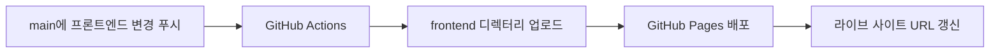

[English](README.md) | **한국어**

# Secret MCP Use

이 저장소는 [`yyeongjin/secret_mcp`](https://github.com/yyeongjin/secret_mcp)의 `DESIGN_INDEX` 명세 규칙 전체를 재사용 가능한 문서로 옮긴 저장소입니다. 하나의 GDWEB 작품과 이미지 근거를 구현 가능한 프론트엔드 명세로 변환할 때 LLM이 따라야 하는 규칙을 정의합니다.

단순한 스타일 요약으로 축약하지 않고 `secret-mcp/design-index/v2` 계약 전체를 보존합니다. 요청 격리, 근거 분류, 이미지 좌표, 페이지·라우트 분리, 내비게이션 좌표, 섹션 경계, 컴포넌트 계약, 정확한 색상, 타이포그래피, 에셋, 반응형 동작, 상호작용, 접근성, 프론트엔드 구조, 구현 작업, 시각 QA와 불확실성 처리 규칙을 모두 포함합니다.

## 문서

- [Complete DESIGN_INDEX Specification](DESIGN_INDEX_SPECIFICATION.md)
- [DESIGN_INDEX 전체 명세 규칙](DESIGN_INDEX_SPECIFICATION.ko.md)

## 핵심 계약

1. 검색 결과 하나는 하나의 독립된 LLM 요청으로 처리합니다.
2. 요청 하나에는 작품 하나의 메타데이터, 계약과 근거 이미지만 전달합니다.
3. 작품 하나마다 `DESIGN_INDEX_gdweb-<id>.md` 문서 하나를 생성합니다.
4. 작품 문서 안에서 확인되는 모든 페이지와 라우트를 서로 분리해 명세합니다.
5. 모든 주요 판단에는 `MEASURED`, `OBSERVED`, `INFERRED`, `UNKNOWN` 중 하나를 표시합니다.
6. 측정값이 뒤따르지 않는 모호한 시각 표현은 유효한 명세로 인정하지 않습니다.
7. 다른 LLM이 GDWEB을 다시 열거나 누락 수치를 몰래 지어내지 않고도 완성된 문서만으로 구현할 수 있어야 합니다.

## 권장 사용법

정확히 한 작품의 메타데이터와 근거 이미지에 전체 명세 문서를 함께 전달합니다. 계약 헤더와 근거 좌표표의 자리표시자를 실제 값으로 교체하고, 출력 언어를 지정한 뒤 완성된 Markdown 문서만 응답하도록 요청합니다.

전체 규칙의 영어 기준 문서는 [DESIGN_INDEX_SPECIFICATION.md](DESIGN_INDEX_SPECIFICATION.md)입니다. [DESIGN_INDEX_SPECIFICATION.ko.md](DESIGN_INDEX_SPECIFICATION.ko.md)는 내용을 생략하지 않은 한국어 대응본입니다.

## 프론트엔드 라이브 미리보기

[`trigger/DESIGN_INDEX_gdweb-26357.md`](trigger/DESIGN_INDEX_gdweb-26357.md)를 바탕으로 생성한 구현 결과는 [`frontend/`](frontend/)에 있습니다. GitHub Pages가 이 디렉터리를 실제 웹사이트로 배포하므로 현재 프론트엔드를 확인하기 위한 스크린샷을 저장소에 둘 필요가 없습니다.

**라이브 사이트:** <https://yyeongjin.github.io/secret_mcp_use/>



### 배포 구조

- `frontend/`: 배포 가능한 정적 HTML, CSS, JavaScript와 로컬 시각 에셋입니다.
- `.github/workflows/deploy-frontend-pages.yml`: GitHub Pages 배포 워크플로우입니다.
- `trigger/DESIGN_INDEX_gdweb-26357.md`: 현재 프론트엔드 재구현에 사용한 원본 명세서입니다.
- `main` 푸시에서 `frontend/**` 또는 배포 워크플로우가 바뀌면 새 배포가 시작됩니다.
- 저장소 Actions 탭의 `workflow_dispatch`를 이용해 수동으로도 배포할 수 있습니다.
- 워크플로우는 `frontend/`만 업로드하므로 명세서와 저장소의 다른 문서는 공개 사이트 아티팩트에 포함되지 않습니다.
- 최초 배포 전에 저장소에서 **Settings → Pages → Build and deployment → Source → GitHub Actions**를 한 번 선택해야 합니다.

로컬 확인 방법:

```bash
cd frontend
python3 -m http.server 4321
```

그다음 <http://127.0.0.1:4321/>을 엽니다.

## 원본 기준

이 저장소의 최초 규칙은 `yyeongjin/secret_mcp` 커밋 `8097977`의 `secret-mcp/design-index/v2` 계약을 기준으로 옮겼습니다.
