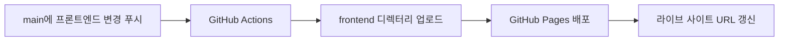

[English](README.md) | **한국어**

# Secret MCP Use

이 저장소는 [`yyeongjin/secret_mcp`](https://github.com/yyeongjin/secret_mcp)의 `DESIGN_INDEX` 명세 규칙 전체를 재사용 가능한 문서로 옮긴 저장소입니다. 하나의 GDWEB 작품과 이미지 근거를 구현 가능한 프론트엔드 명세로 변환할 때 LLM이 따라야 하는 규칙을 정의합니다.

단순한 스타일 요약으로 축약하지 않고 `secret-mcp/design-index/v2` 계약 전체를 보존합니다. 요청 격리, 근거 분류, 이미지 좌표, 페이지·라우트 분리, 내비게이션 좌표, 섹션 경계, 컴포넌트 계약, 정확한 색상, 타이포그래피, 에셋, 반응형 동작, 상호작용, 접근성, 프론트엔드 구조, 구현 작업, 시각 QA와 불확실성 처리 규칙을 모두 포함합니다.

## 문서

- [Complete DESIGN_INDEX Specification](DESIGN_INDEX_SPECIFICATION.md)
- [DESIGN_INDEX 전체 명세 규칙](DESIGN_INDEX_SPECIFICATION.ko.md)

## 핵심 계약

1. 검색 결과 하나는 하나의 독립된 LLM 요청으로 처리합니다.
2. 요청 하나에는 작품 하나의 메타데이터, 계약과 근거 이미지만 전달합니다.
3. 작품 하나마다 `DESIGN_INDEX_gdweb-<id>.md` 문서 하나를 생성합니다.
4. 작품 문서 안에서 확인되는 모든 페이지와 라우트를 서로 분리해 명세합니다.
5. 모든 주요 판단에는 `MEASURED`, `OBSERVED`, `INFERRED`, `UNKNOWN` 중 하나를 표시합니다.
6. 측정값이 뒤따르지 않는 모호한 시각 표현은 유효한 명세로 인정하지 않습니다.
7. 다른 LLM이 GDWEB을 다시 열거나 누락 수치를 몰래 지어내지 않고도 완성된 문서만으로 구현할 수 있어야 합니다.

## 권장 사용법

정확히 한 작품의 메타데이터와 근거 이미지에 전체 명세 문서를 함께 전달합니다. 계약 헤더와 근거 좌표표의 자리표시자를 실제 값으로 교체하고, 출력 언어를 지정한 뒤 완성된 Markdown 문서만 응답하도록 요청합니다.

전체 규칙의 영어 기준 문서는 [DESIGN_INDEX_SPECIFICATION.md](DESIGN_INDEX_SPECIFICATION.md)입니다. [DESIGN_INDEX_SPECIFICATION.ko.md](DESIGN_INDEX_SPECIFICATION.ko.md)는 내용을 생략하지 않은 한국어 대응본입니다.

## NVIDIA 검증 파이프라인 설정

검증 파이프라인은 NVIDIA API를 통해 [`nvidia/nemotron-3-super-120b-a12b`](https://build.nvidia.com/nvidia/nemotron-3-super-120b-a12b)를 사용합니다. 모델 ID가 하나라고 해서 하나의 통합 LLM 작업으로 처리하지 않습니다. `S01-S19`는 모델 호출 단위가 아니라 결과 집계용 부모입니다. 결정적 코드가 Specification과 DESIGN_INDEX의 모든 비구조 source span을 원자 leaf Requirement로 만들고, 1차는 Specification leaf마다 소스코드 없는 독립 문서 완전성 요청을, 2차는 DESIGN_INDEX leaf마다 Specification 본문 없는 독립 구현 감사 요청을 보냅니다. 따라서 호출 수는 38로 고정되지 않고 현재 문서에서 계산됩니다. 현재 `gdweb-26357` 입력은 1차 327개와 2차 761개, 총 1,088개의 primary 요청을 재시도·preflight·patch·재감사 전에 예약합니다.

전체 파이프라인 계약은 [IDEA_VALIDATION_AND_PR_PIPELINE.ko.md](IDEA_VALIDATION_AND_PR_PIPELINE.ko.md)에 기록되어 있습니다.

### 1. API 키를 GitHub Actions Secret으로 추가

**Settings → Secrets and variables → Actions → Secrets → New repository secret**을 열고 다음 값을 추가합니다.

```text
NVIDIA_API_KEY=nvapi-...
```

`NVIDIA_API_KEY`는 반드시 Secret으로 저장해야 합니다. Repository variable, workflow YAML, 소스 파일, 커밋되는 `.env`, 로그, artifact, PR 본문 또는 검증 증명서에 넣지 않습니다.

명령 기록에 키를 직접 남기지 않고 GitHub CLI로 같은 Secret을 설정할 수도 있습니다.

```bash
read -s NVIDIA_API_KEY
printf '%s' "$NVIDIA_API_KEY" | gh secret set NVIDIA_API_KEY \
  --repo yyeongjin/secret_mcp_use
unset NVIDIA_API_KEY
```

### 2. Repository variable 추가

**Settings → Secrets and variables → Actions → Variables → New repository variable**을 열고 다음 값을 추가합니다.

| Variable | 권장값 | 목적 |
| --- | --- | --- |
| `NVIDIA_BASE_URL` | `https://integrate.api.nvidia.com/v1` | NVIDIA OpenAI 호환 API 기본 URL |
| `NVIDIA_MODEL` | `nvidia/nemotron-3-super-120b-a12b` | 원자 leaf별 독립 요청이 공통으로 사용할 모델 |
| `NVIDIA_CONTEXT_WINDOW_TOKENS` | `1000000` | 모델의 선언된 전체 context window |
| `NVIDIA_MAX_INPUT_TOKENS` | `980000` | 출력과 메시지 template 공간을 남기는 runner 입력 예산 |
| `NVIDIA_MAX_OUTPUT_TOKENS` | `4096` | 독립 요청 하나의 최대 출력량 |
| `NVIDIA_ENABLE_THINKING` | `false` | 최초 strict audit JSON 테스트에서 reasoning token 비활성화 |
| `NVIDIA_REASONING_BUDGET` | `0` | thinking을 끈 상태에서 별도 reasoning 예산 사용 방지 |
| `NVIDIA_TEMPERATURE` | `1.0` | 해당 모델의 권장 sampling temperature |
| `NVIDIA_TOP_P` | `0.95` | 해당 모델의 권장 top-p 값 |
| `NVIDIA_RPM_LIMIT` | `36` | provider의 40 RPM rolling-window 상한에 여유를 둔 저장소 측 rate limiter 값 |
| `NVIDIA_AUDIT_CONCURRENCY` | `8` | stateless worker 동시성. 공용 36 RPM 시작 제한기가 요청 시작 시점은 계속 제어함 |
| `NVIDIA_MAX_RETRIES` | `8` | network 오류, HTTP 429 또는 HTTP 5xx 뒤 논리 요청 하나에 허용하는 transport 재시도 횟수 |
| `PIPELINE_TRIGGER_GLOB` | `trigger/DESIGN_INDEX_gdweb-*.md` | 작품별 run을 시작하는 불변 입력 문서 경로 |
| `PIPELINE_FORCE_FULL_AUDIT` | `false` | 일반 코드 검증에서 유효한 PASS cache를 유지 |
| `PIPELINE_DRY_RUN` | `false` | 임시 worktree 검증을 통과한 patch 게시 허용 |
| `PIPELINE_CREATE_PRS` | `true` | 1차 원문 보고서 하위 PR·작품별 대표 보고서 PR과 이슈, 2차 검증 코드 diff의 멱등적인 stacked draft PR을 게시 |
| `PIPELINE_AUDIT_ATTEMPTS` | `5` (최소값) | transport/schema 결함과 애매하거나 차단된 판정을 위한 동일 leaf 독립 audit 최대 시도 횟수 |
| `PIPELINE_PATCH_ATTEMPTS` | `8` | `PATCH_REQUIRED` Section 하나에 허용하는 전체 검증 재시도를 포함한 독립 seed patch 후보 최대 횟수 |

이 값들은 runner 설정이며 전부 NVIDIA 요청에 그대로 전달되는 필드는 아닙니다. 특히 `NVIDIA_MAX_INPUT_TOKENS`는 HTTP 요청을 보내기 전에 runner가 검사합니다. 입력을 100만 token으로 가득 채우지 않고 `980000`으로 제한해 system message, chat template과 최대 4,096 output token을 위한 약 20,000 token의 여유를 둡니다. `NVIDIA_RPM_LIMIT`는 transport 재시도를 포함한 모든 물리 HTTP 요청 시작에 적용됩니다. HTTP 429가 반환되면 하나의 공용 `Retry-After` cooldown을 모든 worker가 함께 따르며 동시성으로 이를 우회할 수 없습니다.

GitHub CLI로도 Variable을 설정할 수 있습니다.

```bash
REPO=yyeongjin/secret_mcp_use

gh variable set NVIDIA_BASE_URL --body 'https://integrate.api.nvidia.com/v1' --repo "$REPO"
gh variable set NVIDIA_MODEL --body 'nvidia/nemotron-3-super-120b-a12b' --repo "$REPO"
gh variable set NVIDIA_CONTEXT_WINDOW_TOKENS --body '1000000' --repo "$REPO"
gh variable set NVIDIA_MAX_INPUT_TOKENS --body '980000' --repo "$REPO"
gh variable set NVIDIA_MAX_OUTPUT_TOKENS --body '4096' --repo "$REPO"
gh variable set NVIDIA_ENABLE_THINKING --body 'false' --repo "$REPO"
gh variable set NVIDIA_REASONING_BUDGET --body '0' --repo "$REPO"
gh variable set NVIDIA_TEMPERATURE --body '1.0' --repo "$REPO"
gh variable set NVIDIA_TOP_P --body '0.95' --repo "$REPO"
gh variable set NVIDIA_RPM_LIMIT --body '36' --repo "$REPO"
gh variable set NVIDIA_AUDIT_CONCURRENCY --body '8' --repo "$REPO"
gh variable set NVIDIA_MAX_RETRIES --body '8' --repo "$REPO"
gh variable set PIPELINE_TRIGGER_GLOB --body 'trigger/DESIGN_INDEX_gdweb-*.md' --repo "$REPO"
gh variable set PIPELINE_FORCE_FULL_AUDIT --body 'false' --repo "$REPO"
gh variable set PIPELINE_DRY_RUN --body 'false' --repo "$REPO"
gh variable set PIPELINE_CREATE_PRS --body 'true' --repo "$REPO"
gh variable set PIPELINE_AUDIT_ATTEMPTS --body '5' --repo "$REPO"
gh variable set PIPELINE_PATCH_ATTEMPTS --body '8' --repo "$REPO"
```

저장된 Secret 값은 GitHub가 다시 보여주지 않으므로 이름과 갱신 시각만 확인합니다.

```bash
gh secret list --repo yyeongjin/secret_mcp_use
gh variable list --repo yyeongjin/secret_mcp_use
```

### 3. 이미 통과한 작업 건너뛰기

변경되지 않은 작업을 검사할지 판단하기 위해 NVIDIA 요청을 보내면 안 됩니다. 그 순간 이미 API 호출을 소모하기 때문입니다. 어떤 요청도 보내기 전에 결정적 오케스트레이터 코드가 모든 source span을 inventory하고 byte 전체 coverage를 증명한 뒤 각 leaf와 `S01-S19` 집계 부모의 fingerprint를 계산합니다. 1차 leaf fingerprint는 정확한 Specification source span, 비교 경계, Evidence, Request Contract, validator 계약과 모델 설정을 포함합니다. 2차 leaf fingerprint는 정확한 DESIGN_INDEX source span, 소유 frontend 소스 hash, 같은 Section의 1차 lineage, Evidence, validator 계약과 모델 설정을 포함합니다.

그다음 같은 작품, Stage, Section, inventory, 원문과 구현 fingerprint를 가진 불변 PASS 증명서가 있는지 확인합니다.

```text
1차 leaf 증명서 전체 일치 -> document CACHED_PASS -> 1차 호출 0회
2차 leaf 증명서 전체 일치 -> implementation CACHED_PASS -> 2차 호출 0회 -> patch 없음 -> 코드 PR 없음
leaf 증명서 누락 또는 불일치 -> 영향받은 leaf inventory를 각각 독립 감사
```

시각적으로 비슷해 보인다는 추측이나 모델의 기억만으로는 건너뛸 수 없습니다. 검사하지 않았거나 원문에 연결되지 않았거나 `UNKNOWN`인 자식 leaf가 하나라도 있으면 부모 Section은 PASS가 될 수 없습니다. byte 전체 inventory의 결정적 bottom-up 집계만 이후 동일한 실행을 정적이고 호출 없이 만들 수 있습니다.

fingerprint 입력, leaf inventory, 증명서 또는 의존 증명서 중 하나라도 바뀌면 cache를 무효화합니다. `trigger/DESIGN_INDEX_gdweb-*.md`가 새로 추가되거나 외부에서 갱신되면 새로운 불변 계약 버전이므로 해당 작품의 현재 1차·2차 leaf 전체를 다시 실행합니다. `PIPELINE_FORCE_FULL_AUDIT=true`도 두 PASS cache를 모두 무시하므로 의도적인 전체 재검증 때만 사용해야 합니다. 의존성과 겹치는 write-set은 결정적 실행 순서와 parent commit을 정할 뿐, 근거 있는 `PATCH_REQUIRED` Requirement의 preflight·patch 호출·PR 생성을 차단하지 않습니다.

Specification 내용은 runner에 하드코딩하지 않습니다. 매 실행마다 현재 `DESIGN_INDEX_SPECIFICATION.md`와 trigger 원문을 파싱하고 heading, fence marker, 표 구분선, thematic break와 공백을 구조 span으로, 나머지 문단 줄, 목록 항목, 표 행과 code payload를 audit leaf로 기록합니다. inventory는 byte offset 0부터 파일 끝까지 중복이나 미귀속 범위 없이 덮어야 합니다. 번호 Section 누락·중복, source coverage gap 또는 오래된 inventory가 있으면 NVIDIA 요청 전에 실행을 중단하며 pipeline이 Specification이나 trigger를 수정해 구조를 보정하지 않습니다.

두 fan-out은 cache되지 않은 원자 leaf마다 논리 요청 하나를 예약합니다. 어떤 모델도 다른 leaf의 결과나 다른 Section의 자연어 출력을 받지 않으며 1차에는 소스코드가, 2차에는 Specification 본문이 들어가지 않습니다. provider 응답이 잘렸거나 JSON이 깨졌거나 schema-invalid이거나 `UNKNOWN`, `BLOCKED_MISSING_EVIDENCE`, `BLOCKED_CONTRACT_CONFLICT`이면 같은 Stage와 leaf만 `PIPELINE_AUDIT_ATTEMPTS`까지 독립 재시도합니다. 결정적 코드가 leaf 결과를 Section과 작품 상태로 bottom-up 집계하며 모델에게 결과 요약을 다시 요청하지 않습니다. 실행 기록은 `documentAuditRequests`, `implementationAuditRequests`, `totalLogicalAuditRequests`와 추가 provider 호출 수를 구분합니다. leaf별 입력과 출력은 `nodes/SXX/document-leaves/<requirement-id>/`와 `nodes/SXX/implementation-leaves/<requirement-id>/`에 분리해 저장합니다.

### 4. 최초 실행 안전 설정

커밋된 push workflow는 `PIPELINE_DRY_RUN=false`, `PIPELINE_CREATE_PRS=true`로 실행합니다. 그렇더라도 모델 출력을 바로 게시할 수는 없습니다. 요청 격리, 응답 schema 검증, 불변 경로 거부, base hash 검증, write 소유권, diff 크기 제한, `git apply --check`, typecheck, 단위 테스트, 데스크톱·모바일 브라우저 테스트, 접근성 회귀 검사, 수정 Section 재감사, 영향받은 기존 PASS 회귀 감사, 열린 PR 충돌 검사와 멱등성 검사를 모두 통과한 하위 diff만 병합되지 않은 draft PR로 생성합니다. `git apply` 전에는 결정적 코드가 변경 없는 hunk 또는 완전히 동일한 no-op hunk 제거, 저장소 기준 경로 접두사 복원, 신뢰하지 않는 index metadata 제거와 hunk 개수 재계산만 수행할 수 있으며 의미 있는 추가·삭제 소스 줄은 바꾸지 않습니다. Requirement ID, Evidence ref, base hash와 read/write set은 모델이 중복 작성한 metadata를 신뢰하지 않고 격리 audit 입력과 검사한 diff에서 계산합니다.

검증된 코드 PR은 해당 하위 correction에 배정된 Requirement ID를 본문 최상단에 표시하고, 변경 줄 수, 실제 request ID, guard 결과와 실행 artifact를 이어서 표시합니다. `S01-S19`는 상위 집계 Section으로 유지합니다. 1차는 비-PASS Section마다 원문 보고서 하위 PR을 만들고 최대 5개씩 가장 깊은 자식부터 자동 병합해 작품별 대표 보고서 draft PR 하나와 대표 이슈 하나를 남깁니다. `DOCUMENT_GAPS.md`는 각 Section 보고서를 byte 단위로 그대로 포함하며, 이슈 본문 한도를 넘으면 순번 댓글을 이어 붙여 같은 파일을 정확히 복원합니다. 기존 Section 이슈 본문도 대표 이슈에 원문 그대로 복제한 뒤 기존 이슈에는 포인터를 남기고 닫습니다. 2차는 `S09-1`, `S09-2`, `S09-3` 같은 코드 하위 노드를 동적으로 만들고 각 leaf Requirement를 별도 NVIDIA 요청·guard·재감사로 처리합니다. 코드 하위 PR도 최대 5개씩 자동 병합해 Section별 대표 draft PR 하나만 사람의 검토 경계로 남깁니다. 규범 계약은 `IDEA_VALIDATION_AND_PR_PIPELINE.ko.md`입니다.

열린 자동화 PR은 `main`이 바뀌었다는 이유만으로 자동 종료하거나 branch를 삭제하지 않습니다. pipeline은 해당 PR을 stale로 표시하고 현재 base를 기준으로 새로운 독립 audit를 실행하며 PR 번호와 review 이력을 보존합니다. 대체 diff가 모든 guard를 통과한 경우에만 봇 소유 자동화 branch를 `--force-with-lease`로 갱신하고, 같은 PR의 제목, 본문, manifest와 diff를 최신 결과로 바꿉니다. 새 결과가 PASS이거나 차단되었거나 안전하게 patch할 수 없는 경우에도 PR은 사람의 판단을 위해 열린 상태로 남고 현재 피드백을 게시하며, 자동화가 사용자를 대신해 PR을 닫지 않습니다.

독립 patch 후보 하나가 현재 base 코드가 audit finding을 이미 충족한다고 주장하거나 값 부족·과도한 범위를 반환해도 그 한 응답이 근거 있는 누락을 취소할 수 없습니다. 오케스트레이터는 동일 Section과 변경되지 않은 base에서 새 seed를 사용하는 독립 후보를 `PIPELINE_PATCH_ATTEMPTS`까지 요청합니다. 잘못된 응답 형식, 유효하지 않은 diff, 일부 Requirement ID만 구현한 후보, 검사 실패와 재감사 실패도 같은 제한된 replacement candidate 예산을 사용합니다. 모든 독립 후보가 만장일치로 `BLOCKED_AUDIT_CONFLICT`를 반환하면 원래 audit을 현재 실행의 기존 구현 충족 PASS로 결정적으로 해소하고 consensus artifact를 남기며 후행 DAG를 계속 진행합니다. 판정이 섞이거나 다른 실패를 모두 소진한 경우에는 terminal 결과를 Check와 실행 artifact에만 기록합니다.

하나의 `PATCH_REQUIRED` Section은 유한한 Requirement ID 집합을 모두 처리할 때까지 필요한 수만큼 하위 노드를 만들 수 있으며 `19`는 patch 호출 상한이 아닙니다. 각 하위 노드는 최대 `PIPELINE_PATCH_ATTEMPTS`개의 교체 후보를 받을 수 있고 후보마다 고유 request ID를 쓰는 별도 NVIDIA 요청입니다. 요청에는 아직 해결되지 않은 finding과 그 finding이 지목한 구현 파일만 넣습니다. 후보는 공급된 Requirement ID 중 최소 하나를 완전히 구현해 실제 진전을 만들어야 합니다. JSON·schema 오류, 진전 없음, 차단 후보 판정, 테스트 실패, 하위 노드 재감사 실패 또는 영향받은 기존 PASS 회귀 감사 실패가 발생하면 같은 하위 노드만 재시도합니다. 검증된 부분 후보는 독립 stacked 하위 PR이 되며, 다음 하위 노드는 게시된 부모 commit에서 입력을 다시 만들고 남은 ID만 받습니다. 재시도에는 자기 거부 출력의 제한된 요약만 전달하며 다른 Section의 계약, 응답 또는 diff는 전달하지 않습니다. 불변 경로 쓰기, 소유권 밖 쓰기, 위험한 경로·파일 작업, 과도한 범위, Section 간 write-set 충돌과 게시 충돌에서는 guard를 완화하지 않습니다. 모든 시도는 `patches/SXX/SXX-N/attempt-M/` 아래에 기록합니다. PASS에는 patch 요청과 PR을 만들지 않습니다.

audit의 `implementationRefs`는 schema에서 저장소 상대 경로만 허용합니다. selector, 소스 조각, `path:line`, 컴포넌트 이름 또는 설명문은 patch scheduling 전에 거부합니다. 모든 `PATCH_REQUIRED` finding은 supplied writable path 또는 허용된 안전한 새 text file 경로를 정확히 지목해야 합니다. S18이 필수 페이지별 acceptance test 파일 부재를 증명하고 `frontend/tests/**`를 소유하지만 audit가 새 파일 경로를 생략하면, 결정적 오케스트레이터가 코드 누락을 근거 부족으로 강등하지 않고 `frontend/tests/design-index-s18.spec.ts`를 배정합니다. 실제 테스트 diff의 작성과 검증은 계속 NVIDIA 독립 patch 요청이 담당합니다.

DESIGN_INDEX, Specification 또는 문서 자체의 누락은 애플리케이션 patch로 바꾸지 않습니다. 주석, marker, TODO, hidden metadata, 문서 문자열 또는 report file만 추가하는 후보는 `COMMENT_ONLY_PATCH`로 거부하며 사용자에게 보이거나 동작하는 프론트엔드 요구사항을 통과시킬 수 없습니다.

source value가 `UNKNOWN`, `TBD`, `N/A`, unspecified, unavailable, 빈 값 또는 명시적인 값 없음이면 patch 생성 전에 `BLOCKED_MISSING_EVIDENCE`로 분류합니다. 계약에 존재하지 않는 값을 구현하라고 반복 patch API를 호출하지 않습니다.

영향받은 기존 PASS 회귀 요청은 새 전체 감사가 아니라 수정 전후 delta 감사입니다. 해당 기존 PASS Section의 동일한 계약, 후보 적용 전후 자기 구현 slice, 변경 경로 목록과 PASS fingerprint 증명만 받습니다. 후보가 만들지 않은 기존 누락이나 수정 전후 그대로인 Requirement는 새 회귀로 PR을 막을 수 없습니다. patch 담당 Section의 finding과 응답은 전달하지 않습니다.

### 5. 파이프라인 실행과 결과 확인

전체 runner는 [`validation/`](validation/)에 있고 [`.github/workflows/validate-design-index.yml`](.github/workflows/validate-design-index.yml)이 실행합니다. trigger, 영어 Specification, frontend 소스, validation 코드 또는 runner package 파일이 바뀐 `main` push에서 검증된 draft PR 자동 생성을 켠 상태로 실행합니다. **Actions → Validate DESIGN_INDEX and prepare grounded PRs → Run workflow**에서 수동으로도 실행할 수 있습니다.

수동 입력의 의미는 다음과 같습니다.

- `trigger_path`: 정확히 하나의 불변 `trigger/DESIGN_INDEX_gdweb-*.md` 입력입니다. push 실행은 일치하는 입력을 모두 찾고 fingerprint가 그대로인 작품은 건너뜁니다.
- `force_full_audit`: 유효한 두 PASS cache를 무시하고 현재 1차·2차 원자 leaf마다 primary audit 요청 하나를 전송합니다.
- `dry_run`: 제안 diff를 격리된 임시 worktree에만 적용하고 게시하지 않습니다.
- `create_prs`: 1차 원문 보고서 트리와 대표 Issue를 게시하고, guard·브라우저 테스트·수정 코드 재감사를 통과한 모든 2차 patch를 멱등적인 draft PR로 게시합니다. 이때 `dry_run=false`여야 합니다.
- 게시 PR은 workflow를 실행한 branch/ref를 대상으로 합니다. 따라서 `main` push는 `main`을 대상으로 하고, 명시적으로 dispatch한 검증 branch에서는 `main`을 변경하지 않고 게시를 시험할 수 있습니다.

end-to-end 순서는 다음으로 고정합니다.

```text
현재 Specification과 trigger 파싱
  -> 모든 source byte를 구조 span 또는 원자 leaf로 inventory
  -> Specification leaf마다 1차 fingerprint 계산
  -> API 호출 전에 유효한 불변 문서 PASS 증명서 재사용
  -> 남은 leaf마다 Specification-to-DESIGN_INDEX stateless 요청 하나 전송
  -> 결정적 코드로 1차 leaf를 bottom-up 집계
  -> 원문 Section 보고서 하위 PR, 대표 보고서 PR과 대표 이슈 게시
  -> 같은 Section의 1차 lineage를 사용해 DESIGN_INDEX leaf마다 2차 fingerprint 계산
  -> API 호출 전에 유효한 불변 구현 PASS 증명서 재사용
  -> 남은 leaf마다 DESIGN_INDEX-to-source stateless 요청 하나 전송
  -> 결정적 코드로 2차 leaf를 bottom-up 집계
  -> 모든 PATCH_REQUIRED finding이 해당 Section 소유의 supplied file을 지목하는지 검증
  -> 근거가 있는 PATCH_REQUIRED 노드만 별도 patch 요청 전송
  -> 같은 Section 안에서 서로 다른 seed의 후보를 PIPELINE_PATCH_ATTEMPTS 횟수까지 시도
  -> old-side context가 원본 파일의 한 위치에만 매칭될 때 diff 기계 요소만 복구
  -> trigger/spec 쓰기, 오래된 hash, 과도한 diff와 소유권 위반 거부
  -> 후보마다 변경되지 않은 원본에서 별도 임시 worktree에 적용
  -> 후보마다 typecheck, 단위 테스트, 데스크톱·모바일 렌더링, 접근성 검사
  -> 별도 stateless 요청으로 수정 Section과 영향받은 기존 PASS Section 재감사
  -> 실패 후보를 폐기하고 제한된 Section 내부 반복 계속
  -> 검증된 하위 노드마다 멱등적인 stacked draft PR을 선택적으로 생성
```

PASS 증명서는 orphan `validation-state` branch에 기록합니다. 격리된 원본 입력, 검증된 출력, gap report, patch guard, 테스트 결과와 재감사 결과는 30일 동안 보존되는 GitHub Actions artifact로 올립니다. workflow는 PR을 자동 승인하거나 자동 병합하지 않습니다.

파이프라인을 실행하지 않는 로컬 결정적 검사:

```bash
npm ci
npx playwright install chromium
npm run typecheck
npm test
npm run test:frontend
```

로컬 mock provider와 mock workflow mode는 존재하지 않습니다. end-to-end pipeline은 항상 실제 NVIDIA API를 요구합니다. 모든 audit, patch, re-audit 요청은 요청별로 결합한 JSON Schema를 NVIDIA `guided_json`에 전달하며 Nemotron chat template에는 `enable_thinking`과 `force_nonempty_content: true`를 전달합니다. NVIDIA grammar가 `uniqueItems` annotation을 거부하므로 요청에는 이 annotation만 재귀적으로 제거한 schema 복사본을 사용하고, 반환된 객체는 변경하지 않은 전체 schema로 Ajv에서 다시 검증합니다. audit, 정규 patch, 모델 patch 후보의 전체 schema가 validator contract fingerprint에 포함되므로 출력 계약이 하나라도 바뀌면 이전 PASS 증명서는 무효화됩니다. PR을 게시하지 않고 로컬에서 검증하려면 `NVIDIA_API_KEY`를 export한 뒤 `npm run audit -- --dry-run --trigger trigger/DESIGN_INDEX_gdweb-26357.md`를 실행합니다. 저장소 권한과 draft PR 생성까지 확인하는 최종 게시 검증은 GitHub Actions 결과를 기준으로 합니다.

### 파이프라인 artifact 뷰어

뷰어는 실제 pipeline artifact를 읽으며 NVIDIA mock 응답을 만들지 않습니다. 로컬 실행 뒤 다음 명령으로 시작합니다.

```bash
npm run viewer
```

<http://127.0.0.1:4318/>을 엽니다. Actions에서 내려받은 artifact를 보려면 `pipeline-summary.json`이 있는 디렉터리를 지정합니다.

```bash
PIPELINE_VIEWER_DATA_ROOT=/absolute/path/to/.validation-runs/current npm run viewer
```

첫 번째 grid는 모든 1차 문서 leaf 요청을, 두 번째 grid는 모든 2차 구현 leaf 요청을 표시하며 크기는 현재 문서에 따라 달라집니다. 카운터는 실행 summary의 `documentAuditRequests`, `implementationAuditRequests`, `totalLogicalAuditRequests`를 그대로 사용합니다.

## 프론트엔드 라이브 미리보기

[`trigger/DESIGN_INDEX_gdweb-26357.md`](trigger/DESIGN_INDEX_gdweb-26357.md)를 바탕으로 생성한 구현 결과는 [`frontend/`](frontend/)에 있습니다. GitHub Pages가 이 디렉터리를 실제 웹사이트로 배포하므로 현재 프론트엔드를 확인하기 위한 스크린샷을 저장소에 둘 필요가 없습니다.

**라이브 사이트:** <https://yyeongjin.github.io/secret_mcp_use/>



### 배포 구조

- `frontend/`: 배포 가능한 정적 HTML, CSS, JavaScript와 로컬 시각 에셋입니다.
- `.github/workflows/deploy-frontend-pages.yml`: GitHub Pages 배포 워크플로우입니다.
- `trigger/DESIGN_INDEX_gdweb-26357.md`: 현재 프론트엔드 재구현에 사용한 원본 명세서입니다.
- `main` 푸시에서 `frontend/**` 또는 배포 워크플로우가 바뀌면 새 배포가 시작됩니다.
- 저장소 Actions 탭의 `workflow_dispatch`를 이용해 수동으로도 배포할 수 있습니다.
- 워크플로우는 `frontend/`만 업로드하므로 명세서와 저장소의 다른 문서는 공개 사이트 아티팩트에 포함되지 않습니다.
- 최초 배포 전에 저장소에서 **Settings → Pages → Build and deployment → Source → GitHub Actions**를 한 번 선택해야 합니다.

로컬 확인 방법:

```bash
cd frontend
python3 -m http.server 4321
```

그다음 <http://127.0.0.1:4321/>을 엽니다.

## 원본 기준

이 저장소의 최초 규칙은 `yyeongjin/secret_mcp` 커밋 `8097977`의 `secret-mcp/design-index/v2` 계약을 기준으로 옮겼습니다.
