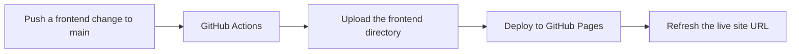

**English** | [한국어](README.ko.md)

# Secret MCP Use

This repository contains the complete, reusable `DESIGN_INDEX` specification rules extracted from [`yyeongjin/secret_mcp`](https://github.com/yyeongjin/secret_mcp). The rules define how an LLM must turn one GDWEB work and its image evidence into an implementation-ready frontend specification.

The documents preserve the complete `secret-mcp/design-index/v2` contract rather than reducing it to a style summary. They cover request isolation, evidence classification, image coordinates, page and route separation, navigation geometry, section bounds, component contracts, exact colors, typography, assets, responsive behavior, interactions, accessibility, frontend architecture, implementation tasks, visual QA, and uncertainty handling.

## Documents

- [Complete DESIGN_INDEX Specification](DESIGN_INDEX_SPECIFICATION.md)
- [DESIGN_INDEX 전체 명세 규칙](DESIGN_INDEX_SPECIFICATION.ko.md)

## Core Contract

1. One search result is one independent LLM request.
2. One request contains only one work's metadata, contract, and evidence images.
3. One work produces one `DESIGN_INDEX_gdweb-<id>.md` document.
4. Every visible page or route is specified separately inside that work's document.
5. Every material claim is labeled `MEASURED`, `OBSERVED`, `INFERRED`, or `UNKNOWN`.
6. Vague visual descriptions are invalid unless they are followed by measurable values.
7. Another LLM must be able to implement the work from the completed document without reopening GDWEB or silently inventing missing measurements.

## Recommended Use

Provide the specification document to the LLM together with exactly one work's metadata and evidence images. Replace the placeholders in the contract header and evidence map, request the desired output language, and require the response to contain only the completed Markdown document.

The complete rules are maintained in [DESIGN_INDEX_SPECIFICATION.md](DESIGN_INDEX_SPECIFICATION.md). That file is the primary English contract. [DESIGN_INDEX_SPECIFICATION.ko.md](DESIGN_INDEX_SPECIFICATION.ko.md) is its complete Korean counterpart.

## Live Frontend Preview

The implementation generated from [`trigger/DESIGN_INDEX_gdweb-26357.md`](trigger/DESIGN_INDEX_gdweb-26357.md) is stored in [`frontend/`](frontend/). GitHub Pages publishes that directory as a live website, so repository screenshots are not required to inspect the current frontend.

**Live site:** <https://yyeongjin.github.io/secret_mcp_use/>



### Deployment Structure

- `frontend/`: deployable static HTML, CSS, JavaScript, and local visual assets.
- `.github/workflows/deploy-frontend-pages.yml`: the GitHub Pages deployment workflow.
- `trigger/DESIGN_INDEX_gdweb-26357.md`: the source specification used to reconstruct the current frontend.
- A push to `main` that changes `frontend/**` or the deployment workflow starts a new deployment.
- `workflow_dispatch` also allows a manual deployment from the repository's Actions tab.
- The workflow uploads only `frontend/`; specifications and other repository documents are not included in the public site artifact.
- The first deployment requires **Settings → Pages → Build and deployment → Source → GitHub Actions** to be selected once for the repository.

For local inspection:

```bash
cd frontend
python3 -m http.server 4321
```

Then open <http://127.0.0.1:4321/>.

## Source Baseline

The initial rules in this repository were transferred from `yyeongjin/secret_mcp` at commit `8097977` (`secret-mcp/design-index/v2`).
