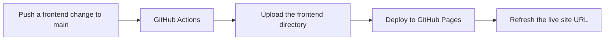

**English** | [한국어](README.ko.md)

# Secret MCP Use

This repository contains the complete, reusable `DESIGN_INDEX` specification rules extracted from [`yyeongjin/secret_mcp`](https://github.com/yyeongjin/secret_mcp). The rules define how an LLM must turn one GDWEB work and its image evidence into an implementation-ready frontend specification.

The documents preserve the complete `secret-mcp/design-index/v2` contract rather than reducing it to a style summary. They cover request isolation, evidence classification, image coordinates, page and route separation, navigation geometry, section bounds, component contracts, exact colors, typography, assets, responsive behavior, interactions, accessibility, frontend architecture, implementation tasks, visual QA, and uncertainty handling.

## Documents

- [Complete DESIGN_INDEX Specification](DESIGN_INDEX_SPECIFICATION.md)
- [DESIGN_INDEX 전체 명세 규칙](DESIGN_INDEX_SPECIFICATION.ko.md)

## Core Contract

1. One search result is one independent LLM request.
2. One request contains only one work's metadata, contract, and evidence images.
3. One work produces one `DESIGN_INDEX_gdweb-<id>.md` document.
4. Every visible page or route is specified separately inside that work's document.
5. Every material claim is labeled `MEASURED`, `OBSERVED`, `INFERRED`, or `UNKNOWN`.
6. Vague visual descriptions are invalid unless they are followed by measurable values.
7. Another LLM must be able to implement the work from the completed document without reopening GDWEB or silently inventing missing measurements.

## Recommended Use

Provide the specification document to the LLM together with exactly one work's metadata and evidence images. Replace the placeholders in the contract header and evidence map, request the desired output language, and require the response to contain only the completed Markdown document.

The complete rules are maintained in [DESIGN_INDEX_SPECIFICATION.md](DESIGN_INDEX_SPECIFICATION.md). That file is the primary English contract. [DESIGN_INDEX_SPECIFICATION.ko.md](DESIGN_INDEX_SPECIFICATION.ko.md) is its complete Korean counterpart.

## NVIDIA Validation Pipeline Setup

The planned validation pipeline uses [`nvidia/nemotron-3-super-120b-a12b`](https://build.nvidia.com/nvidia/nemotron-3-super-120b-a12b) through the NVIDIA API. A single model ID does not mean a single combined LLM job: one work is split into `S01` through `S19`, and the orchestrator sends 19 stateless requests whose prompts, inputs, outputs, request IDs, logs, and temporary workspaces are isolated from one another.

The complete pipeline contract is documented in [IDEA_VALIDATION_AND_PR_PIPELINE.ko.md](IDEA_VALIDATION_AND_PR_PIPELINE.ko.md).

### 1. Add the API key as a GitHub Actions secret

Open **Settings → Secrets and variables → Actions → Secrets → New repository secret** and add:

```text
NVIDIA_API_KEY=nvapi-...
```

`NVIDIA_API_KEY` must be a secret. Do not add it to repository variables, workflow YAML, source files, committed `.env` files, logs, artifacts, PR bodies, or validation attestations.

The same secret can be configured with GitHub CLI without printing it in the command history:

```bash
read -s NVIDIA_API_KEY
printf '%s' "$NVIDIA_API_KEY" | gh secret set NVIDIA_API_KEY \
  --repo yyeongjin/secret_mcp_use
unset NVIDIA_API_KEY
```

### 2. Add repository variables

Open **Settings → Secrets and variables → Actions → Variables → New repository variable** and add the following values:

| Variable | Recommended value | Purpose |
| --- | --- | --- |
| `NVIDIA_BASE_URL` | `https://integrate.api.nvidia.com/v1` | NVIDIA OpenAI-compatible API base URL |
| `NVIDIA_MODEL` | `nvidia/nemotron-3-super-120b-a12b` | Model used by every isolated Section request |
| `NVIDIA_CONTEXT_WINDOW_TOKENS` | `1000000` | Declared model context window |
| `NVIDIA_MAX_INPUT_TOKENS` | `980000` | Runner-side input budget, leaving space for output and message templates |
| `NVIDIA_MAX_OUTPUT_TOKENS` | `4096` | Maximum output for each independent request |
| `NVIDIA_ENABLE_THINKING` | `false` | Disables reasoning tokens for strict audit JSON on the first test |
| `NVIDIA_REASONING_BUDGET` | `0` | Prevents a separate reasoning budget when thinking is disabled |
| `NVIDIA_TEMPERATURE` | `1.0` | Sampling temperature recommended for this model |
| `NVIDIA_TOP_P` | `0.95` | Top-p value recommended for this model |
| `NVIDIA_RPM_LIMIT` | `40` | Repository-side rate limiter; lower this if the account limit is lower |
| `NVIDIA_AUDIT_CONCURRENCY` | `1` | Safe initial concurrency; request independence does not require parallel execution |
| `PIPELINE_TRIGGER_GLOB` | `trigger/DESIGN_INDEX_gdweb-*.md` | Immutable input documents that start a work-specific run |
| `PIPELINE_FORCE_FULL_AUDIT` | `false` | Preserves valid cached PASS results during ordinary code validation |
| `PIPELINE_DRY_RUN` | `true` | Produces audit artifacts without applying patches or creating PRs |
| `PIPELINE_CREATE_PRS` | `false` | Keeps PR creation disabled during the first validation test |

These are runner configuration variables, not all direct NVIDIA request fields. In particular, `NVIDIA_MAX_INPUT_TOKENS` is enforced before the HTTP request is sent. The `980000` limit deliberately keeps approximately 20,000 tokens available for the system message, chat template, and up to 4,096 output tokens instead of filling the entire one-million-token window with input.

The variables can also be configured with GitHub CLI:

```bash
REPO=yyeongjin/secret_mcp_use

gh variable set NVIDIA_BASE_URL --body 'https://integrate.api.nvidia.com/v1' --repo "$REPO"
gh variable set NVIDIA_MODEL --body 'nvidia/nemotron-3-super-120b-a12b' --repo "$REPO"
gh variable set NVIDIA_CONTEXT_WINDOW_TOKENS --body '1000000' --repo "$REPO"
gh variable set NVIDIA_MAX_INPUT_TOKENS --body '980000' --repo "$REPO"
gh variable set NVIDIA_MAX_OUTPUT_TOKENS --body '4096' --repo "$REPO"
gh variable set NVIDIA_ENABLE_THINKING --body 'false' --repo "$REPO"
gh variable set NVIDIA_REASONING_BUDGET --body '0' --repo "$REPO"
gh variable set NVIDIA_TEMPERATURE --body '1.0' --repo "$REPO"
gh variable set NVIDIA_TOP_P --body '0.95' --repo "$REPO"
gh variable set NVIDIA_RPM_LIMIT --body '40' --repo "$REPO"
gh variable set NVIDIA_AUDIT_CONCURRENCY --body '1' --repo "$REPO"
gh variable set PIPELINE_TRIGGER_GLOB --body 'trigger/DESIGN_INDEX_gdweb-*.md' --repo "$REPO"
gh variable set PIPELINE_FORCE_FULL_AUDIT --body 'false' --repo "$REPO"
gh variable set PIPELINE_DRY_RUN --body 'true' --repo "$REPO"
gh variable set PIPELINE_CREATE_PRS --body 'false' --repo "$REPO"
```

Verify only the names and update timestamps. GitHub does not reveal the stored secret value:

```bash
gh secret list --repo yyeongjin/secret_mcp_use
gh variable list --repo yyeongjin/secret_mcp_use
```

### 3. Skip work that has already passed

An NVIDIA request must not be used to decide whether an unchanged Section should be inspected. That would already consume an API call. Before any request, deterministic orchestrator code calculates a fingerprint for each Section from its immutable trigger fragment, relevant common specification fragment, evidence hashes, validator contract and schema version, model configuration, owned frontend source hashes, and direct dependency attestations.

The orchestrator then looks for an immutable PASS attestation with the same `targetId`, `sectionId`, and fingerprint:

```text
matching valid PASS attestation -> CACHED_PASS -> zero NVIDIA calls -> no patch -> no PR
missing or mismatched attestation -> one isolated NVIDIA audit call for that Section
```

A visual similarity guess or the model's memory is never sufficient for a skip. A Section that appears to be implemented but has no valid PASS attestation is audited once. After it passes, the attestation makes later identical runs static and call-free.

The cache is invalidated when any fingerprint input changes, the attestation is missing or revoked, or a dependency attestation is no longer valid. A newly added or externally updated `trigger/DESIGN_INDEX_gdweb-*.md` is a new immutable contract version and therefore starts a full 19-request audit for that work. `PIPELINE_FORCE_FULL_AUDIT=true` also bypasses cached PASS results and must only be used for an intentional complete re-audit.

### 4. First-run safety settings

Keep `PIPELINE_DRY_RUN=true` and `PIPELINE_CREATE_PRS=false` for the first execution. The expected result is 19 isolated audit outputs for a new trigger, deterministic merged artifacts, no write under `trigger/**`, and no generated PR. Enable PR creation only after request isolation, response schema validation, fingerprint reuse, immutable-path rejection, rate limiting, and artifact redaction have all been verified.

At present, this repository contains the Pages deployment workflow but not the NVIDIA validation runner or its GitHub Actions workflow. Adding the secret and variables prepares the repository configuration; it does not itself issue the 19 API requests. The runner must implement the contract above before an end-to-end validation run can start.

## Live Frontend Preview

The implementation generated from [`trigger/DESIGN_INDEX_gdweb-26357.md`](trigger/DESIGN_INDEX_gdweb-26357.md) is stored in [`frontend/`](frontend/). GitHub Pages publishes that directory as a live website, so repository screenshots are not required to inspect the current frontend.

**Live site:** <https://yyeongjin.github.io/secret_mcp_use/>



### Deployment Structure

- `frontend/`: deployable static HTML, CSS, JavaScript, and local visual assets.
- `.github/workflows/deploy-frontend-pages.yml`: the GitHub Pages deployment workflow.
- `trigger/DESIGN_INDEX_gdweb-26357.md`: the source specification used to reconstruct the current frontend.
- A push to `main` that changes `frontend/**` or the deployment workflow starts a new deployment.
- `workflow_dispatch` also allows a manual deployment from the repository's Actions tab.
- The workflow uploads only `frontend/`; specifications and other repository documents are not included in the public site artifact.
- The first deployment requires **Settings → Pages → Build and deployment → Source → GitHub Actions** to be selected once for the repository.

For local inspection:

```bash
cd frontend
python3 -m http.server 4321
```

Then open <http://127.0.0.1:4321/>.

## Source Baseline

The initial rules in this repository were transferred from `yyeongjin/secret_mcp` at commit `8097977` (`secret-mcp/design-index/v2`).
