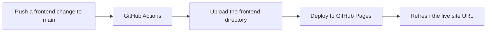

**English** | [한국어](README.ko.md)

# Secret MCP Use

This repository contains the complete, reusable `DESIGN_INDEX` specification rules extracted from [`yyeongjin/secret_mcp`](https://github.com/yyeongjin/secret_mcp). The rules define how an LLM must turn one GDWEB work and its image evidence into an implementation-ready frontend specification.

The documents preserve the complete `secret-mcp/design-index/v2` contract rather than reducing it to a style summary. They cover request isolation, evidence classification, image coordinates, page and route separation, navigation geometry, section bounds, component contracts, exact colors, typography, assets, responsive behavior, interactions, accessibility, frontend architecture, implementation tasks, visual QA, and uncertainty handling.

## Documents

- [Complete DESIGN_INDEX Specification](DESIGN_INDEX_SPECIFICATION.md)
- [DESIGN_INDEX 전체 명세 규칙](DESIGN_INDEX_SPECIFICATION.ko.md)

## Core Contract

1. One search result is one independent LLM request.
2. One request contains only one work's metadata, contract, and evidence images.
3. One work produces one `DESIGN_INDEX_gdweb-<id>.md` document.
4. Every visible page or route is specified separately inside that work's document.
5. Every material claim is labeled `MEASURED`, `OBSERVED`, `INFERRED`, or `UNKNOWN`.
6. Vague visual descriptions are invalid unless they are followed by measurable values.
7. Another LLM must be able to implement the work from the completed document without reopening GDWEB or silently inventing missing measurements.

## Recommended Use

Provide the specification document to the LLM together with exactly one work's metadata and evidence images. Replace the placeholders in the contract header and evidence map, request the desired output language, and require the response to contain only the completed Markdown document.

The complete rules are maintained in [DESIGN_INDEX_SPECIFICATION.md](DESIGN_INDEX_SPECIFICATION.md). That file is the primary English contract. [DESIGN_INDEX_SPECIFICATION.ko.md](DESIGN_INDEX_SPECIFICATION.ko.md) is its complete Korean counterpart.

## NVIDIA Validation Pipeline Setup

The validation pipeline uses [`nvidia/nemotron-3-super-120b-a12b`](https://build.nvidia.com/nvidia/nemotron-3-super-120b-a12b) through the NVIDIA API. A single model ID does not mean a single combined LLM job. `S01` through `S19` are aggregation parents, not model-call units. Deterministic code assigns every nonstructural source span in the Specification and DESIGN_INDEX to an atomic leaf Requirement. Stage 1 sends one stateless document-completeness request per Specification leaf and contains no source code; Stage 2 sends one stateless implementation request per DESIGN_INDEX leaf and contains no Specification text. The request count is therefore derived from the current documents instead of being fixed at 38. With the current `gdweb-26357` input it is 327 Stage 1 leaves plus 761 Stage 2 leaves, or 1,088 primary requests before retries, preflights, patch candidates, and re-audits.

The complete pipeline contract is documented in [IDEA_VALIDATION_AND_PR_PIPELINE.ko.md](IDEA_VALIDATION_AND_PR_PIPELINE.ko.md).

### 1. Add the API key as a GitHub Actions secret

Open **Settings → Secrets and variables → Actions → Secrets → New repository secret** and add:

```text
NVIDIA_API_KEY=nvapi-...
```

`NVIDIA_API_KEY` must be a secret. Do not add it to repository variables, workflow YAML, source files, committed `.env` files, logs, artifacts, PR bodies, or validation attestations.

The same secret can be configured with GitHub CLI without printing it in the command history:

```bash
read -s NVIDIA_API_KEY
printf '%s' "$NVIDIA_API_KEY" | gh secret set NVIDIA_API_KEY \
  --repo yyeongjin/secret_mcp_use
unset NVIDIA_API_KEY
```

### 2. Add repository variables

Open **Settings → Secrets and variables → Actions → Variables → New repository variable** and add the following values:

| Variable | Recommended value | Purpose |
| --- | --- | --- |
| `NVIDIA_BASE_URL` | `https://integrate.api.nvidia.com/v1` | NVIDIA OpenAI-compatible API base URL |
| `NVIDIA_MODEL` | `nvidia/nemotron-3-super-120b-a12b` | Model used by every isolated atomic-leaf request |
| `NVIDIA_CONTEXT_WINDOW_TOKENS` | `1000000` | Declared model context window |
| `NVIDIA_MAX_INPUT_TOKENS` | `980000` | Runner-side input budget, leaving space for output and message templates |
| `NVIDIA_MAX_OUTPUT_TOKENS` | `4096` | Maximum output for each independent request |
| `NVIDIA_ENABLE_THINKING` | `false` | Disables reasoning tokens for strict audit JSON on the first test |
| `NVIDIA_REASONING_BUDGET` | `0` | Prevents a separate reasoning budget when thinking is disabled |
| `NVIDIA_TEMPERATURE` | `1.0` | Sampling temperature recommended for this model |
| `NVIDIA_TOP_P` | `0.95` | Top-p value recommended for this model |
| `NVIDIA_RPM_LIMIT` | `40` | Repository-side rate limiter; lower this if the account limit is lower |
| `NVIDIA_AUDIT_CONCURRENCY` | `8` | Concurrent stateless workers; the shared 40 RPM start limiter still controls request starts |
| `PIPELINE_TRIGGER_GLOB` | `trigger/DESIGN_INDEX_gdweb-*.md` | Immutable input documents that start a work-specific run |
| `PIPELINE_FORCE_FULL_AUDIT` | `false` | Preserves valid cached PASS results during ordinary code validation |
| `PIPELINE_DRY_RUN` | `false` | Allows verified patches to be published after temporary-worktree validation |
| `PIPELINE_CREATE_PRS` | `true` | Publishes Stage 1 verbatim report child PRs, one report representative PR and Issue per work, plus idempotent stacked draft PRs for verified Stage 2 code diffs |
| `PIPELINE_AUDIT_ATTEMPTS` | `5` (minimum) | Maximum same-leaf independent audit attempts for transport/schema defects and ambiguous or blocked judgments |
| `PIPELINE_PATCH_ATTEMPTS` | `8` | Maximum independently seeded patch candidates, including full verification retries, for one `PATCH_REQUIRED` Section |
| `PIPELINE_PR_MERGE_BATCH_SIZE` | `5` | Number of verified child PRs recursively merged deepest-first into one Section branch; valid range is 1-10 |

These are runner configuration variables, not all direct NVIDIA request fields. In particular, `NVIDIA_MAX_INPUT_TOKENS` is enforced before the HTTP request is sent. The `980000` limit deliberately keeps approximately 20,000 tokens available for the system message, chat template, and up to 4,096 output tokens instead of filling the entire one-million-token window with input.

The variables can also be configured with GitHub CLI:

```bash
REPO=yyeongjin/secret_mcp_use

gh variable set NVIDIA_BASE_URL --body 'https://integrate.api.nvidia.com/v1' --repo "$REPO"
gh variable set NVIDIA_MODEL --body 'nvidia/nemotron-3-super-120b-a12b' --repo "$REPO"
gh variable set NVIDIA_CONTEXT_WINDOW_TOKENS --body '1000000' --repo "$REPO"
gh variable set NVIDIA_MAX_INPUT_TOKENS --body '980000' --repo "$REPO"
gh variable set NVIDIA_MAX_OUTPUT_TOKENS --body '4096' --repo "$REPO"
gh variable set NVIDIA_ENABLE_THINKING --body 'false' --repo "$REPO"
gh variable set NVIDIA_REASONING_BUDGET --body '0' --repo "$REPO"
gh variable set NVIDIA_TEMPERATURE --body '1.0' --repo "$REPO"
gh variable set NVIDIA_TOP_P --body '0.95' --repo "$REPO"
gh variable set NVIDIA_RPM_LIMIT --body '40' --repo "$REPO"
gh variable set NVIDIA_AUDIT_CONCURRENCY --body '8' --repo "$REPO"
gh variable set PIPELINE_TRIGGER_GLOB --body 'trigger/DESIGN_INDEX_gdweb-*.md' --repo "$REPO"
gh variable set PIPELINE_FORCE_FULL_AUDIT --body 'false' --repo "$REPO"
gh variable set PIPELINE_DRY_RUN --body 'false' --repo "$REPO"
gh variable set PIPELINE_CREATE_PRS --body 'true' --repo "$REPO"
gh variable set PIPELINE_AUDIT_ATTEMPTS --body '5' --repo "$REPO"
gh variable set PIPELINE_PATCH_ATTEMPTS --body '8' --repo "$REPO"
```

Verify only the names and update timestamps. GitHub does not reveal the stored secret value:

```bash
gh secret list --repo yyeongjin/secret_mcp_use
gh variable list --repo yyeongjin/secret_mcp_use
```

### 3. Skip work that has already passed

An NVIDIA request must not be used to decide whether unchanged work should be inspected. That would already consume an API call. Before any request, deterministic orchestrator code inventories every source span, proves byte-complete coverage, and calculates a fingerprint for each leaf plus its `S01-S19` aggregation parent. A Stage 1 leaf fingerprint covers its exact Specification source span, comparison boundary, Evidence, request contract, validator contract, and model configuration. A Stage 2 leaf fingerprint covers its exact DESIGN_INDEX source span, owned frontend source hashes, same-Section Stage 1 lineage, Evidence, validator contract, and model configuration.

The orchestrator then looks for immutable PASS attestations with the same work, Stage, Section, inventory, source, and implementation fingerprints:

```text
all Stage 1 leaf attestations match -> document CACHED_PASS -> zero Stage 1 calls
all Stage 2 leaf attestations match -> implementation CACHED_PASS -> zero Stage 2 calls -> no patch -> no code PR
any leaf attestation is missing or mismatched -> independently audit the affected leaf inventory
```

A visual similarity guess or the model's memory is never sufficient for a skip. A parent Section cannot pass while one child leaf is unexamined, unmapped, or `UNKNOWN`. Only the deterministic bottom-up aggregate of a byte-complete inventory can make later identical runs static and call-free.

The cache is invalidated when any fingerprint input changes, the leaf inventory changes, an attestation is missing or revoked, or a dependency attestation is no longer valid. A newly added or externally updated `trigger/DESIGN_INDEX_gdweb-*.md` is a new immutable contract version and therefore starts a complete audit of every current Stage 1 and Stage 2 leaf for that work. `PIPELINE_FORCE_FULL_AUDIT=true` bypasses both PASS caches and must only be used for an intentional complete re-audit. Dependencies and overlapping write sets determine deterministic order and parent commits; they never block an independently grounded `PATCH_REQUIRED` Requirement from receiving its own preflight and patch attempt.

The Specification is not compiled into the runner. Every execution parses the current `DESIGN_INDEX_SPECIFICATION.md` and trigger source, records headings, fence markers, table separators, thematic breaks, and whitespace as structural spans, and records all remaining paragraph lines, list items, table rows, and code payloads as audit leaves. The inventory must cover byte offset 0 through end-of-file with no overlap or uncovered range. Missing or duplicate numbered Sections, a source coverage gap, or a stale inventory stops the run before any NVIDIA request, and the pipeline never edits the Specification or trigger to repair the structure.

The two fan-outs always schedule one logical request for every uncached atomic leaf. No model receives another leaf's result or another Section's natural-language output. Stage 1 never receives source code; Stage 2 never receives Specification text. If a provider response is truncated, malformed, schema-invalid, `UNKNOWN`, `BLOCKED_MISSING_EVIDENCE`, or `BLOCKED_CONTRACT_CONFLICT`, only that same Stage and leaf is independently retried up to `PIPELINE_AUDIT_ATTEMPTS`. Deterministic code aggregates leaf results into Section and work results; it never asks a model to summarize them. Run records distinguish `documentAuditRequests`, `implementationAuditRequests`, and `totalLogicalAuditRequests` from additional provider attempts. Leaf inputs and outputs are stored separately under `nodes/SXX/document-leaves/<requirement-id>/` and `nodes/SXX/implementation-leaves/<requirement-id>/`.

### 4. First-run safety settings

The committed push workflow runs with `PIPELINE_DRY_RUN=false` and `PIPELINE_CREATE_PRS=true`. It still cannot publish arbitrary model output: a patch must pass request isolation, response schema validation, immutable-path rejection, base-hash validation, write ownership, diff size limits, `git apply --check`, type checks, unit tests, desktop/mobile browser tests, accessibility regression checks, patched-Section re-audit, affected PASS regression audits, open-PR conflict checks, and idempotency checks. Only then is an unmerged draft PR created. Before `git apply`, deterministic code may remove context-only or exact no-op hunks, restore repository-rooted path prefixes, discard untrusted index metadata, and recompute hunk counts; it never changes a meaningful added or deleted source line. A zero-context hunk is accepted only when every declared base hash still matches byte for byte, and the resulting worktree must still pass the Requirement re-audit and affected-PASS regression audits. Requirement IDs, Evidence refs, base hashes, and read/write sets are derived from the isolated audit input and the inspected diff instead of trusting duplicated model metadata.

Every verified code child PR leads with the Requirement ID assigned to that correction, followed by changed-line counts, concrete request IDs, guard results, and the run artifact. `S01` through `S19` remain top-level aggregation Sections. Stage 1 creates one verbatim report child PR for every non-PASS Section, merges report children deepest-first in groups of at most five, and leaves one report representative draft PR plus one representative Issue per work. `DOCUMENT_GAPS.md` embeds each Section report byte-for-byte; oversized Issue payloads are split into ordered comments that reconstruct the exact file. Legacy Section Issue bodies are copied verbatim into the representative Issue before the old Issues are linked and closed. Stage 2 creates dynamic code children such as `S09-1`, `S09-2`, and `S09-3`; each child receives exactly one independently preflighted Requirement and is independently guarded and re-audited. Code children are also merged deepest-first in groups of at most five, leaving one `S09`-style draft PR as the human review boundary. The normative pipeline contract is `IDEA_VALIDATION_AND_PR_PIPELINE.ko.md`.

An open Section representative PR is never closed and its branch is never deleted merely because `main` changed. The pipeline marks it stale, performs a fresh isolated audit against the current base, and preserves the PR number and review history. When a replacement diff passes every guard, only the bot-owned representative branch is updated with `--force-with-lease`. Temporary Requirement child PRs are different: after a verified batch is complete, they are recursively merged into the Section branch and their child branches are deleted. If a refreshed Section result is PASS, blocked, or cannot be patched safely, the representative PR remains open for a human decision.

When an isolated patch candidate claims that the current base already satisfies an audit finding, lacks a value, or cannot fit the patch scope, that single candidate is not allowed to cancel a grounded omission. The orchestrator requests another independently seeded candidate for the same Section until `PIPELINE_PATCH_ATTEMPTS` is exhausted. Malformed responses, invalid diffs, incomplete Requirement ID coverage, failed checks, and failed re-audits use the same bounded replacement-candidate budget. If every independently seeded candidate unanimously reports `BLOCKED_AUDIT_CONFLICT`, deterministic orchestration resolves the original audit as an already-satisfied PASS for the current run, records the consensus artifact, and lets downstream DAG nodes continue. Mixed or exhausted failures remain explicit terminal Check and artifact records.

One `PATCH_REQUIRED` Section may create as many child nodes as are required to cover its finite Requirement ID set; `19` is not a patch-call ceiling. Each child gets up to `PIPELINE_PATCH_ATTEMPTS` replacement candidates, and every candidate is a separate NVIDIA request with a distinct request ID. The request contains only one Requirement and the implementation files it names. Invalid JSON or schema, no progress, blocked candidate judgments, failed tests, a non-PASS child re-audit, or a failed affected-PASS regression audit discards that candidate and retries only the same child. A verified candidate becomes a temporary stacked child PR; the next child is rebuilt from that published parent commit. Every completed group of up to `PIPELINE_PR_MERGE_BATCH_SIZE` child PRs is recursively merged into the Section branch, after which the next group starts from that consolidated commit. Retries receive only their own bounded rejection summary, never another Section's contract, response, or diff. Attempts are stored under `patches/SXX/SXX-N/attempt-M/`. PASS Sections never create patch requests or PRs.

Audit `implementationRefs` are schema-constrained repository-relative paths. A selector, source excerpt, `path:line`, component name, or prose description is rejected before patch scheduling. Every `PATCH_REQUIRED` finding must identify an exact supplied writable path or an allowed safe new text-file path. When S18 proves that a required page-specific acceptance test file is absent and owns `frontend/tests/**`, deterministic orchestration assigns `frontend/tests/design-index-s18.spec.ts` rather than downgrading that code omission because the audit omitted a new-file path. The model still authors and verifies the actual test diff.

A DESIGN_INDEX/Specification/documentation gap cannot be converted into an application patch. Comment-only, marker-only, TODO-only, hidden-metadata, documentation-string, and report-file candidates are rejected as `COMMENT_ONLY_PATCH`; they can never satisfy a user-visible or behavioral frontend requirement.

Literal `UNKNOWN`, `TBD`, `N/A`, unspecified, unavailable, empty, or explicitly absent source values are classified as `BLOCKED_MISSING_EVIDENCE` before patch generation. The pipeline does not spend repeated patch calls asking a model to implement a value that the contract does not contain.

An affected prior-PASS regression request is a before/after delta audit, not another fresh completeness audit. It receives only that prior-PASS Section's unchanged contract, its own implementation slice before and after the candidate, the changed path list, and a PASS fingerprint proof. A pre-existing omission or a requirement unchanged by the candidate cannot block the PR as a new regression. The patching Section's findings and response are never included.

### 5. Run and inspect the pipeline

The complete runner is under [`validation/`](validation/) and [`.github/workflows/validate-design-index.yml`](.github/workflows/validate-design-index.yml) executes it. A push to `main` that changes a trigger, the English Specification, frontend source, validation code, or runner package files starts validation with automatic verified draft PR creation enabled. A manual run is available under **Actions → Validate DESIGN_INDEX and prepare grounded PRs → Run workflow**.

Manual inputs have the following meaning:

- `trigger_path`: exactly one immutable `trigger/DESIGN_INDEX_gdweb-*.md` input. Push runs discover every matching input and skip unchanged works by fingerprint.
- `force_full_audit`: ignores both valid PASS caches and sends one primary request for every current Stage 1 and Stage 2 atomic leaf.
- `dry_run`: applies a proposed diff only in an isolated temporary worktree and never publishes it.
- `create_prs`: publishes the Stage 1 verbatim report tree, its representative Issue, and every Stage 2 patch that passes its guards, browser tests, and patched-code re-audit. Published draft PRs are idempotent, and this requires `dry_run=false`.
- A published PR targets the branch/ref that ran the workflow. A `main` push therefore targets `main`, while an explicitly dispatched validation branch can test publication without modifying `main`.

The end-to-end order is fixed:

```text
parse current Specification and trigger
  -> inventory every source byte as structural span or atomic leaf
  -> compute one Stage 1 fingerprint per Specification leaf
  -> reuse valid immutable document PASS attestations before API calls
  -> send one stateless Specification-to-DESIGN_INDEX request per remaining leaf
  -> aggregate Stage 1 leaves bottom-up with deterministic code
  -> publish verbatim Section report child PRs, one report PR, and one representative Issue
  -> compute one Stage 2 fingerprint per DESIGN_INDEX leaf using same-Section Stage 1 lineage
  -> reuse valid immutable implementation PASS attestations before API calls
  -> send one stateless DESIGN_INDEX-to-source request per remaining leaf
  -> aggregate Stage 2 leaves bottom-up with deterministic code
  -> require every PATCH_REQUIRED finding to name a supplied file owned by that Section
  -> send a separate patch request only for grounded PATCH_REQUIRED nodes
  -> try at most PIPELINE_PATCH_ATTEMPTS independently seeded candidates inside that Section
  -> repair only diff mechanics when old-side context maps to one unique base-file location
  -> reject trigger/spec writes, stale hashes, excessive diffs, and ownership violations
  -> apply each candidate from the unchanged base in its own temporary worktree
  -> type-check, unit-test, render desktop/mobile, and check accessibility per candidate
  -> re-audit the patched Section and affected prior PASS Sections with separate stateless requests
  -> discard a failed candidate and continue the bounded Section-local loop
  -> create one idempotent child PR for each verified Requirement
  -> recursively merge child PRs in groups of five and leave one Section draft PR
```

PASS attestations are written to the orphan `validation-state` branch. Raw isolated inputs, validated outputs, gap reports, patch guards, test results, and re-audit results are uploaded as a 30-day GitHub Actions artifact. The workflow auto-merges only verified child PRs into their own Section branch. It never auto-approves or auto-merges the final Section representative PR into `main` or another Section branch.

For local deterministic checks that do not execute the pipeline:

```bash
npm ci
npx playwright install chromium
npm run typecheck
npm test
npm run test:frontend
```

There is no local mock provider or mock workflow mode. An end-to-end pipeline run always requires the real NVIDIA API. Every audit, patch, and re-audit request sends its bound JSON Schema through NVIDIA `guided_json`; the Nemotron chat template also receives `enable_thinking` and `force_nonempty_content: true`. Because the NVIDIA grammar rejects the `uniqueItems` annotation, the request uses a recursive schema copy without that annotation and then validates the returned object against the unchanged complete schema with Ajv. The complete audit, canonical patch, and model patch-candidate schemas are part of the validator contract fingerprint, so changing any output contract invalidates stale PASS attestations. To verify it locally without publishing a PR, export `NVIDIA_API_KEY` and run `npm run audit -- --dry-run --trigger trigger/DESIGN_INDEX_gdweb-26357.md`. GitHub Actions remains the authoritative publication test because it also exercises repository permissions and draft PR creation.

### Pipeline artifact viewer

The viewer reads real pipeline artifacts; it does not create mock NVIDIA responses. After a local run, start it with:

```bash
npm run viewer
```

Open <http://127.0.0.1:4318/>. To inspect a downloaded Actions artifact, point the viewer at the directory containing `pipeline-summary.json`:

```bash
PIPELINE_VIEWER_DATA_ROOT=/absolute/path/to/.validation-runs/current npm run viewer
```

The first grid shows every Stage 1 document leaf request and the second grid shows every Stage 2 implementation leaf request. Their sizes change with the current documents. The counters come directly from `documentAuditRequests`, `implementationAuditRequests`, and `totalLogicalAuditRequests` in the run summary.

## Live Frontend Preview

The implementation generated from [`trigger/DESIGN_INDEX_gdweb-26357.md`](trigger/DESIGN_INDEX_gdweb-26357.md) is stored in [`frontend/`](frontend/). GitHub Pages publishes that directory as a live website, so repository screenshots are not required to inspect the current frontend.

**Live site:** <https://yyeongjin.github.io/secret_mcp_use/>



### Deployment Structure

- `frontend/`: deployable static HTML, CSS, JavaScript, and local visual assets.
- `.github/workflows/deploy-frontend-pages.yml`: the GitHub Pages deployment workflow.
- `trigger/DESIGN_INDEX_gdweb-26357.md`: the source specification used to reconstruct the current frontend.
- A push to `main` that changes `frontend/**` or the deployment workflow starts a new deployment.
- `workflow_dispatch` also allows a manual deployment from the repository's Actions tab.
- The workflow uploads only `frontend/`; specifications and other repository documents are not included in the public site artifact.
- The first deployment requires **Settings → Pages → Build and deployment → Source → GitHub Actions** to be selected once for the repository.

For local inspection:

```bash
cd frontend
python3 -m http.server 4321
```

Then open <http://127.0.0.1:4321/>.

## Source Baseline

The initial rules in this repository were transferred from `yyeongjin/secret_mcp` at commit `8097977` (`secret-mcp/design-index/v2`).
