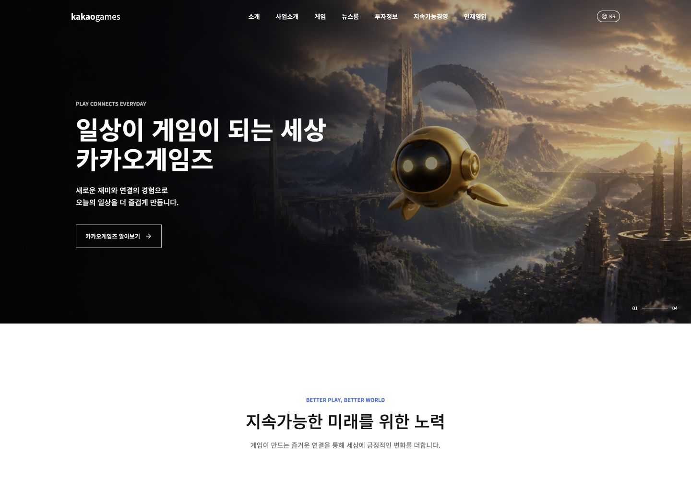
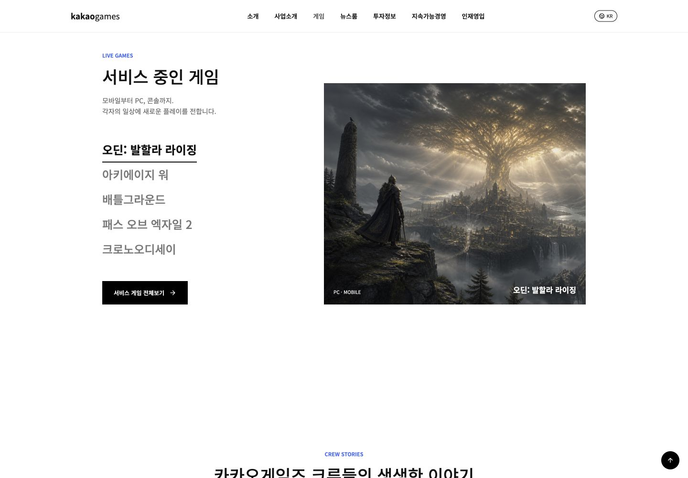
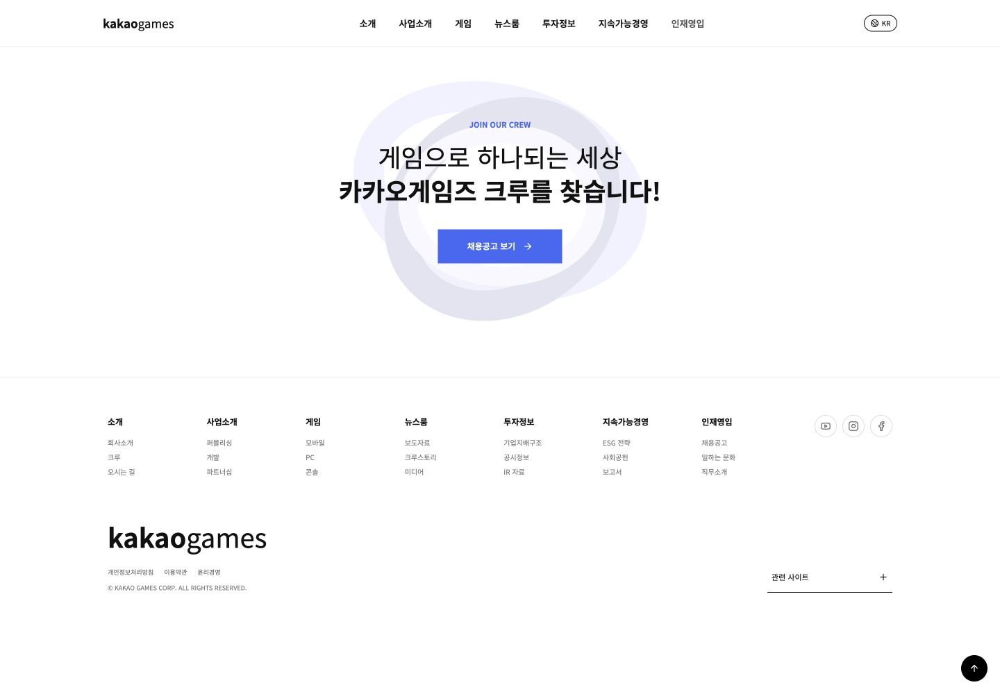
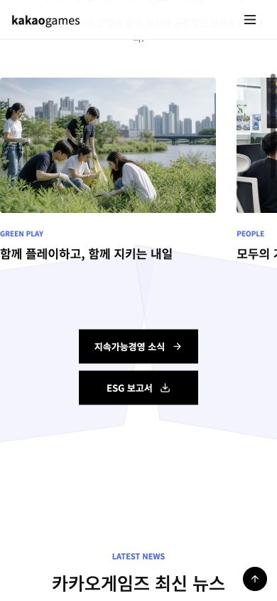
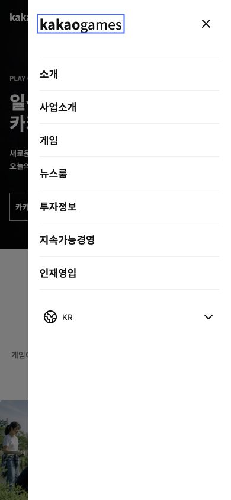

# GDWEB 26357 Frontend Captures

`trigger/DESIGN_INDEX_gdweb-26357.md`를 기반으로 구현한 프론트엔드의 검증 캡처입니다.

- 구현 경로: [`frontend/`](../)
- 기준 문서: [`DESIGN_INDEX_gdweb-26357.md`](../../trigger/DESIGN_INDEX_gdweb-26357.md)
- 데스크톱 뷰포트: `1440 × 1000 px`
- 모바일 뷰포트: `390 × 844 px`

## Desktop Home

투명 오버레이 헤더, 히어로 카피, 원본 대체 게임 아트와 지속가능경영 섹션의 첫 화면입니다.

## Desktop Games

게임 선택 목록, 선택 상태, 게임 아트워크와 다음 크루 섹션 진입부입니다.

## Desktop Recruitment And Footer

채용 CTA, 장식 루프, 7개 사이트맵 그룹과 법적 고지 영역입니다.

## Mobile Home

`390 px` 모바일 히어로, 메뉴 버튼과 가로 스크롤 미디어 트랙입니다.

## Mobile Menu

오른쪽 슬라이드 메뉴, 배경 오버레이, 7개 내비게이션 항목과 언어 선택 컨트롤입니다.

## Validation Summary

| Check | Result |
| --- | --- |
| Desktop document width | `1440 px`, no horizontal document overflow |
| Desktop canonical height | `5137 px` |
| Mobile document width | `390 px`, no horizontal document overflow |
| Mobile menu | Open, Escape close, focus containment and scroll lock verified |
| Game selector | Selected tab, artwork, title and platform update verified |
| Assets | All local images loaded successfully |
| Browser console | No warnings or errors |
